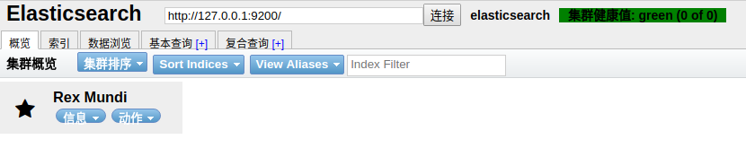
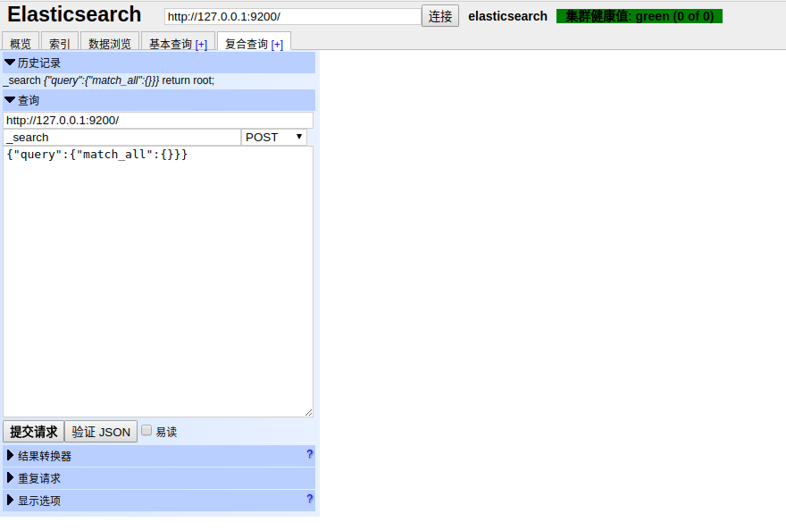

对外接口
================================================================================
### 1.API约定

### 2.REST介绍

### 3.Head插件安装
在学习Elasticsearch的过程中也要借助一些工具来进行。官方文档中的模拟工具用的是 **curl**，这是控制
台工具，不是很直观。这里用 **Head插件** 来作为请求的工具。

插件安装，在 **elasticsearch/bin目录** 下执行下面的命令：
```shell
./plugin install mobz/elasticsearch-head
```
安装成功后，启动Elasticsearch，然后在浏览器中输入：
```
http://127.0.0.1:9200/_plugin/head/
```
可以看到如下图：



在后面大多数的接口操作中使用Any Request面板进行交互：



**注意：在请求URL中要用127.0.0.1或者绑定的具体IP地址，用localhost不起作用**。

### 4.创建库

### 5.插入数据

### 6.修改文档

### 7.查询文档

### 8.删除文档

### 9.删除库
