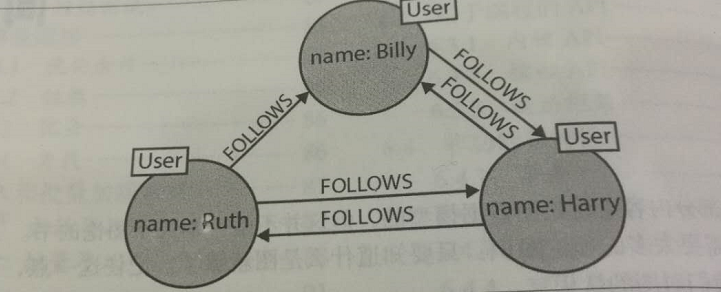
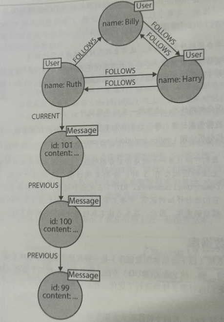

图是什么
================================================================================
形式上，**图不过是顶点和边的集合**，或者说更简单一点儿，**图就是一些节点和关联这些节点的联系的集
合。图将实体表现为节点，实体与其他实体连接的方式表现为联系**。我们可以用这个通用而富有表现力的结构
来为各种场景建模。
```
无处不在的图

在我们了解科学、政府和商业领域的数据集广泛多样性的过程中，图起到了极大的作用。现实世界完全不同于关系型数据库背后的基于表的
模型，它是丰富的且相互之间充满关联：有些部分是统一而规则的，而其他部分是特殊的、不规则的。一旦理解了图，你就会发现图无处不
在。比如，Gartner定义了商业世界的5个图————社交、意向、消费、兴趣和移动，并指出运用这些图的能力是一个“可持续的竞争优势”。
```

就拿Twitter来说，它的数据很容易表示为一张图。如下图中，我们可以看到 **由Twitter用户组成的一个小
型社交网络**。每个节点都被标为User，表明了他在这个网络中的角色。然后这些节点又用联系连接起来，帮助
更好地建立语义上下文。也就是说，Billy关注了Harry，相应地，Harry也关注了Billy。Ruth和Harry也是
互相关注的，不过，尽管Ruth关注了Billy，但Billy还没有关注她。



```
带标签的属性图模型

我们也顺便提一下现在最流行的图模型形式————带标签的属性图（labeled property graph）。带标签的属性图具有如下特征：
+ 它包含节点和联系；
+ 节点上有属性（键值对）；
+ 节点可以有一个或多个标签；
+ 联系有名字和方向，并总是有一个开始节点和一个结束节点；
+ 联系也可以有属性；
对于大部分人来说，属性图模型是直观且容易理解的。不过简单归简单，它却可以描述绝大部分图的使用场景，并对我们的数据产生有
价值的见解。
```
下面我们把Ruth **发布的消息** 也包含到图里面来：



上图展示出了图模型的表现力。我们可以很容易从图中看出Ruth发布了一连串的消息。通过标记为CURRENT的
联系可以找到她最新发布的消息，PREVIOUS联系建立了Ruth的消息时间线。
