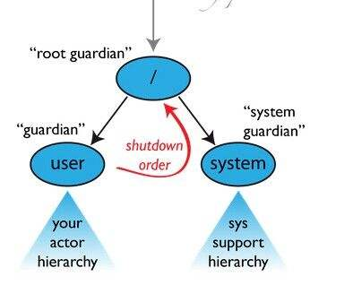

Actor组件
================================================================================
## 1.Akka中的Actor
在Akka中，消息在不同Actor之间进行传递和处理，以此来驱动任务的执行，这和普通OOP的调用方式有明显
的区别。

Actor也拥有 **线程安全** 和 **轻量级** 的特点：
+ **线程安全：Actor运行于线程池之上，但是几乎不用考虑它的安全性问题，因为单个Actor总是线程安全
的，并且本身在处理接收到的消息时是串行的**。
+ **轻量级**：在一个大型的应用中，可能同时运行着成千上万个Actor，这样会不会耗费太多资源？这点我
们大可放心，**在Akka中，每个Actor只占用300字节左右**，即使单机内存不够用了，我们也可以很方便地
切换成分布式模式。

## 2.ActorSystem与监管
**在一个应用中，所有的Actor共同构成了Actor系统，即ActorSystem**。它是一个 **层级结构**，该
结构已经限定了我们对某个Actor该施行怎样的管理策略，一般来讲，**我们所用的Actor都可能有一个显的
父级Actor（除了顶级Actor之外），它会处理所有自己子孙失败的情况，比较常见的场景是：当子Actor在
处理消息时出现了异常情况，父Actor可以通过匹配预先设定的某个动作来处理子Actor**，处理方式有：
**恢复子级、重启子级、停止子级、扩大化失败，这就是所谓的“父监督”模式**。

**那么父子关系是怎样定的呢**？很简单，**Actor被谁创建，谁就是父级**。实际上，**在ActorSystem
的创建过程中，会默认启动三个比较顶级的Actor，而我们应用程序里面创建的Actor只是其中的一个分支而已**。
如果所示：

从上图中我们看到，**`Root guardian`是整个ActorSystem的根，它下面有两个分支，左边的`/user`分
支是我们最常见到的，所有通过 `ActorSystem.actorOf()` 方法创建的Actor都属于该分支下，这是我们
能手动创建的最高级别Actor，其他通过 `ActorContext.actorOf()` 方法创建的Actor都是其子级（
ActorContext即Actor的上下文对象，所面会多次使用到），而右边的`/system`分支下的Actor都是系统层
面创建的，主要与系统整体行为有关，在开发阶段并不需要对其过多关注**。

dd
