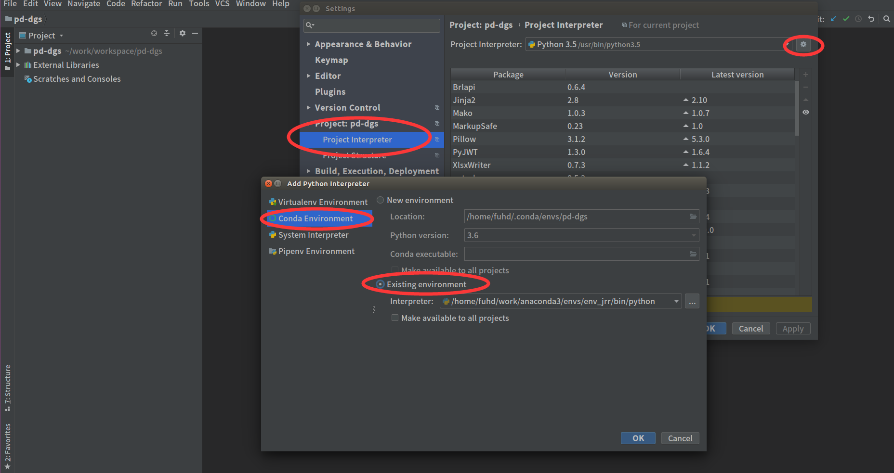

Pycharm中配置Anaconda
================================================================================
在工作环境中我们会集成开发环境去编码，这里推荐JB公司的pycharm，而pycharm也能很方便的和anaconda
的虚拟环境结合。在 **File => Setting => Project:xxxx => Project Interpreter** 里面修改
`Project Interpreter`，点击齿轮标志，再点击`Add Local`，再选择某个环境的python.exe解释器即可。

## 1.在Ubuntu上安装Anaconda3
见另一篇blog，略。

## 2.工具包升级
```shell
conda upgrade --all
```

## 3.创建一个新环境
比如创建环境名称为：**env_jrr** ：
```shell
conda create -n env_jrr python=3.6
```
在 **$anaconda/envs** 目录下会多出一个`env_jrr`子目录，这就是创建的新环境。注：这里我选择使
用python3.6的版本。

## 4.设置anaconda与pycharm连接


