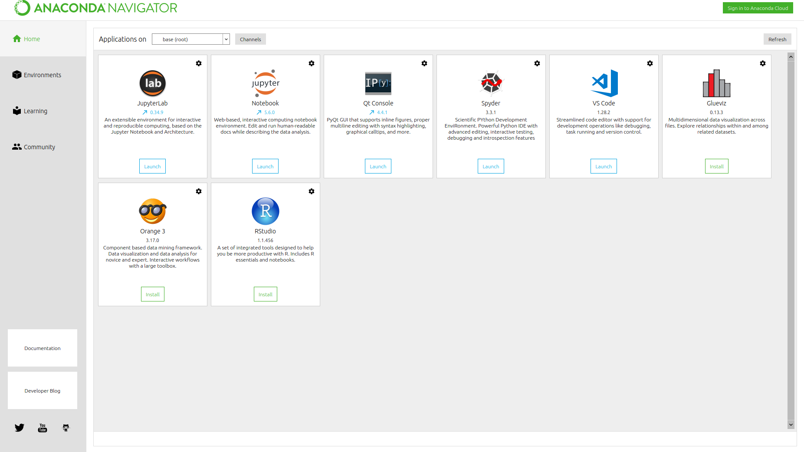

Ubuntu16.04上安装Anaconda3
================================================================================
## 什么是Anaconda
Anaconda是集成了各种Python数据科学计算包的项目，免去开发者手工配置各种依赖包的麻烦。

## 下载
安装包可以从 [Anaconda官网](https://www.anaconda.com/download/#linux) 下载，目前提供了
基于Python2.7和Python3.7版本的安装包。然而国内的网络环境从官网链接下载奇慢无比，推荐从国内的开
源镜像站下载，如 [清华大学开源软件镜像站](https://mirrors.tuna.tsinghua.edu.cn/) ，这里我
选择下载 **Anaconda3-5.3.0-Linux-x86_64.sh**。

## 安装
直接按照 [官方指南](http://docs.anaconda.com/anaconda/install/linux/) 操作即可。
```shell
sudo bash Anaconda3-5.3.0-Linux-x86_64.sh
```
在安装包所在目录执行命令，按 `Enter` 继续，由于我需要安装在 `/opt` 目录，所以加上了 `sudo`。
```
[sudo] fuhd 的密码：

Welcome to Anaconda3 5.3.0

In order to continue the installation process, please review the license
agreement.
Please, press ENTER to continue
>>>
```
接下来提示一些授权信息，输入`yes`。
```
Do you accept the license terms? [yes|no]
[no] >>>
```
继续：
```
Anaconda3 will now be installed into this location:
/home/fuhd/anaconda3

  - Press ENTER to confirm the location
  - Press CTRL-C to abort the installation
  - Or specify a different location below

[/home/fuhd/anaconda3] >>> /opt/anaconda3
```
在`>>>`之后输入一个其它位置，**这里我们把Anaconda3安装在/opt目录下**。

然后稍等一会，**提示是否要将Anaconda的安装路径添加到PATH环境变量中，输入yes就好了**。
```
......
installing: statsmodels-0.9.0-py37h035aef0_0 ...
installing: blaze-0.11.3-py37_0 ...
installing: seaborn-0.9.0-py37_0 ...
installing: anaconda-5.3.0-py37_0 ...
installation finished.
Do you wish the installer to initialize Anaconda3
in your /home/fuhd/.bashrc ? [yes|no]
[no] >>> yes
```
接下来是否安装VScode，这里我们选择`no`：
```
Initializing Anaconda3 in /home/fuhd/.bashrc
A backup will be made to: /home/fuhd/.bashrc-anaconda3.bak


For this change to become active, you have to open a new terminal.

Thank you for installing Anaconda3!

===========================================================================

Anaconda is partnered with Microsoft! Microsoft VSCode is a streamlined
code editor with support for development operations like debugging, task
running and version control.

To install Visual Studio Code, you will need:
  - Administrator Privileges
  - Internet connectivity

Visual Studio Code License: https://code.visualstudio.com/license

Do you wish to proceed with the installation of Microsoft VSCode? [yes|no]
>>> no
```
至此，Anaconda就安装好了。

## 使用
**打开一个新终端**，启动Python，发现已经替换成 **Anaconda的Python** 了。
```shell
$ python
```
```
Python 3.7.0 (default, Jun 28 2018, 13:15:42)
[GCC 7.2.0] :: Anaconda, Inc. on linux
Type "help", "copyright", "credits" or "license" for more information.
>>>
```

### 添加Anaconda镜像（清华大学的镜像站）
因为Anaconda的服务器在国外，更新非常慢，不过清华大学提供了镜像站，所以我们可以添加清华大学的镜像
站作为第一搜索渠道。
```shell
conda config --add channels 'https://mirrors.tuna.tsinghua.edu.cn/anaconda/pkgs/free/'
conda config --set show_channel_urls yes
```

### Anaconda自带工具
```shell
$ anaconda-navigator
```



可参考官方的 
页面进一步探索如何使用Anaconda。
