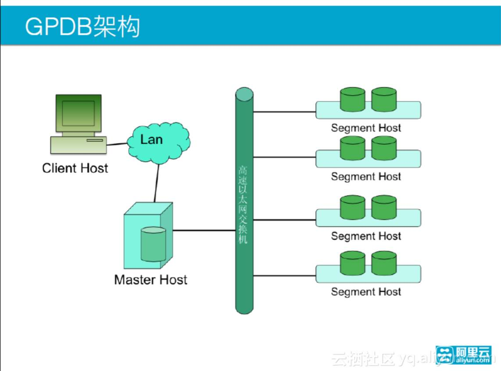
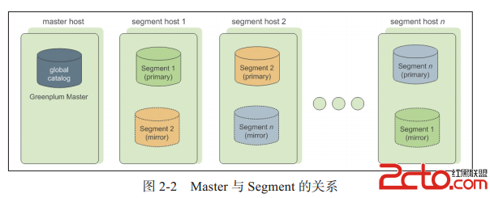

软件安装及数据库初始化（未完成）
================================================================================
## 1.Greenplum架构
在安装数据库的时候，我们先要对Greenplum架构有一定的了解，这样可以对数据库的安装和使用起到一个
指导性的作用。

Greenplum总架构图如下：



下面介绍每个部件的主要功能：

+ **Master主机负责**
  - 建立与客户端的会话连接和管理
  - SQL的解析并形成分布式的执行计划
  - 将生成好的执行计划分发到每个Segment上执行
  - 收集Segment的执行结果
  - Master不存储业务数据，只存储数据字典
  - Master主机可以一主一备，分布在两台机器上
  - 为了提高性能，Master最好单独占用一台机器
+ **Segment主机负责**
  - 业务数据的存储和存取
  - 执行由Master分发的SQL语句
  - 对于Master来说，每个Segment都是对等的，负责对应数据的存储和计算
  - 每一台机器上可以配置一到多个Segment
  - 由于每个Segment都是对等的，建议采用相同的机器
  - Segment分primary和mirror两种，一般交错地存放在子节点上

通过下图可以看出Master与Segment的关系：



**Master和Segment其实都是一个单独的PostgreSQL数据库。每一个都有自己单独的一套元数据字典，在
这里，Master节点一般也叫主节点，Segment也叫做数据节点**。

**Segment节点与Master节点的通信，通过千兆（或万兆）网卡组成的内部连接，在同一台数据节点机器上可
以放多个Segment，不同的Segment节点会被赋予不同的端口，同时，Segment之间也不断地进行着交互。为
了实现高可用，每个Segment都有对应的备节点（mirror Segment），分别存在于不同的机器上**。

**Client一般只能与Master节点进行交互，Client将SQL发给Master，然后Master对SQL进行分析后，再
将其分配给所有的Segment进行操作，并且将汇总结果返回给客户端**。

## 2.环境搭建

### 2.1.Greenplum集群介绍
在这里的Greenplum集群中，有4台机器，IP分别是：
+ 10.20.151.101
+ 10.20.151.102
+ 10.20.151.103
+ 10.20.151.104

机器对应的Master和Segment如下分配：10.20.151.101作为Master节点，10.20.151.102~10.20.151.104
作为Segment节点，每个机器上配置两个Primary Segment和两个Mirror Segment；同时10.20.151.104
作为Master Standy节点。

通过如下的架构图可以清晰地知道我们所搭建的集群的概况。


### 2.2.安装Linux
**Greenplum没有Windows版本，只能安装在类Unix的操作系统上**，例如：
+ SUSE Linux SLES 10.2 or higher;
+ CentOS 5.0 or higher;
+ Redhat Enterprise Linux 5.0 or highter;
+ Solaris x86 v10 update7;
如果读者没有现成的Linux机器，可以在虚拟机（VMWare）上安装，用户可自行安装VMWare及对应的Linux
操作系统，网上相应的资料很多。

### 2.3.数据库存储
**对于数据库来说，在性能上磁盘IO很容易成为瓶颈**，由于数据库的特性，每一个SQL基本都是对全表数据
进行分析，每次处理的数据量非常大，数据基本上都是没有缓存的（数字字典除外），极度消耗IO资源（全表
扫描主要都是顺序IO），所以 **Greenplum对存储的要求比较高。在文件系统的选择上，在Linux上建议使
用XFS，在Solaris下建议使用ZFS，对于Raid根据需求选择硬Raid或软Raid，如果需要更大的空间，建议使
用Raid5，如果对性能有更高要求，可以选择Raid 1+0**。

如果只是想试用Greenplum，数据量比较小，那么怎么存储无所谓，可以用任意的目录作为数据库数据目录。

### 2.4.网络（hosts）
在确定机器配置的时候，要保证所有机器的网络都是通的，**并且每台机器的防火墙都是关闭的**，避免存在
网络不通的问题。

在配置`/etc/hosts`时，习惯将Master机器叫做`mdw`，将Segment机器叫做`sdw`，配置好后，使用`ping`
命令确定所有`hostname`都是通的。
```shell
cat /etc/hosts
```
```
#BEGIN_GROUP_CUSTOMER
127.0.0.1 localhost localhost.localdomain
10.20.151.101 dw-greenplum-1 mdw
10.20.151.102 dw-greenplum-2 sdw1
10.20.151.103 dw-greenplum-3 sdw2
10.20.151.104 dw-greenplum-4 sdw3
#END_GROUP_CUSTOMER
```

### 2.5.创建用户及用户组
创建`gpadmin`用户及用户组，将其作为安装Greenplum的操作系统用户。

**将原有用户删除**：
```shell
groupdel gpadmin
userdel gpadmin
```
**创建新的用户和用户组**：
```shell
groupadd -g 530 gpadmin
useradd -g 530 -u 530 -m -d /home/gpadmin -s /bin/bash gpadmin
```
**对文件夹进行赋权，为新用户创建密码**：
```shell
#目录授权
chown -R gpadmin:gpadmin /home/gpadmin/
#修改密码
passwd gpadmin
```
```
Changing password for user gpadmin.
New UNIX password:
Retype new UNIX password:
```

## 3.Greenplum安装
Greenplum的官网：https://greenplum.org/ ，我们可以从
[这里](https://github.com/greenplum-db/gpdb/releases) 下载最新版本的Greenplum（源代码）。


......后续......


## 4.创建数据库
现在我们开始 **创建测试数据库**：
```shell
$ createdb testDB -E utf-8
```
**没有设置`PGDATABASE`这个环境变量时，使用`psql`进行登录，默认的数据库是与操作系统用户名一致的，
这时候会报错**：
```shell
$ psql
psql: FATAL:  database "fuhd" does not exist
```
**然后设置（`export`）环境变量`PGDATABASE=testDB`，这样就默认登录testDB数据库**：
```shell
$ export PGDATABASE=testDB
$ psql
psql (8.3.23)
Type "help" for help.

testDB=#
```
**查询数据库版本并创建一张简单的表**：
```sql
select version();
                                                                                               version                                                                                                
------------------------------------------------------------------------------------------------------------------------------------------------------------------------------------------------------
 PostgreSQL 8.3.23 (Greenplum Database 5.15.0 build 1fb2325-oss) on x86_64-pc-linux-gnu, compiled by GCC gcc (Ubuntu 5.4.0-6ubuntu1~16.04.10) 5.4.0 20160609, 64-bit compiled on Dec  5 2018 23:17:59
(1 row)

testDB=#
```
```sql
create table test01(id int primary key,name varchar(128));
```
```
NOTICE:  CREATE TABLE / PRIMARY KEY will create implicit index "test01_pkey" for table "test01"
CREATE TABLE
testDB=#
```

## 5.数据库启动与关闭


dd
