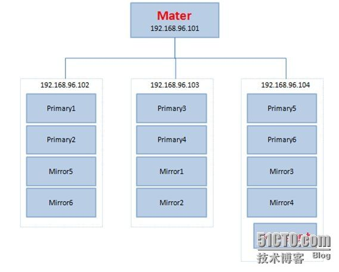

软件安装及数据库初始化
================================================================================
## 1.Greenplum架构
在安装数据库的时候，我们先要对Greenplum架构有一定的了解，这样可以对数据库的安装和使用起到一个
指导性的作用。

Greenplum总架构图如下：

下面介绍每个部件的主要功能：

+ **Master主机负责**
  - 建立与客户端的会话连接和管理
  - SQL的解析并形成分布式的执行计划
  - 将生成好的执行计划分发到每个Segment上执行
  - 收集Segment的执行结果
  - Master不存储业务数据，只存储数据字典
  - Master主机可以一主一备，分布在两台机器上
  - 为了提高性能，Master最好单独占用一台机器
+ **Segment主机负责**
  - 业务数据的存储和存取
  - 执行由Master分发的SQL语句
  - 对于Master来说，每个Segment都是对等的，负责对应数据的存储和计算
  - 每一台机器上可以配置一到多个Segment
  - 由于每个Segment都是对等的，建议采用相同的机器
  - Segment分primary和mirror两种，一般交错地存放在子节点上

通过下图可以看出Master与Segment的关系：

**Master和Segment其实都是一个单独的PostgreSQL数据库。每一个都有自己单独的一套元数据字典，在
这里，Master节点一般也叫主节点，Segment也叫做数据节点**。

**Segment节点与Master节点的通信，通过千兆（或万兆）网卡组成的内部连接，在同一台数据节点机器上可
以放多个Segment，不同的Segment节点会被赋予不同的端口，同时，Segment之间也不断地进行着交互。为
了实现高可用，每个Segment都有对应的备节点（mirror Segment），分别存在于不同的机器上**。

**Client一般只能与Master节点进行交互，Client将SQL发给Master，然后Master对SQL进行分析后，再
将其分配给所有的Segment进行操作，并且将汇总结果返回给客户端**。

## 2.环境搭建

### 2.1.Greenplum集群介绍
在这里的Greenplum集群中，有4台机器，IP分别是：
+ 10.20.151.101
+ 10.20.151.102
+ 10.20.151.103
+ 10.20.151.104

机器对应的Master和Segment如下分配：10.20.151.101作为Master节点，10.20.151.102~10.20.151.104
作为Segment节点，每个机器上配置两个Primary Segment和两个Mirror Segment；同时10.20.151.104
作为Master Standy节点。

通过如下的架构图可以清晰地知道我们所搭建的集群的概况。

dd
