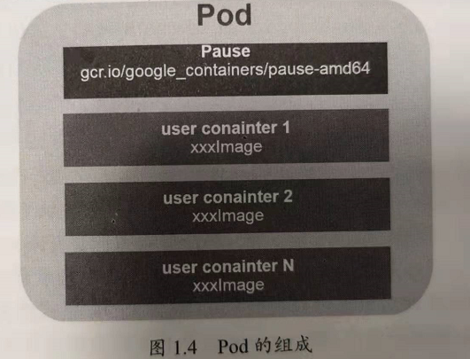
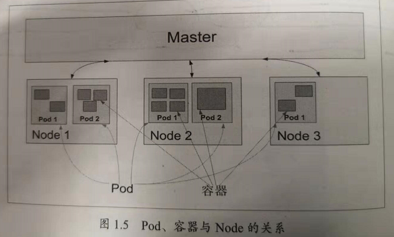

Kubernetes基本概念和术语之Pod
================================================================================
**Pod** 是Kubernetes的最重要也最基本的概念，如下图所示是Pod的组成示意图，我们看到 **每个Pod
都有一个特殊的被称为“根容器”的Pause容器。Pause容器对应的镜像属于Kubernetes平台的一部分**，除
了Pause容器，**每个Pod还包含一个或多个紧密相关的用户业务容器**。



为什么Kubernetes会设计出一个全新的Pod的概念并且Pod有这样特殊的组成结构？
+ **原因之一：在一组容器作为一个单元的情况下，我们难以对“整体”简单地进行判断及有效地进行行动**。
比如，一个容器死亡了，此时算是整体死亡么？是N/M的死亡率么？**引入业务无关并且不易死亡的Pause容
器作为Pod的根容器，以它的状态代表整个容器组的状态，就简单、巧妙地解决了这个难题**。
+ **原因之二：Pod里的多个业务容器共享Pause容器的IP，共享Pause容器挂接的Volume，这样既简化了
密切关联的业务容器之间的通信问题，也很好地解决了它们之间的文件共享问题**。

**Kubernetes为每个Pod都分配了唯一的IP地址，称之为Pod IP，一个Pod里的多个容器共享Pod IP地址。
Kubernetes要求底层网络支持集群内任意两个Pod之间的TCP/IP直接通信，这通常采用虚拟二层网络技术来
实现**，例如`Flannel`、`Open vSwitch`等，因此我们需要牢记一点：**在Kubernetes里，一个Pod
里的容器与另外主机上的Pod容器能够直接通信**。

Pod其实有两种类型：**普通的Pod** 及 **静态Pod**（`Static Pod`），**后者比较特殊，它并不存放
在Kubernetes的etcd存储里，而是存放在某个具体的Node上的一个具体文件中，并且只在此Node上启动运
行。而普通的Pod一旦被创建，就会被放入到etcd中存储，随后会被Kubernetes Master调度到某个具体的
Node上并进行绑定（`Binding`），随后该Pod被对应的Node上的kubelet进程实例化成一组相关的Docker
容器并启动起来**。

Pod、容器与Node的关系如下图：



**Kubernetes里的所有资源对象都可以采用yaml或者JSON格式的文件来定义或描述**，下面是我们在之前
`Hello World`例子里用到的`myweb`这个Pod的资源定义文件：
```yaml
apiVersion: v1
kind: Pod
metadata:
  name: myweb
  labels:
    name: myweb
  spec:
    containers:
    - name: myweb
      image: kubeguide/tomcat-app:v1
      ports:
      - containerPort: 8080
      env:
      - name: MYSQL_SERVICE_HOST
        value: 'mysql'
      - name: MYSQL_SERVICE_PORT
        value: '3306'
```
**Kind为Pod表明这是一个Pod的定义，metadata里的name属性为Pod的名字，metadata里还能定义资源
对象的标签（Label），这里声明myweb拥有一个`name=myweb`的标签（Label）。Pod里所包含的容器组
的定义则在spec一节中声明，这里定义了一个名字为myweb，对应镜像为`kubeguide/tomcat-app:v1`的
容器，该容器注入了名为MYSQL_SERVICE_HOST='mysql'和MYSQL_SERVICE_PORT='3306'的环境变量
（env关键字），并且在8080端口（containerPort）上启动容器进程。Pod的IP加上这里的容器端口（
containerPort），就组成了一个新的概念————Endpoint，它代表着此Pod里的一个服务进程的对外通信
地址。一个Pod也存在着具有多个Endpoint的情况，比如当我们把Tomcat定义为一个Pod时，可以地外暴露
管理端口与服务端口这两个Endpoint**。

我们所熟悉的Docker Volume在Kubernetes里也有对应的概念————**Pod Volume**，后者有一些扩展，
比如 **可以用分布式文件系统GlusterFS实现后端存储功能；Pod Volume是定义在Pod之上，然后被各个
容器挂载到自己的文件系统中的**。

这里顺便提一下 **Kubernetes的Event概念**，Event是一个事件的记录，记录了事件的最早产生时间、
最后重现时间、重复次数、发起者、类型，**以及导致此事件的原因等众多信息。Event通常会关联到某个具
体的资源对象上，是排故障的重要参考信息**，之前我们看到 **Node的描述信息包括了Event，而Pod同样
有Event记录**，当我们发现某个Pod迟迟无法创建时，可以用`kubectl describe pod xxx`来查看它的
描述信息，用来定位问题的原因。

**每个Pod都可以对其能使用的服务器上的计算资源设置限额**，当前可以设置限额的计算资源有 **CPU**
与 **Memory** 两种，其中 **CPU的资源单位为CPU（`Core`）的数量**，是一个 **绝对值** 而非相
对值。

一个CPU的配额对于绝大多数容器来说是相当大的一个资源配额了。所以，在Kubernetes里，通常以千分之一
的CPU配额为最小单位，用`m`来表示。通常一个容器的CPU配额被定义为`100m~300m`，即占用0.1~0.3个
CPU。由于CPU配额是一个绝对值，所以无论在拥有一个Core的机器上，还是在拥有48个Core的机器上，100m
这个配额所代表的CPU的使用量都是一样的。


dd
