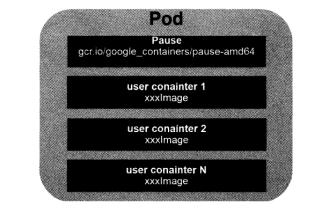
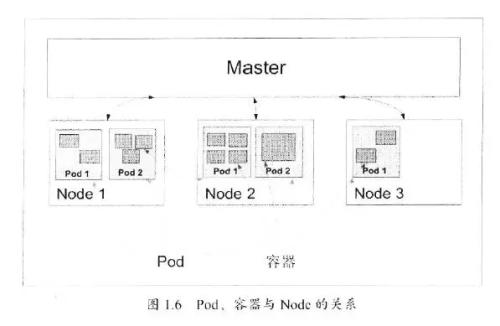

Kubernetes基本概念和术语之Pod
================================================================================
**Pod** 是Kubernetes的最重要也最基本的概念，如下图所示是Pod的组成示意图，我们看到 **每个Pod
都有一个特殊的被称为“根容器”的Pause容器。Pause容器对应的镜像属于Kubernetes平台的一部分**，除
了Pause容器，**每个Pod还包含一个或多个紧密相关的用户业务容器**。

为什么Kubernetes会设计出一个全新的Pod的概念并且Pod有这样特殊的组成结构？
+ **原因之一：在一组容器作为一个单元的情况下，我们难以对“整体”简单地进行判断及有效地进行行动**。
比如，一个容器死亡了，此时算是整体死亡么？是N/M的死亡率么？**引入业务无关并且不易死亡的Pause容
器作为Pod的根容器，以它的状态代表整个容器组的状态，就简单、巧妙地解决了这个难题**。
+ **原因之二：Pod里的多个业务容器共享Pause容器的IP，共享Pause容器挂接的Volume，这样既简化了
密切关联的业务容器之间的通信问题，也很好地解决了它们之间的文件共享问题**。

**Kubernetes为每个Pod都分配了唯一的IP地址，称之为Pod IP，一个Pod里的多个容器共享Pod IP地址。
Kubernetes要求底层网络支持集群内任意两个Pod之间的TCP/IP直接通信，这通常采用虚拟二层网络技术来
实现**，例如`Flannel`、`Open vSwitch`等，因此我们需要牢记一点：**在Kubernetes里，一个Pod
里的容器与另外主机上的Pod容器能够直接通信**。

Pod其实有两种类型：**普通的Pod** 及 **静态Pod**（`Static Pod`），**后者比较特殊，它并不存放
在Kubernetes的etcd存储里，而是存放在某个具体的Node上的一个具体文件中，并且只在此Node上启动运
行。而普通的Pod一旦被创建，就会被放入到etcd中存储，随后会被Kubernetes Master调度到某个具体的
Node上并进行绑定（`Binding`），随后该Pod被对应的Node上的kubelet进程实例化成一组相关的Docker
容器并启动起来**。

Pod、容器与Node的关系如下图：

dd
