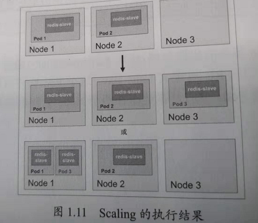

Kubernetes基本概念和术语之Replication Controller
================================================================================
**RC** 是Kubernetes系统中的核心概念之一，简单来说，它其实是定义了一个期望的场景，**即声明某种
Pod的副本数量在任意时刻都符合某个预期值**，所以RC的定义包括如下几个部分：
+ **Pod期待的副本数（replicas）**。
+ **用于筛选目标Pod的Label Selector**。
+ **当Pod的副本数量小于预期数量时，用于创建新Pod的Pod模板（template）**

下面是一个完整的RC定义的例子，即确保拥有`tier=frontend`标签的这个Pod（运行Tomcat容器）在整个
Kubernetes集群中始终只有一个副本：
```yaml
apiVersion: v1
kind: ReplicationController
metadata:
  name: frontend
spec:
  replicas: 1
  selector:
    tier: frontend
  template:
    metadata:
      labels:
        app: app-demo
        tier: frontend
    spec:
      containers:
      - name: tomcat-demo
        image: tomcat
        imagePullPolicy: IfNotPresent
        env:
        - name: GET_HOSTS_FROM
          value: dns
        ports:
        - containerPort: 80
```
**当我们定义了一个RC并提交到Kubernetes集群中以后，Master节点上的Controller Manager组件就得
到通知，定期巡检系统中当前存活的目标Pod，并确保目标Pod实例的数量刚好等于此RC的期望值，如果有过多
的Pod副本在运行，系统就会停掉一些Pod，否则系统就会再自动创建一些Pod**。可以说，通过RC，Kubernetes
实现了用户应用集群的高可用性，并且大大减少了系统管理员在传统IT环境中需要完成的许多手工运维工作（
如主机监控脚本、应用监控脚本、故障恢复脚本等）。

下面我们 **以3个Node节点的集群为例，说明Kubernetes如何通过RC来实现Pod副本数量自动控制的机制**。
假如我们的RC里定义`redis-slave`这个Pod需要保持两个副本，系统将可能在其中的两个Node上创建Pod。
下图描述了在两个Node上创建`redis-slave` Pod的情形。


假设Node2上的Pod2意外终止，根据RC定义的replicas数量2，Kubernetes将会自动创建并启动一个新的
Pod，以保证整个集群中始终有两个`redis-slave` Pod在运行。

下图所示，系统可能选择Node3或者Node1来创建一个新的Pod。


此外，**在运行时，我们可以通过修改RC的副本数量，来实现Pod的动态缩放（`Scaling`）功能**，这可以
通过执行`kubectl scale`命令来一键完成：
```shell
kubectl scale rc redis-slave --replicas=3
```
Scaling的执行结果如下图：



**需要注意的是，删除RC并不会影响通过该RC已创建好的Pod。为了删除所有Pod，可以设置replicas的值
为0，然后更新该RC。另外，kubectl提供了stop和delete命令来一次性删除RC和RC控制的全部Pod**。

当我们的应用升级时，通常会通过Build一个新的Docker镜像，并用新的镜像版本替代旧的版本的方式达到目
的。**在系统升级的过程中，我们希望是平滑的方式，比如当前系统中10个对应的旧版本的Pod，最佳的方式
是旧版本的Pod每次停止一个，同时创建一个新版本的Pod，在整个升级过程中，此消彼长，而运行中的Pod数
量始终是10个，几分钟以后，当所有的Pod都已经是新版本时，升级过程完成**。通过RC的机制，Kubernetes
很容易就实现了这种高级实用的特性，被称为“**滚动升级**”（`Rolling Update`），具体的操作方法详
见第4章。

由于`Replication Controller`与Kubernetes代码中的模块`Replication Controller`同名，同
时这个词也无法准确表达它的本意，所以在 **Kubernetes v1.2** 时，它就升级成了另外一个新的概念——
**Replica Set**，官方解释为“**下一代的RC**”，**它与RC当前存在的唯一区别是：Replica Sets支
持基于集合的Label Selector，而RC只支持基于等式的Label Selector，这使得Replica Set的功能更
强**，下面是等价于之前RC例子的Replica Set的定义（省去了Pod模板部分的内容）：
```yaml
apiVersion: extensions/v1beta1
kind: ReplicaSet
metadata:
  name: frontend
spec:
  selector:
    matchLabels:
      tier: frontend
    matchExpressions:
    - {key: tier, operator: In, values: [frontend]}
  template:
    ......
```


dd
