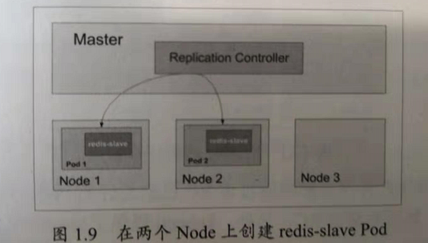
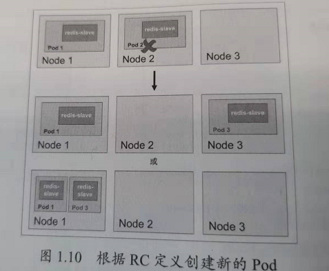

Kubernetes基本概念和术语之Replication Controller
================================================================================
**RC** 是Kubernetes系统中的核心概念之一，简单来说，它其实是定义了一个期望的场景，**即声明某种
Pod的副本数量在任意时刻都符合某个预期值**，所以RC的定义包括如下几个部分：
+ **Pod期待的副本数（replicas）**。
+ **用于筛选目标Pod的Label Selector**。
+ **当Pod的副本数量小于预期数量时，用于创建新Pod的Pod模板（template）**

下面是一个完整的RC定义的例子，即确保拥有`tier=frontend`标签的这个Pod（运行Tomcat容器）在整个
Kubernetes集群中始终只有一个副本：
```yaml
apiVersion: v1
kind: ReplicationController
metadata:
  name: frontend
spec:
  replicas: 1
  selector:
    tier: frontend
  template:
    metadata:
      labels:
        app: app-demo
        tier: frontend
    spec:
      containers:
      - name: tomcat-demo
        image: tomcat
        imagePullPolicy: IfNotPresent
        env:
        - name: GET_HOSTS_FROM
          value: dns
        ports:
        - containerPort: 80
```
**当我们定义了一个RC并提交到Kubernetes集群中以后，Master节点上的Controller Manager组件就得
到通知，定期巡检系统中当前存活的目标Pod，并确保目标Pod实例的数量刚好等于此RC的期望值，如果有过多
的Pod副本在运行，系统就会停掉一些Pod，否则系统就会再自动创建一些Pod**。可以说，通过RC，Kubernetes
实现了用户应用集群的高可用性，并且大大减少了系统管理员在传统IT环境中需要完成的许多手工运维工作（
如主机监控脚本、应用监控脚本、故障恢复脚本等）。

下面我们 **以3个Node节点的集群为例，说明Kubernetes如何通过RC来实现Pod副本数量自动控制的机制**。
假如我们的RC里定义`redis-slave`这个Pod需要保持两个副本，系统将可能在其中的两个Node上创建Pod。
下图描述了在两个Node上创建`redis-slave` Pod的情形。



假设Node2上的Pod2意外终止，根据RC定义的replicas数量2，Kubernetes将会自动创建并启动一个新的
Pod，以保证整个集群中始终有两个`redis-slave` Pod在运行。

下图所示，系统可能选择Node3或者Node1来创建一个新的Pod。



此外，**在运行时，我们可以通过修改RC的副本数量，来实现Pod的动态缩放（`Scaling`）功能**，这可以
通过执行`kubectl scale`命令来一键完成：
```shell
kubectl scale rc redis-slave --replicas=3
```
```
scaled
```


dd
