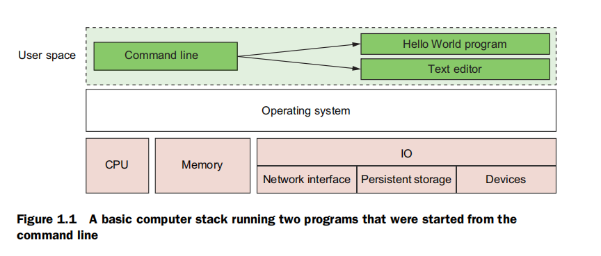

什么是Docker
===================================================================================
2013年3月推出的Docker，**可以和操作系统协作来打包、分发和运行软件**。你可以把Docker作为软件分发供
应商，用来节省你的时间，让你专注于高价值的事情。你可以使用Docker构建网络应用，如Web服务器、数据库
和邮件服务器，也可以构建终端应用程序，比如文本编辑器、编译器、网络分析工具和脚本；在某些情况下，它
甚至可用来运行GUI程序，如网页浏览器和生产力类的软件。

Docker不是一种编程语言，并且也不是构建软件的框架。Docker是一个工具，可以帮助解决如安装、拆卸、升级、
分发、信任和管理软件等常见问题。

**Docker包括一个命令行程序、一个后台守护进程，以及一组远程服务。它解决了常见的软件问题，并简化了安
装、运行、发布和删除软件。这一切能够实现是通过使用一项UNIX技术，称为容器**。

## 1. 容器
从历史上看，**UNIX风格的操作系统都使用jail这个术语来形容一个修改过的运行时环境，以防止该程序访问受
保护的资源**。自2005年以来，Sun的 **Solaris 10** 和 **Solaris容器** 发布后，**容器已经成为这样一个运
行环境的首选术语，已经从防止对受保护资源的访问，扩展到隔离所有的资源**，除非明确允许。

**使用容器已经是很长一段时间的最佳做法。但手动创建容器、仍然具有挑战性，而且很容易出错**。错误配置
的容器却让他人产生安全的错觉。**这个问题直到Docker的出现终于得到解决**。任何使用Docker运行的软件
其实是在一个容器内运行。Docker使用现有的容器引擎，根据最佳实践提供一致的Docker构建方案。这给大家带
来了触手可及且更强的安全性。

## 2. 容器不是虚拟化
在没有Docker的时代，商家通常使用硬件虚拟化（也称为 **虚拟机**），以 **提供隔离**，虚拟机提供虚拟的
硬件，可安装一个操作系统和其他程序。它们需要很长的时间（通常以分钟计）来创建，也需要显著的资源开销，
因为它们除了要执行你需要的软件，还得运行整个操作系统的副本。

不同于虚拟机，Docker容器不使用硬件虚拟化。**运行在Docker容器中的程序接口和主机的Linux内核直接打交
道。因为容器中运行的程序和计算机的操作系统之间没有额外的中间层，没有资源被冗余软件的运行或虚拟硬件
的模拟而浪费掉**。这是一个很重要的区别。

## 3. 在隔离的容器中运行软件
如上所述，容器已经存在了几十年。Docker使用的是 **2007年** 就已经成为Linux一部分的 **Linux命名空间** 
和 **cgroups**。**Docker并不提供容器技术，但它使得容器更易使用**。要了解系统中的容器长什么样子，
让我们先建立一条基准线。如下图：

