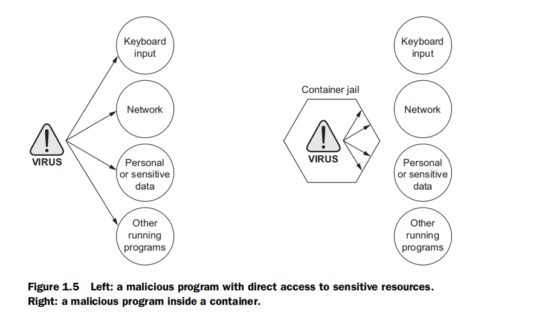

Docker解决了什么问题
===================================================================================
软件的安装是复杂的。安装之前，你必须考虑使用什么样的操作系统，软件需要的资源，其他已经安装的软件，
以及它们的依赖。你需要决定它应该被安装在哪个位置。然后，你需要知道如何安装。

大多数计算机都安装并运行着多个应用程序。大多数应用程序依赖于其他软件。当你想使用的两个或多个应用程
序不能在一起工作，会发生什么？这是一个灾难。简单的事实是：你使用的软件越多，则越难管理。

可能大多数问题在今天看来还是可以接受的。也许是因为你已经习惯了，觉得微不足道。但等你读到如何使用
Docker，使这些问题变得可以解决，很可能就会注意到自己观念开始转变。

## 1. 组织有序
如果没有Docker，一台机器运行完看起来就像一个装满垃圾的抽屉。应用程序有各种各样的依赖。今天，要是没
有Docker，应用遍布整个文件系统，并最终创建出一个相互影响的凌乱关系。如下图：

**Docker保留了通过容器和镜像进行隔离的所有一切**。如下图：

## 2. 提高可移植性
另一个软件的问题是：**应用程序的依赖关系通常包括特定的操作系统。操作系统之间的可移植性是软件用户的
一个主要问题**。虽然Linux软件和OS X之间可能有某种兼容性，但想在Windows上使用相同的软件则更加困难。
想这样做需要构建整个可移植的软件版本，即使是Window中存在合适的替代依赖。这将是该应用程序维护者的
主要开销，而且经常会被忽略。对于用户来说，不幸的是功能强大的软件整体移植太困难，或在他们的系统上根
本无法使用。

**目前，Docker可原生运行在Linux上，在OS X和Windows环境中通过单独的虚拟机也可运行**。在Linux上的
这种融合，意味着 **Docker容器运行该软件只需对一组依赖写一次即可**。

有些情况下，Docker比虚拟机更好，这也是对的，但 **二者其实是互补的技术**。使用虚拟机运行单个程序是浪
费的，尤其是当你在同一台计算机上运行多个虚拟机的时候。**在OS X和Windows上，Docker使用一个小而单一
的虚拟机来运行所有的容器。通过这种方法，运行虚拟机的开光彩是固定的，而且容器的数量可扩展**。

这种新的可移植性在几个方面有助于用户使用。**第一，它将软件以前无法使用的地方彻底解锁。第二，它可在
任何系统上运行相同的软件**。这意味着你的桌面、开发环境、公司的服务器，以及公司的云都可以运行相同的
程序。**运行一致的环境是非常重要的。这样做有助于最大限度地减少采有新技术的学习曲线**。它可以帮助软
件开发人员更好地了解将要运行的系统。**第三，软件维护人员可以集中精力在单一平台和一套依赖关系中编写
他们的软件，这节省了大量的时间**，对他们和他们的客户是一个伟大的胜利。

如果没有Docker或虚拟机，可移植性一般以单个程序为级别，通过一些常用的工具来实现。**而Docker改善了每
个程序的可移植性，无论它用什么语言编写，为什么操作系统而设计，或是在什么样的运行环境下**。

## 3. 保护你的机器
到目前为止，我所提到Docker的大多数情况，都是从软件工作的角度来看的，以及在容器外部这样做的好处。但
是 **Docker也会保护我们在容器内运行的软件**。软件程序可能有各种各样的情况，出现错误或带来安全风险：
+ 程序可能是由攻击者编写的。
+ 好心的开发人员也会编写出有害的错误程序。
+ 程序可能会意外地由于输入处理的故障，被攻击者利用。

无论何种方式，运行软件都将给计算机带来安全威胁。

像物理的牢房，**容器里的任何东西只能访问在它内部的东西。此规则有例外，但仅在用户显式创建时**。容器
限制了一个程序对某他程序带来的影响范围、可访问的数据和系统资源的影响范围。下图说明了 **容器内部运行
和外部运行软件的区别**：

这对你或者你的企业意味着 **受到安全威胁的范围仅限于所运行的特定应用程序本身**。要创建一个强大的应用
程序容器是复杂的，也是任何深度防御战略的重要组成。这实在太容易忽略，或很难尽心尽力。

