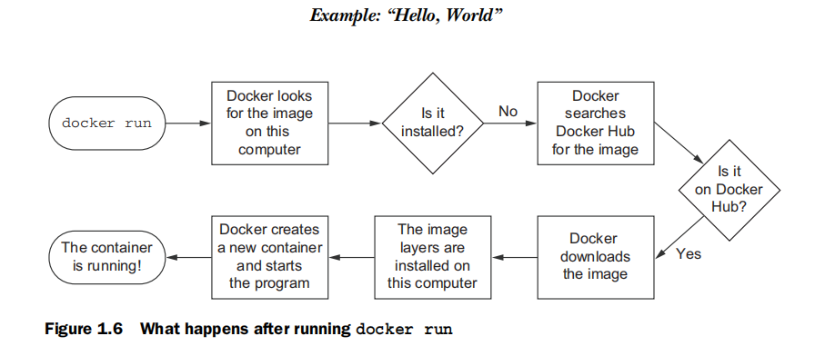

案例：“Hello World”
===================================================================================
按照惯例，我们将使用“Hello World”。在开始之前，**先下载并为系统安装Docker**。
https://docs.docker.com/install/ 上有针对每个可用系统且保持更新的详细说明。OS X和Windows用户需要
Docker工具箱来安装完整Docker套件。当你安装了Docker并连接网络，移到命令提示符，然后输入以下命令：
```shell
docker run dockerinaction/hello_world
```
```
提示：

Docker以系统root用户运行。在某些系统上，你需要使用sudo来执行Docker命令行工具。如果不这样做会导致权限错误。
```
在此之后，**Docker被激活。它会开始下载各种组件，并最终打印出“Hello World”**。再次运行时则只是打
印“Hello World”。在这个例子中做了好几个事情，命令本身有几个不同的部分。
+ 第一，**可以使用`docker run`命令来启动一个新容器**。这种单一的命令将触发安装、运行序列（如下图），
以及暂停在容器内的程序。

    

+ 第二，在容器中运行的程序是`dockerinaction/hello_world`。这就是所谓的 **仓库（或镜像）的名称**。现
在，**你可以把仓库的名称认为是安装或运行程序的名称**。
    ```
    注：该仓库和其他几个，是专门为了支持在本书中的示例而创建。
    ```
    **当你第一次下达命令时，Docker会先弄清楚dockeringaction/hello_world是否已经安装。如果无法找到，
    Docker将问询Docker Hub。Docker Hub是Docker公司提供的公共注册服务器。Docker Hub将会答复你的计
    算机上运行的Docker，dockeringaction/hello_world在哪里可以找到，然后Docker开始下载**。

    一旦安装完毕，Docker创建一个新的容器，并运行一个命令。在这种情况下，该命令是很简单的：
    ```shell
    echo "hello world"
    ```
    在命令输出“Hello World”到终端后，它将退出，容器自动停止。

    