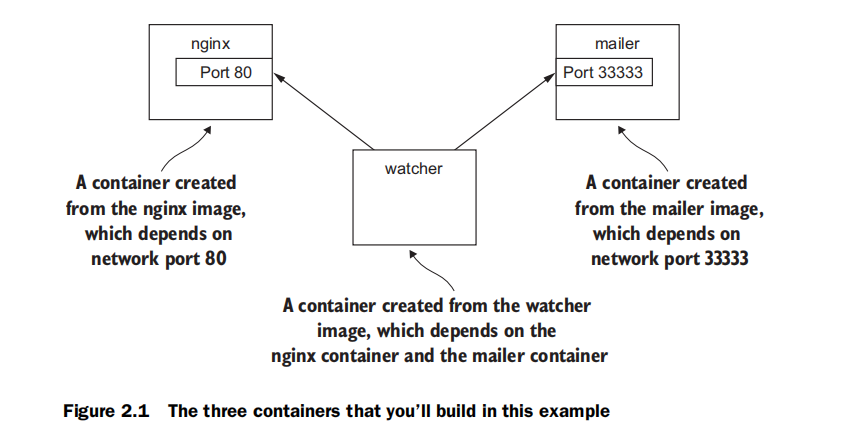

控制容器：建立一个网站的监控器
===================================================================================
假设一个新客户请你为他们打造一个新的网站——并受到相应的监控。这个特别的客户想要经营自己的业务，所
以他们会要你提供一个解决方案，可以通过电子邮件，告之他们的团队服务器宕机了。如图所示：



本例使用了三个容器，**第一个将运行NGINX，第二个将运行一个邮件程序**。这两个容器，都以 **守护** 的
方式运行。**守护意味着它们将在后台运行，而不连接到任何输入或输出流。第三个程序叫作监控器**，将在一
个 **交互的容器** 中运行。对于这个示例，邮件和监控器都是用少量脚本创建的。在本节中，你将学习如何做
到以下几点：
+ 创建守护式和交互式容器
+ 列出系统中的容器
+ 查看容器日志
+ 暂停并重新启动容器
+ 重新连接终端到容器
+ 分离已连接的容器

## 1. 创建和启动一个新的容器
当用Docker安装软件时，我们会说自己正在安装镜像。**安装镜像的方式不同，镜像来源也有几种**。本例中我
们要为NGINX **从Docker Hub下载和安装镜像**。请记住，**Docker Hub是Docker公司提供的公共注册服务
器**。里NGINX的镜像，来自Docker公司的一个受信仓库。一般情况下，发布该软件的个人或基金会控制该软件
的受信仓库。**运行以下命令将下载、安装并开始运行NGINX的容器**：
```shell
# --detach 守护标记
docker run --detach --name web nginx:latest
```
**运行此命令，Docker将从Docker Hub上的NGINX仓库下载、安装nginx:latest镜像，然后运行该软件**。在
Docker安装好并开始运行NGINX后，一行看似随机的字符串将被写入所述终端。看起来像这个样子：
```
dbcaea10dd7c8ba9374b2db523d599a49cb8dd132bf42a4059cb487061ea2891
```
**这串字符串是刚创建运行的NGINX容器的唯一标识符。每次你用`docker run`创建一个新的容器时，都会得到
一个类似的唯一标识符。用户常常捕获该输出，当作其他命令使用的变量**。标识显示出来之后，看不出发生了
什么事情。那是因为你 **使用了`--detach`选项，并在后台启动该程序**。这意味着，程序启动但不会附着到
终端。这是有道理的，之所以这样启动NGINX，是国为我们要运行几个不同的程序。

**运行守护式容器非常适合那些在后台静默运行的程序。这类程序被称守护程序。当你要在后台运行容器的守护
程序或其他程序，记得请使用`--detach`标志或其缩写形式，如：`-d`**。

你的客户需要的另一个守护程序是一个邮件程序。以下命令将安装并运行邮件程序：
```shell
# -d 启动守护容器
docker run -d --name mailer dockerinaction/ch2_mailer
```
**此命令使用`--detach`标志的缩写形式，启动了一个名为mailer的新容器**。此时，你已经运行两个命令和交
付了三分之二客户想要的系统。

## 2. 运行交互式容器
Docker命令行工具是一个很好的交互式终端程序示例。这类程序可能需要用户的输入或终端显示输出。**通过
Docker运行的交互式程序，你需要绑定部分终端到正在运行容器的输入或输出上**。

**开始使用交互式容器**，要运行以下命令：
```shell
# 创建虚拟终端并绑定标准输入  --interactive --tty
docker run --interactive --tty --link web:web --name web_test busybox:latest /bin/sh
```
该命令使用run命令的两个标志：**`--interactive`（或`-i`）和`--tty`（或`-t`）。首先，`--interactive`选项
告诉Docker保持标准输入流（`stdin`，标准输入）对容器开放，即使容器没有终端连接。其次，`--tty`选项告
诉Docker为容器分配一个虚拟终端，这将允许你发信号给容器**。这通常就是你想从交互式的命令行工具得到的。
当在交互式容器中运行程序，如shell，通常两种都会用到。

与交互式的标志同样重要的是，当你启动这个容器，得让程序在容器内运行起来。在这种情况下，运行一个叫作
sh的shell程序。这样就可以在容器内运行任何程序。

用交互式容器示例的命令创建一个容器，启动一个UNIX shell，命令被链接到运行NGINX的容器上。你可以在shell
上运行一个命令来验证Web服务器是否运行正常：
```shell
wget -O - http://web:80/
```
这个名为wget的程序，将一个HTTP请求发送到Web服务器，然后再终端上显示网页的内容。你可以继续 **输入
exit来关闭这个互动容器。这将终止shell程序，并停止该容器。如果要分离终端，你可以通过按住`ctrl`键，然
后按`p`键，接着按`q`键。只有使用了`--tty`选项，以上操作才会生效**。

为了完成客户的要求，你需要启动监控器。与过去的示例一样，将测试Web服务器，如果Web服务器停止，就要
通过邮件发送消息。此命令将使用缩略标志在交互式容器中启动监控器：
```shell
//-it 是创建虚拟终端并绑定标准输入
sudo docker run -it --name agent --link web:insideweb --link mailer:insidemailer dockerinaction/ch2_agent
```
运行之后，该容器将每秒测试web容器，并打印如下所示的消息：
```
System up.
```
**当你启动容器，并开始写“System up”并按住ctrl键，然后按p键，再按q键，之后就会返回到主机的shell。不
要停止程序，否则，监视器将停止检查Web服务器**。

虽然你会经常使用守护式容器来部署网络服务器，但交互式容器在桌面或服务器手动运行时非常有用。

### 3. 列举、停止、重新启动和查看容器输出
你需要测试当前设置的第一件事，**是通过`docker ps`运行命令检查哪些容器正在运行**：
```shell
docker ps
```
运行该命令会显示每个运行的容器中的以下信息：
+ **该容器ID**
+ **使用的镜像**
+ **容器中执行的命令**
+ **容器运行的时长**
+ **容器暴露的网络端口**
+ **容器名**

此时，你应该有三个正在运行的容器，名字分别是：`web`、`mailer`和`agent`。如果有任何缺失，程序可能
已被误停止。这不是一个问题，因为Docker有一个命令来重新启动容器。**接下来的三个命令使用容器名称重启
每个容器**。
```shell
docker restart web 
docker restart mailer 
docker restart agent 
```
现在所有三个容器都运行起来了，你需要测试的是，该系统操作是否正常。要做到这一点，最好的办法是 **检查
每个容器的日志**。在Web容器中输入：
```shell
docker logs web
```
会显示一个很长很长的日志，其中几行包含以下子串：
```
"GET / HTTP/1.0" 200 612 "-" "-" "-"
```
这意味着该Web服务器正在运行，并且监控器正在测试该站点。每个监控器测试网站时，这些内容将被写入到日
志中。docker log命令可以为这些问题带来帮助，不过依赖于此也是很危险的。该程序写入到标准输出或标准错
误输出流的所有内容都会被记录在此日志中。问题是，**日志从不轮转或截断，所以写入的日志将持久化保存、
持续增长，只要该容器还存在。长期持久性会成为长期进程的一个问题。一个更好的方式是，使用存储卷来处理
日志数据**，这将在第4章中讨论。


