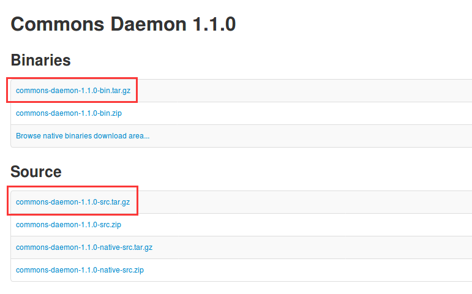

apache commons-daemon的使用
================================================================================
## 1.概述d
`Apache common deamon`是用来提供 **java服务** 的安装，**实现将一个普通的Java应用变成系统的
一个后台服务，在linux下部署为后台运行程序，在windows部署为windows服务**，commons daemon需要
自己写少许代码，即按规定要求编写程序启动及关闭的入口类，仅此而已。

## 2.linux下使用commons-daemon

### 2.1.下载commons-daemon
到[commons-daemon官网](http://commons.apache.org/proper/commons-daemon/download_daemon.cgi)下载，
其中需要下载 **commons-daemon主程序** 和 **jsvc包（源码包）**。如下图：



+ 下载 **commons-daemon-1.1.0-bin.tar.gz**，解压出 **commons-daemon-1.1.0.jar** 放
到程序目录中，以便使用。
+ 下载 **commons-daemon-1.1.0-src.tar.gz** 源码包，**此程序用于在linux下使用源码方式安装
jsvc**。（提醒：在官网的jsvc只讲解了如何安装及使用，源码需要在这里下载）。

### 2.2.安装jsvc
可先查看 [官网的jsvc](http://commons.apache.org/proper/commons-daemon/jsvc.html)，本
示例中安装如下，**把commons-daemon源码包放到/opt目录下**。操作如下：
```shell
$ cd /opt/jsvc/
$ sudo tar xzvf commons-daemon-1.1.0-src.tar.gz
$ cd /opt/jsvc/commons-daemon-1.1.0-src/src/native/unix/
$ sudo ./configure --with-java=/opt/jdk1.8.0_144
```
显示：
```
......
......
*** Writing output files ***
configure: creating ./config.status
config.status: creating Makefile
config.status: creating Makedefs
config.status: creating native/Makefile
*** All done ***
Now you can issue "make"
```
```shell
$ sudo make
```
说明:
> 确保linux上已安装java，安装需依赖java，如上述操作中: --with-java=/opt/jdk1.8.0_144
> make完后，会在commons-daemon-1.0.15-src/src/native/unix下生成jsvc文件


> 记住此jsvc路径，安装时使用

### 2.3.编写程序入口类
简单的打印日志程序：
```java
package com.fuhd;

import org.slf4j.Logger;
import org.slf4j.LoggerFactory;
import java.util.concurrent.TimeUnit;

public class Main {
    private static final Logger logger = LoggerFactory.getLogger(Main.class);
    public static void main(String[] args) throws Exception {
        int i = 1;
        while (true) {
            TimeUnit.SECONDS.sleep(2);
            logger.info("第 {} 次写日志！", i);
            i++;
        }
    }
}
```


dd
