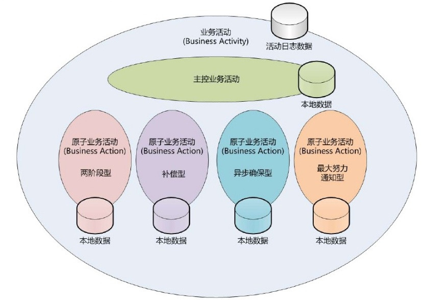
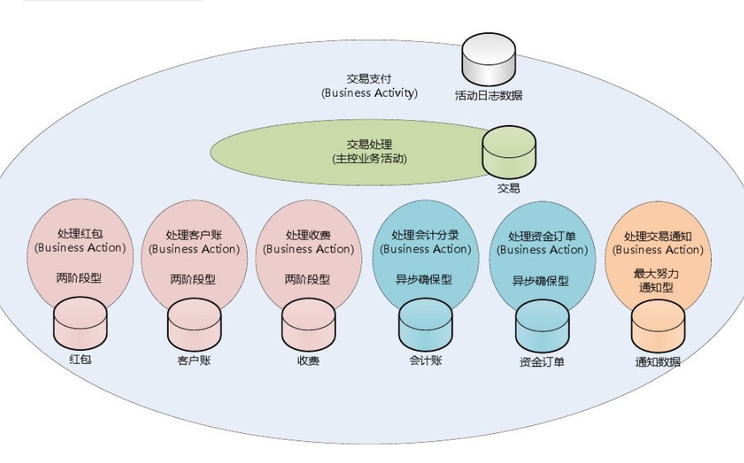

分布式事务的典型处理方式：2PC、TCC、异步确保和最大努力型
==========================================================================================
### 柔性事务和刚性事务
**柔性事务** 满足 **BASE** 理论（**基本可用，最终一致**）；**刚性事务** 满足 **ACID** 理论；

本文主要 **围绕分布式事务当中的柔性事务** 的处理方式进行讨论。

#### 柔性事务：业务活动

#### 柔性事务：业务活动举例

柔性事务分为：
1. **两阶段型**
2. **补偿型**
3. **异步确保型**
4. **最大努力通知型**

### 两阶段提交（`2PC`）型

