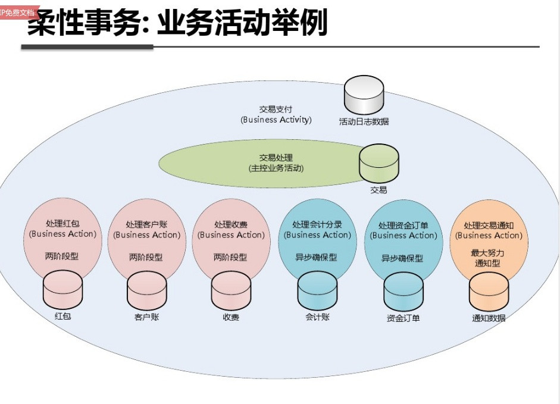
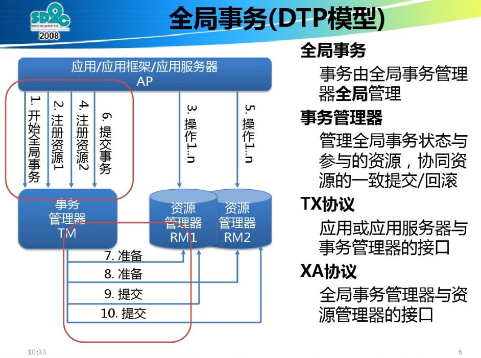
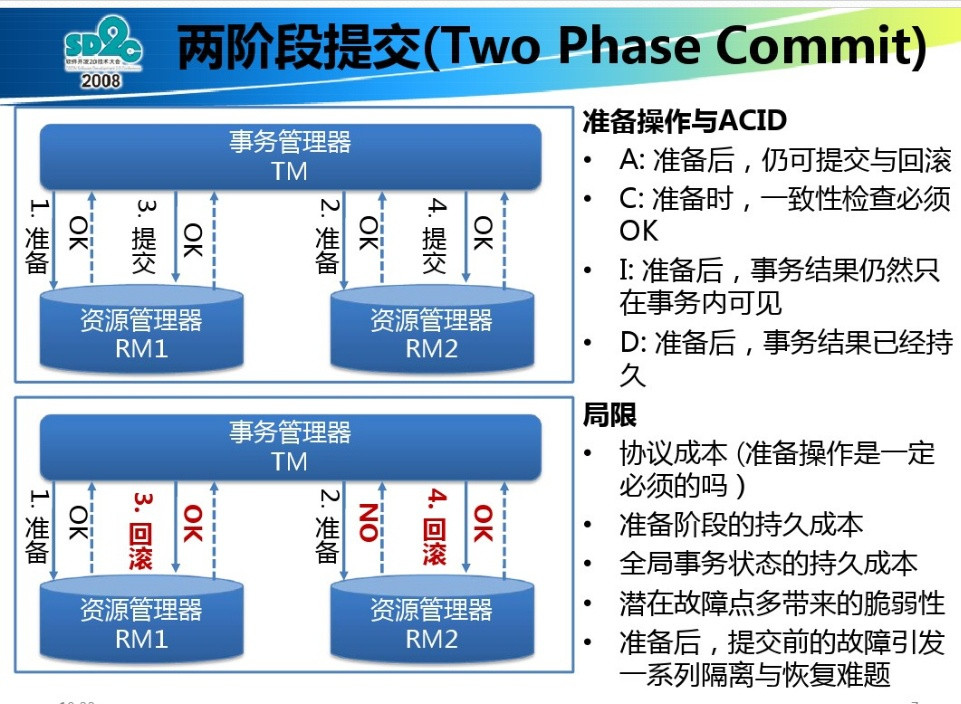
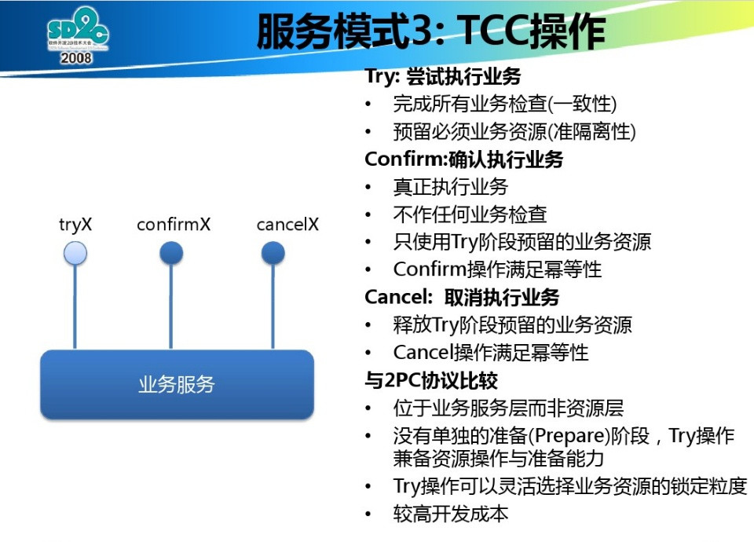
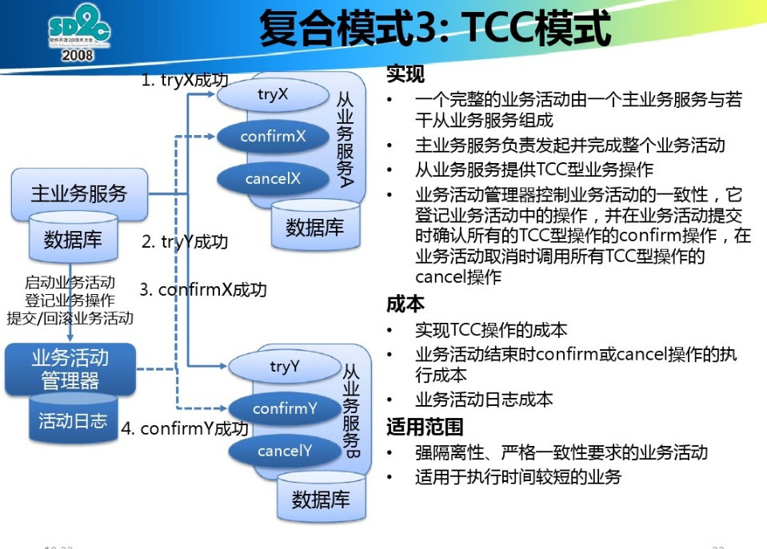

分布式事务的典型处理方式：2PC、TCC、异步确保和最大努力型
==========================================================================================
### 柔性事务和刚性事务
**柔性事务** 满足 **BASE** 理论（**基本可用，最终一致**）；**刚性事务** 满足 **ACID** 理论；

本文主要 **围绕分布式事务当中的柔性事务** 的处理方式进行讨论。

#### 柔性事务：业务活动

#### 柔性事务：业务活动举例

柔性事务分为：
1. **两阶段型**
2. **补偿型**
3. **异步确保型**
4. **最大努力通知型**

### 两阶段提交（`2PC`）型
两阶段型：就是 **分布式事务两阶段提交**，对应技术上的：**`XA`、`JTA/JTS`**。这是分布式环境下事务处理的 **典型模式**。

### 事务补偿型（TCC事务）
**TCC型事务（`Try/Cnfirm/Cancel`）可以归为补偿型**。补偿型的例子，在一个 **长事务（`long-running`）** 中，
一个由两台服务器一起参与的事务，**服务器`A`发起事务，服务`B`参与事务**，B的事务需要人工参与，所以处理时间可能很长。
如果按照`ACID`原则，要保持事务的隔离性、一致性，服务器`A`中发起的事务中使用到的事务资源将会被锁定，不允许其他应用
访问到事务过程中的中间结果，直到整个事务被提交或者回滚。**这就造成事务A中的资源被长时间锁定**，系统的可用性将不可接受。

`WS-BusinessActivity`提供了一种 **基于补偿的`long-running`的事务处理模型**。还是上面的例子，服务器`A`的事务如果执行
顺利，那么事务`A`就先行提交，如果事务`B`也执行顺利，则事务`B`也提交，整个事务就算完成。但是如果事务`B`执行失败，
事务`B`本身回滚，这时事务`A`已经被提交，所以需要执行一个 **补偿操作**，将已经提交的事务`A`执行的操作进行 **反操作**，恢复到未执行
前事务`A`的状态。**这样的`SAGA`事务模型，是牺牲了一定的隔离性和一致性的，但是提高了`long-running`事务的可用性**。

例子来源：`OASIS`的`WS-BusinessActivity`文档

### 异步确保型
将一些 **同步阻塞的事务操作变为异步的操作**，避免对数据库事务的争用，典型例子是热点帐户异步记帐、批量记帐的处理。

