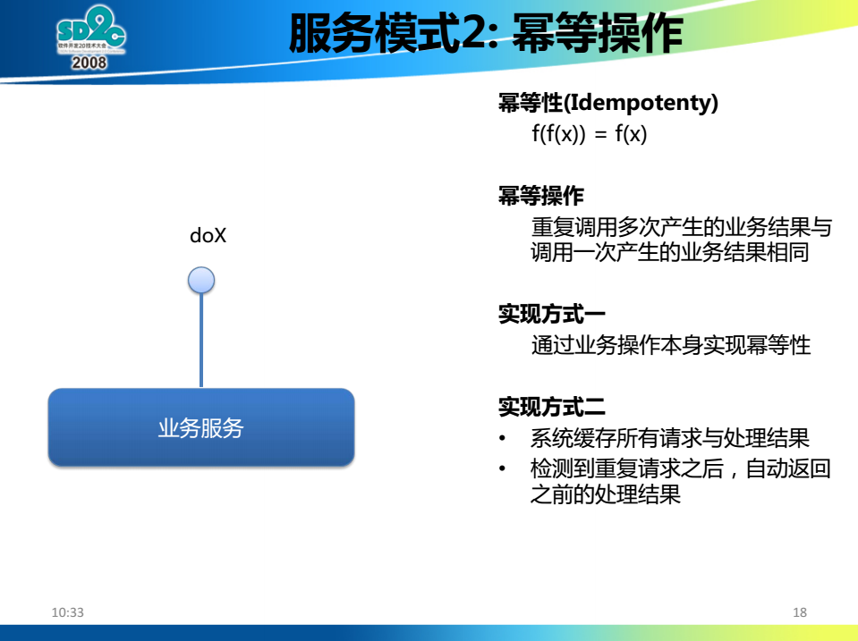
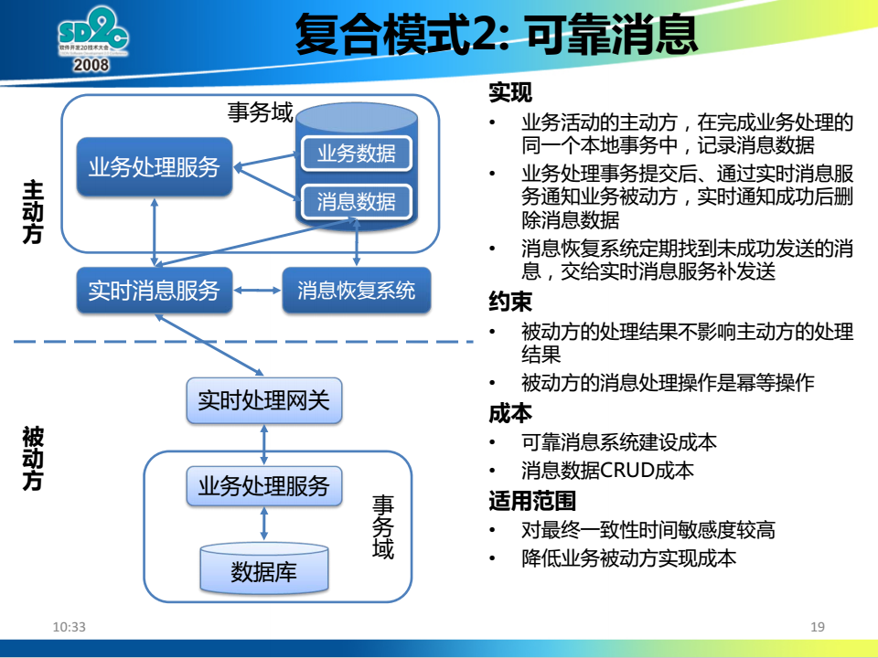
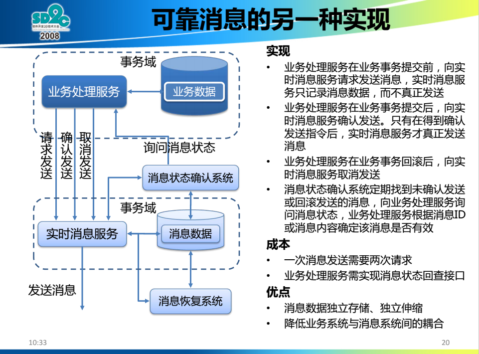

柔性事务之可靠消息模式
====================================================================

### 注意事项
#### 幂等性
重复调用多次产生的业务结果与调用一次产生的业务结果相同。

#### 约束
+ 被动方的处理结果不影响主动方的处理结果
+ 被动方的消息处理操作是幂等操作

#### 该模式的适用范围
+ 对最终一致性的时间敏感度较高
+ 降低业务被动方的实现成本