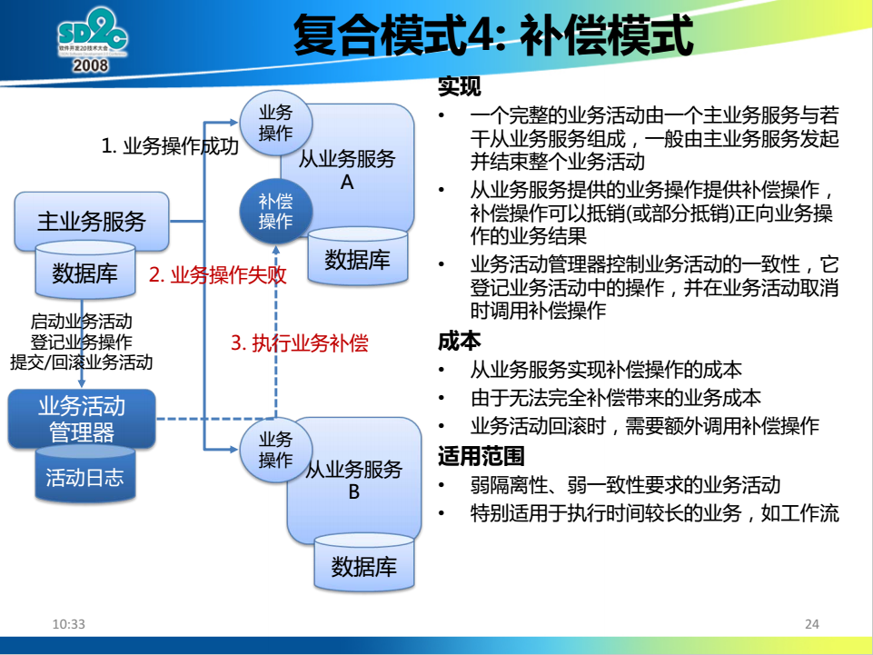

柔性事务之补偿模式
==============================================================

### 注意事项
#### 约束
+ **补偿在业务上可行（补偿操作满足幂等性）**
+ **由于业务执行结果未隔离（业务执行结果外部可见）、或者补偿不完整带来的风险与成本可控**

#### 该模式适用范围
+ **弱隔离性、弱一致性要求的业务活动**
+ **特别适用于执行时间较长的的业务，如工作流**

