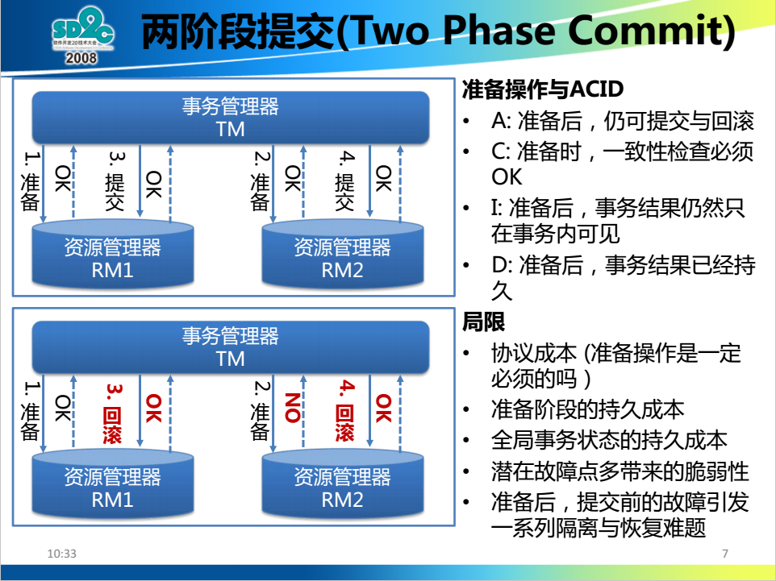
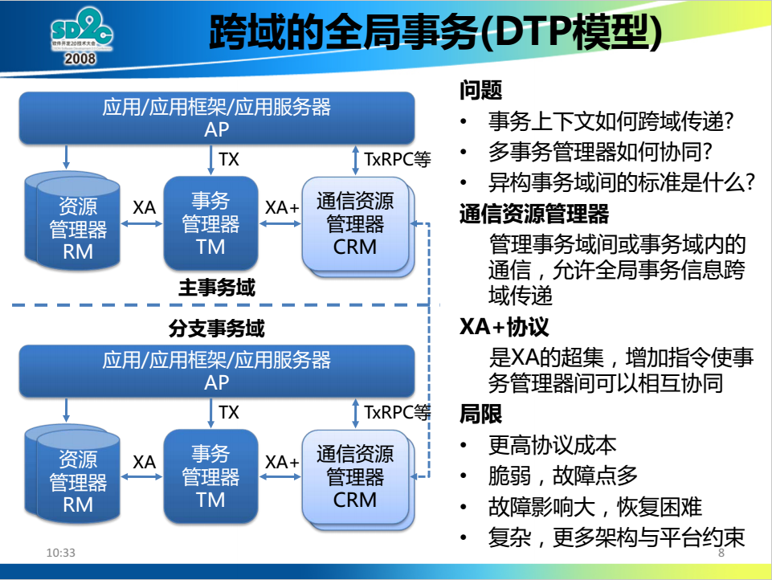
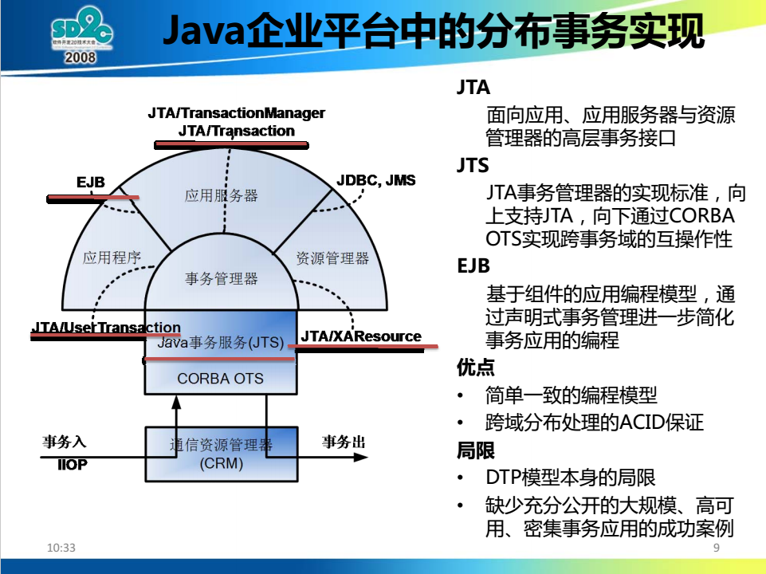

分布式事务之二阶段提交
==================================================================

### 两阶段提交协议
**两阶段提交协议是协调所有分布式原子事务参与者，并决定提交或取消（回滚）的分布式算法**。

#### 协议参与者
在两阶段提交协议中，系统一般包含 **两类机器（或节点）**：一类为 **协调者（`coordinator`）**，
通常一个系统中 **只有一个**；另一类为 **事务参与者**（`participants`，`cohorts`或`workers`），**一般包含多个**。

#### 两阶段的执行
1. **请求阶段**（`commit-request phase`，或称 **表决阶段**，`voting phase`）
在请求阶段，协调者将通知事务参与者准备提交或取消事务，然后进入表决过程。在表决过程中，参与者将告知协调者自己的决策：
同意（事务参与者本地作业执行成功）或取消（本地作业执行故障）。

2. **提交阶段**（`commit phase`）
在该阶段，协调者将基于第一个阶段的投票结果进行决策：提交或取消。当且仅当所有的参与者同意提交事务协调者才通知所有的参与者提交事务，
否则协调者将通知所有的参与者取消事务。参与者在接收到协调者发来的消息后将执行响应的操作。

**注意**：分布式事务之二阶段提交（`2PC`）是反可伸缩模式的，JavaEE中的`JTA`事务可以支持`2PC`。因为`2PC`是反模式，
**尽量不要使用`2PC`，使用`BASE`来回避**。