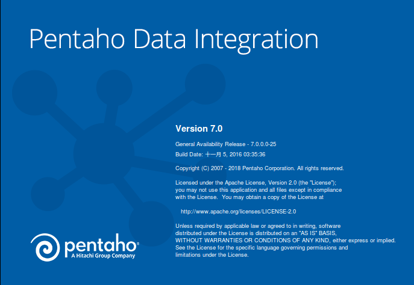
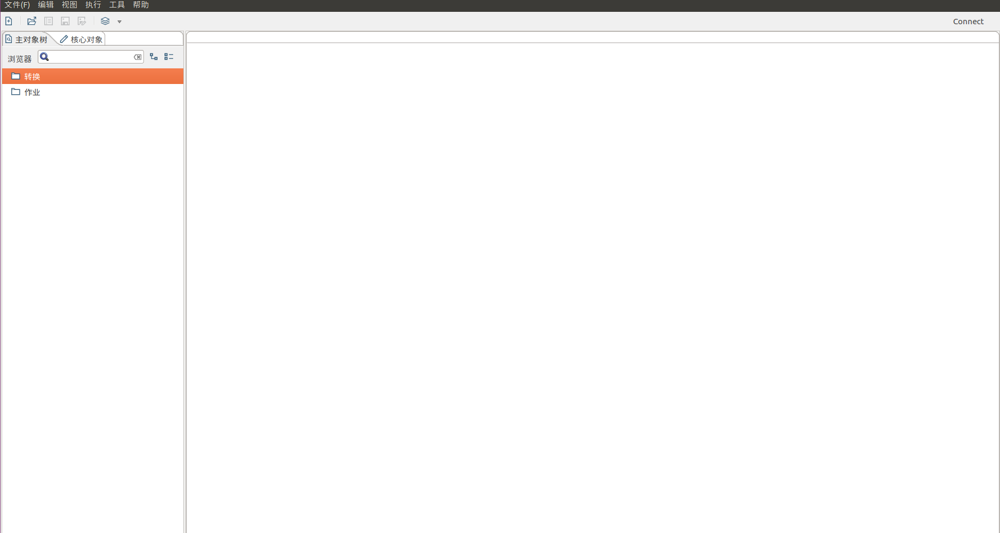

Kettle下载、安装与运行
================================================================================
## 1.Kettle下载
可以从官方下载：https://community.hitachivantara.com/docs/DOC-1009855 ，但限于国内网速，
我们还是从国内的镜像下载更快：http://mirror.bit.edu.cn/pentaho/Data%20Integration/

## 2.安装Java
略

## 3.解压并运行Spoon
+ `Spoon.bat`：在windows平台运行Spoon。
+ `Spoon.sh`：在Linux、Apple OSX、Solaris平台运行Spoon。

