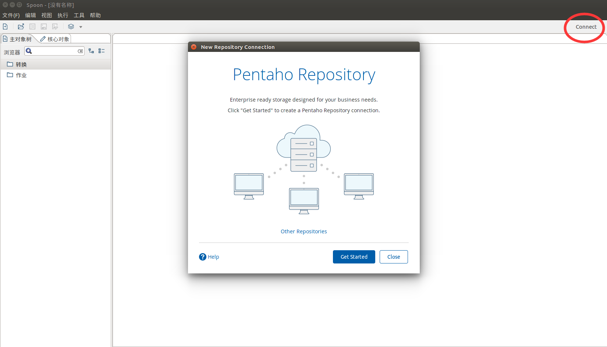
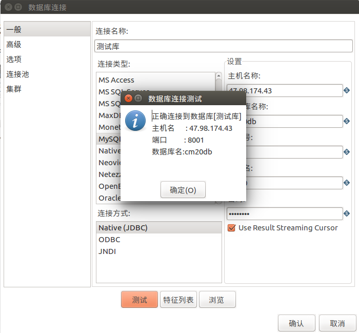

一个Kettle示例
================================================================================
```
Tips：进行操作前，别忘记将数据库驱动包放入Spoon（data-integration）的lib文件夹下。本示例使用的是Mysql，我们需要把MySQL
的驱动放在Spoon的lib目录下。

这里需要下载：mysql-connector-java-5.1.41.tar.gz
```

## 1.小试牛刀
首先新建一个作业：**文件 -> 新建作业**。

### 1.1.新建连接
**主对象树 -> 作业 -> 作业1 -> DB连接**



输入数据库连接信息，点击测试。




dd
