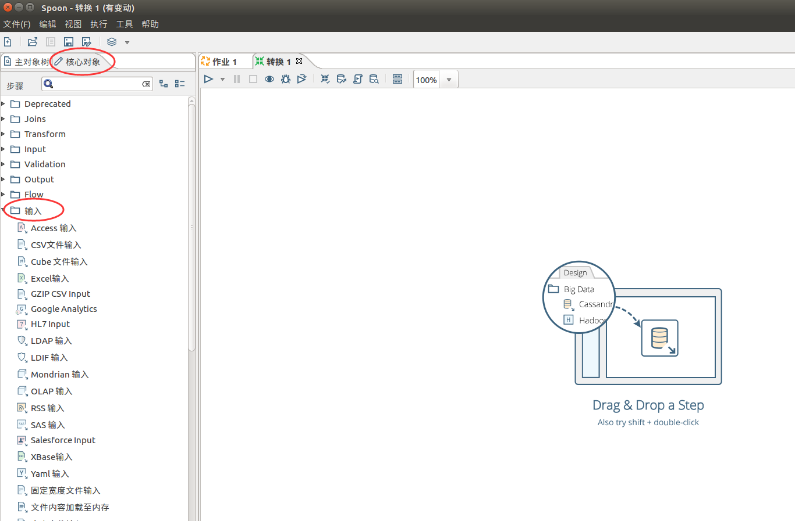
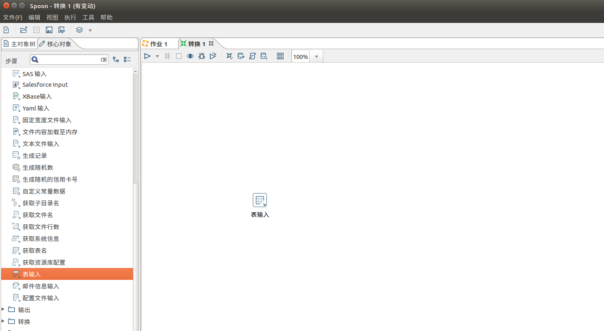

一个Kettle示例
================================================================================
```
Tips：进行操作前，别忘记将数据库驱动包放入Spoon（data-integration）的lib文件夹下。本示例使用的是Mysql，我们需要把MySQL
的驱动放在Spoon的lib目录下。

这里需要下载：mysql-connector-java-5.1.41.tar.gz
```

## 1.小试牛刀
首先新建一个作业：**文件 -> 新建作业**。

### 1.1.新建连接
新建一个DB连接：**主对象树 -> 作业 -> 作业1 -> DB连接**


输入数据库连接信息，点击测试。


## 2.新建转换（由DB到DB）
目前有两个数据库，`DB1`和`DB2`。将`DB1`中的某一个表中的数据，导入到`DB2`对应的表中。
> 为了演示方便，此处两个数据源的数据模型完全相同。但在实际操作中，两个数据源的模型会复杂很多。

新建一个转换：**文件 -> 新建 -> 转换**

### 2.1.拖动控件
在左侧“**核心对象**”下的“**输入**”菜单中，找到“**表输入**”，并将其拖动到右侧的空白处。同理，
将“**输出**”菜单中，找到“**插入/更新**”，拖至空白处。






dd
