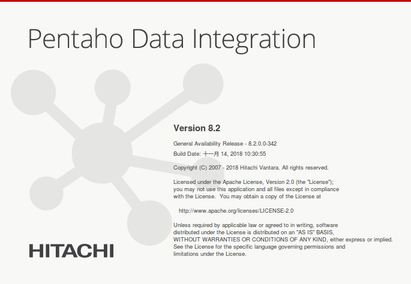
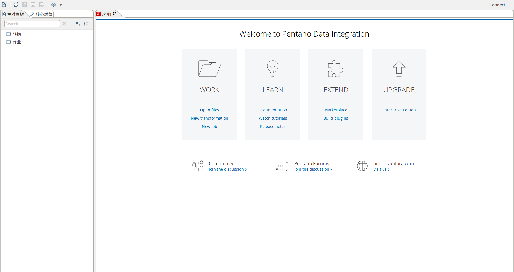

Kettle安装、部署、运行
================================================================================
## 1.Kettle概念
Kettle是一款国外开源的ETL工具，**纯Java编写，可以在windows、Linux、Unix上运行**，绿色无需安
装，数据抽取高效稳定。

Kettle中文名称叫 **水壶**，该项目的主程序员MATT希望把各种数据放到一个壶里，然后以一种指定的格式
流出。

Kettle这个ETL工具集，它允许你管理来自不同数据库的数据，**通过提供一个图形介绍所用户环境来描述你
想做什么，而不是你想怎么做**。

**Kettle中有两种脚本文件，transformation和job，transformation完成针对数据的基础转换，job则
完成整个工作流的控制**。

## 2.下载和部署
从 https://community.hitachivantara.com/docs/DOC-1009855 下载Kettle压缩包：
**pdi-ce-8.2.0.0-342.zip**。因为Kettle为无须安装，解压缩到任意本地路径即可。
```
注意：前提是已安装了JDK。
```

## 3.运行Kettle
如果是windows，运行 **$KETTLE_HOME/spoon.bat**；如果是linux，运行 **$KETTLE_HOME/spoon.sh**。

## 4.界面




