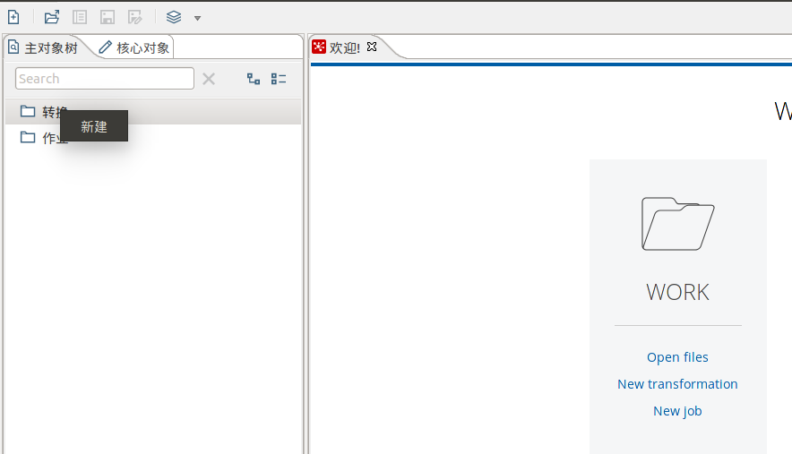

Kettle组件介绍与使用
================================================================================
## 1.Kettle使用
Kettle提供了资源库的方式来整合所有的工作：
1. 创建一个新的transformation，点击保存到本地路径，例如保存到`~/fuhd/work/etltest`，保存文
件名为`Trans`，**Kettle默认transformation文件保存后后缀名为ktr**。
2. 创建一个新的job，点击保存到本地路径，例如保存到`~/fuhd/work/etltest`下，保存文件名为`Job`，
Kettle默认job文件保存后后缀名为`kjb`。

