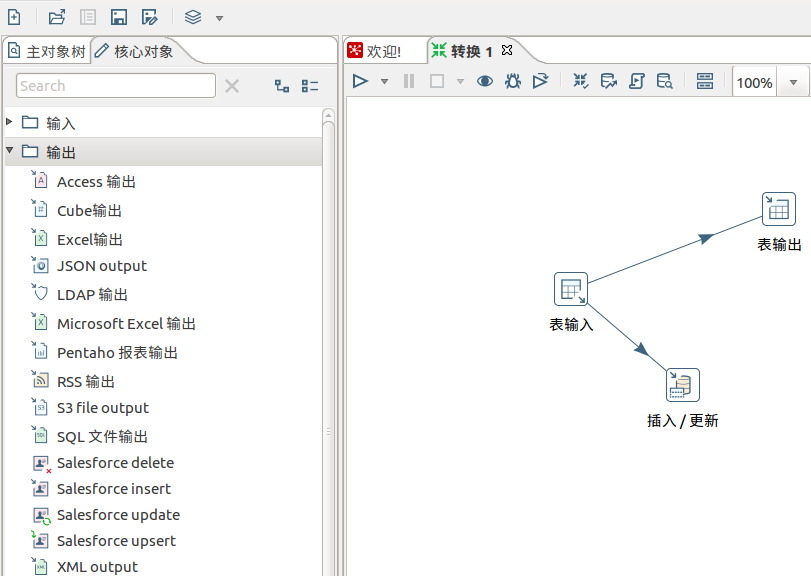
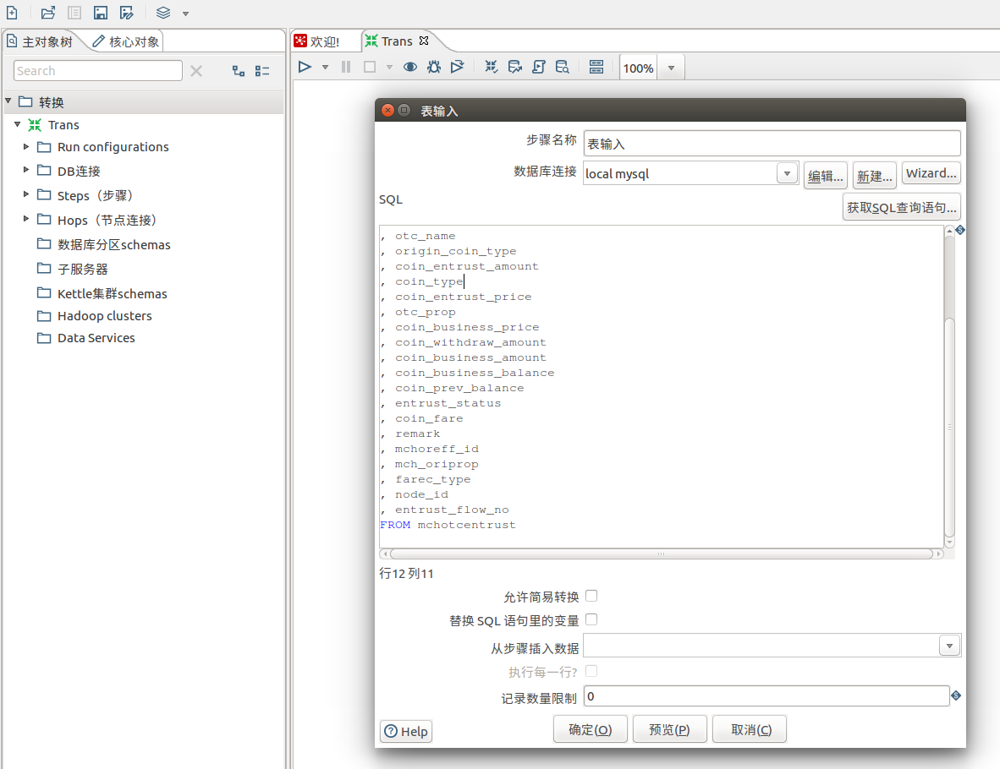
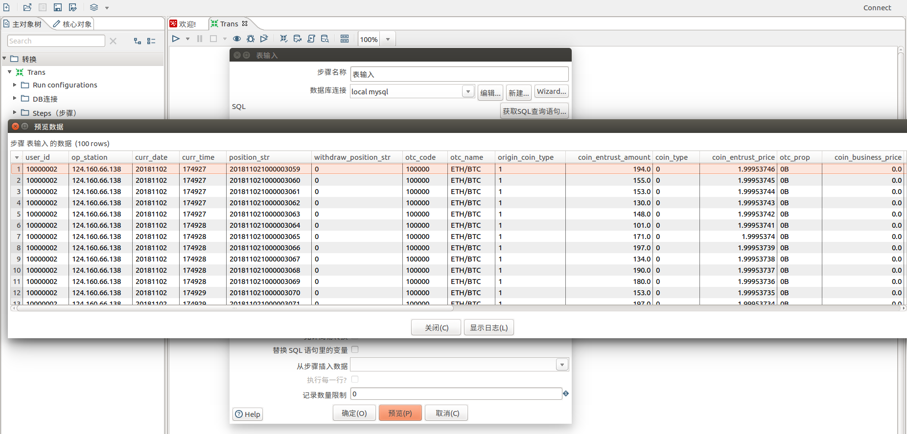
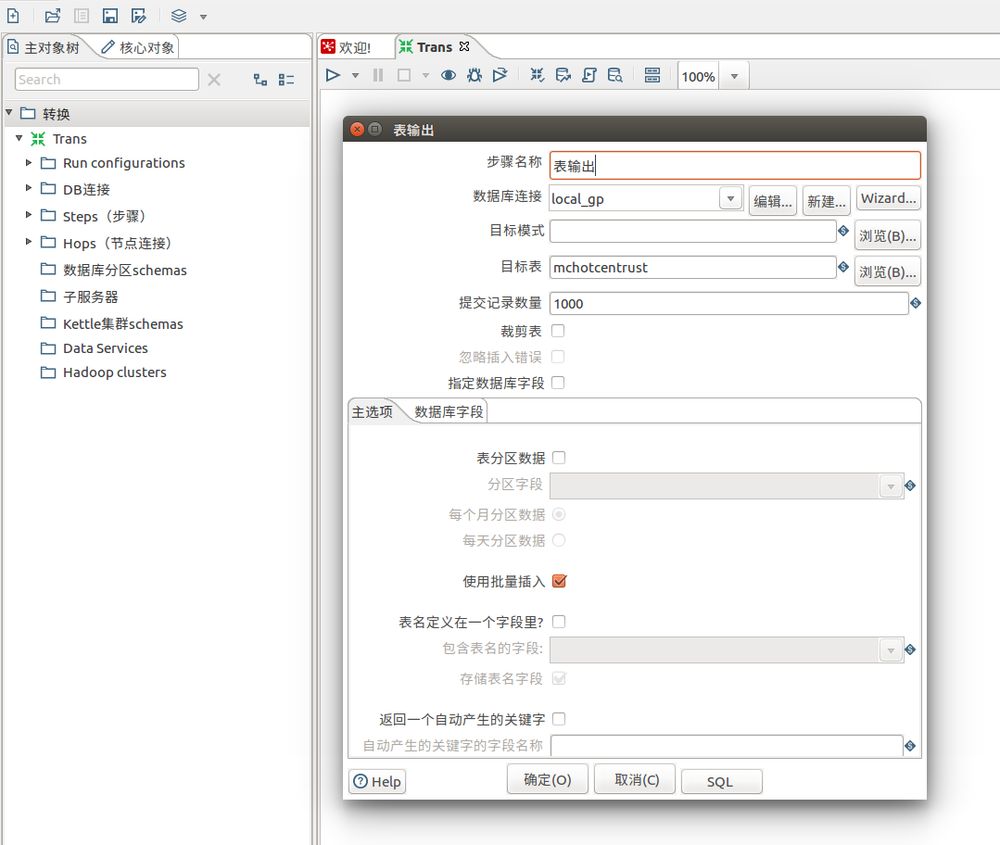
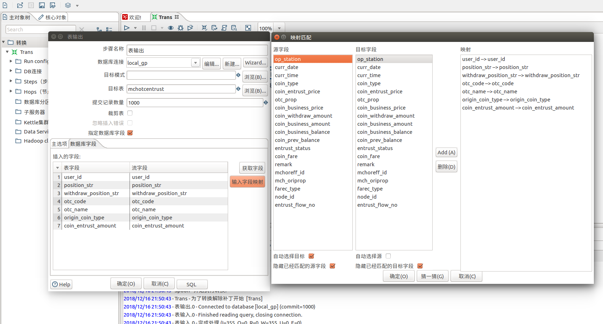
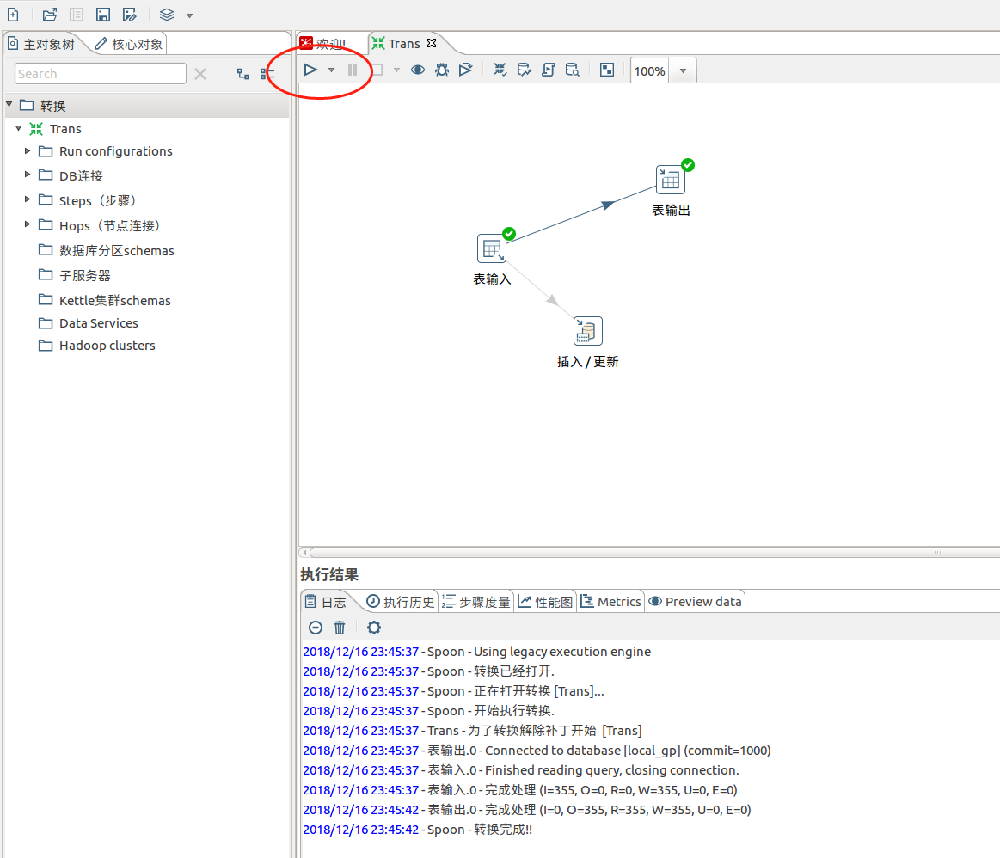
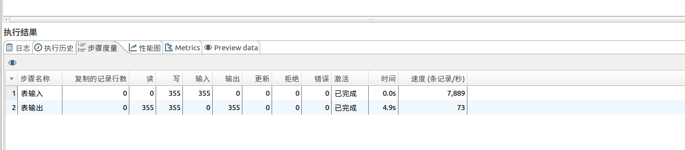
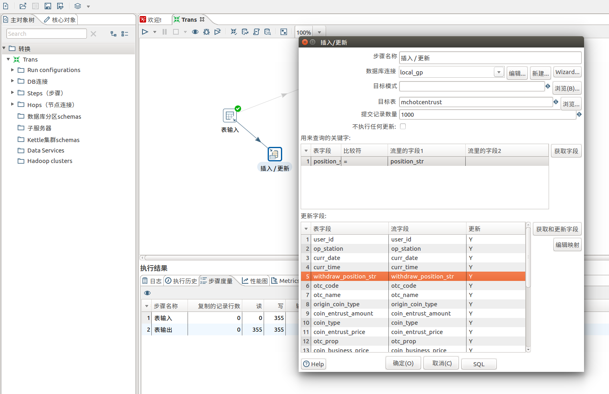

示例A
================================================================================
## 1.建立转换
选中 **输入 -> 表输入、表输出、插入/更新**，拖一右侧工作区。**鼠标选中节点键盘按`shift`键，拖
拽即可连线**。下图是一个转换，有两个动作，**一是直接从数据源表同步数据到目标表，一是检查源表的插
入和更新，同步到目标表**。如图：

**黑色线为生效，灰色线为失效，节点和连接可双击进行编辑**。

### 1.1.表输入编辑
> 创建数据库连接时，如果缺少驱动可以自行下载并放到$KETTLE_HOME/lib即可。

可以预览数据是否正确：

### 1.2.表输出编辑
> 注：目标数据库为Greenplum，好像不需要下载Greenplum的jdbc驱动

**也可以指定数据库字段，再指定映射关系**，如下图：

编辑好后点击上面的 **执行** 即可，执行完可以看下方的日志。，如下图：

执行结果如下：

### 1.3.`插入/更新` 编辑

然后点击运行。

## 2.创建Job/作业

d
