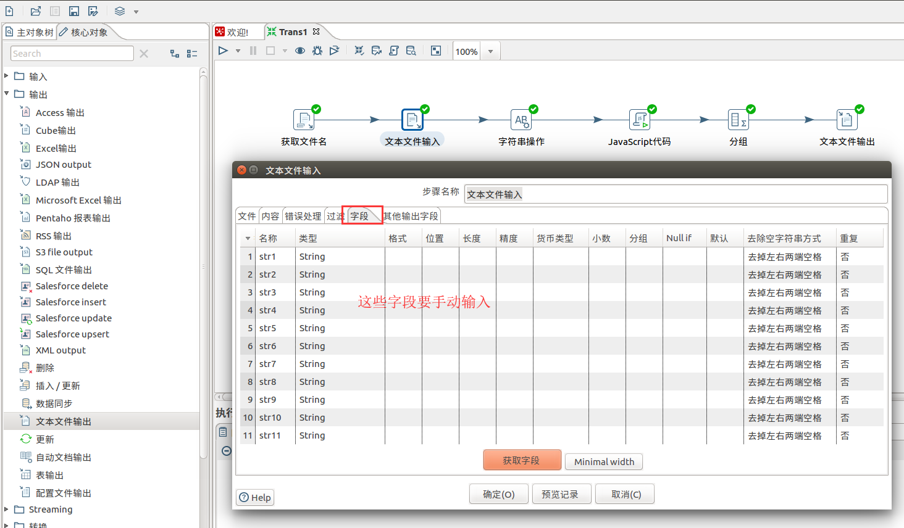
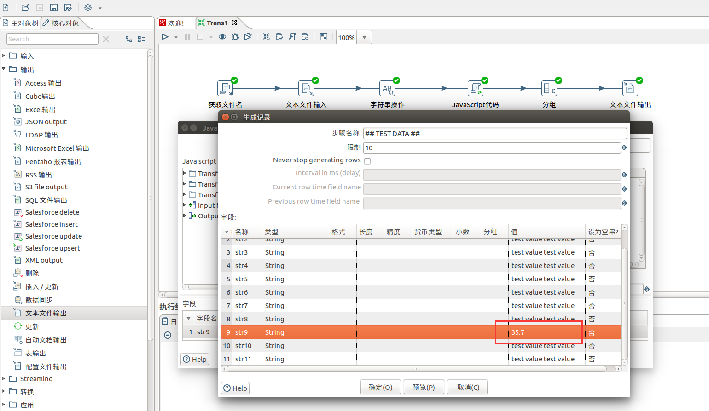

示例B
================================================================================
本例是完成读取`xxx`目录下的`xxx.log`文件，根据“字段”分组统计个数，其中`str9`字段的数字值取
`floor`值加2。

`xxx.log`的数据如下：
```
JY01011604280016|JY010116042800160019|1|1|2017-04-27|1000000.00|121666.66|1000000.00|121666.66|          |01 |
JY01011604280022|JY010116042800220025|1|1|2017-04-27|1000000.00|121666.66|1000000.00|121666.66|          |01 |
WT01011607040001|WT010116070400010002|1|1|2016-08-04|12000.00|51.67|12000.00|51.67|          |01 |
JY01011602020103|JY010116020201030004|2|2|2016-06-20|0.00|28933.33|0.00|28933.33|          |01 |
JY01011602020103|JY010116020201030004|3|1|2016-08-01|2000000.00|19600.00|2000000.00|19600.00|          |01 |
LD01011607160101|LD010116071601010002|1|1|2016-08-23|16.67|0.94|16.67|0.94|          |01 |
LD01011607160104|LD010116071601040004|1|1|2016-08-23|83.33|4.71|83.33|4.71|          |01 |
JY02011607310101|JY020116073101010002|1|1|2016-08-01|233980.65|2391.67|233980.65|2391.67|          |01 |
JY02011607310001|JY020116073100010002|1|1|2016-08-01|166830.63|3000.00|166830.63|3000.00|          |01 |
LD01011607160101|LD010116071601010002|1|1|2016-08-23|16.67|0.94|16.67|0.94|          |01 |
LD01011607160104|LD010116071601040004|1|1|2016-08-23|83.33|4.71|83.33|4.71|          |01 |
LD01011607160101|LD010116071601010002|1|1|2016-08-23|16.67|0.94|16.67|0.94|          |01 |
LD01011607160104|LD010116071601040004|1|1|2016-08-23|83.33|4.71|83.33|4.71|          |01 |
JY01011604280016|JY010116042800160019|1|1|2017-04-27|1000000.00|121666.66|1000000.00|121666.66|          |01 |
JY01011604280022|JY010116042800220025|1|1|2017-04-27|1000000.00|121666.66|1000000.00|121666.66|          |01 |
WT01011607040001|WT010116070400010002|1|1|2016-08-04|12000.00|51.67|12000.00|51.67|          |01 |
JY01011602020103|JY010116020201030004|2|2|2016-06-20|0.00|28933.33|0.00|28933.33|          |01 |
JY01011602020103|JY010116020201030004|3|1|2016-08-01|2000000.00|19600.00|2000000.00|19600.00|          |01 |
JY01011604280016|JY010116042800160019|1|1|2017-04-27|1000000.00|121666.66|1000000.00|121666.66|          |01 |
JY01011604280022|JY010116042800220025|1|1|2017-04-27|1000000.00|121666.66|1000000.00|121666.66|          |01 |
WT01011607040001|WT010116070400010002|1|1|2016-08-04|12000.00|51.67|12000.00|51.67|          |01 |
JY01011602020103|JY010116020201030004|2|2|2016-06-20|0.00|28933.33|0.00|28933.33|          |01 |
JY01011602020103|JY010116020201030004|3|1|2016-08-01|2000000.00|19600.00|2000000.00|19600.00|          |01 |
```

## 1.新建“转换”


### 1.1.设置“获取文件名”


### 1.2.设置“文本文件输入”




### 1.3.设置“字符串操作”


### 1.4.设置“javascript代码”





dd
