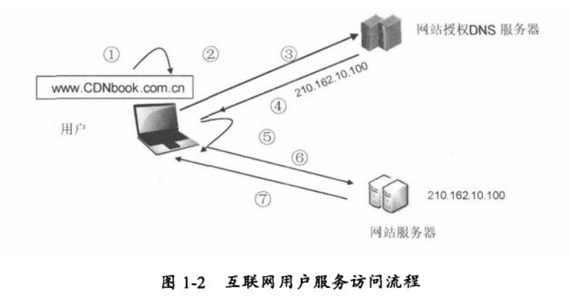
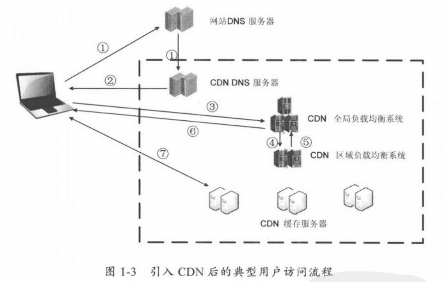

CDN的基本概念
=================================================================
CDN直译为：**内容分发网络**（Content Distribute Network），很显然，CDN完成的是将内容从源站传递到用户端的任务。
CDN在这个分发过程中体现了什么价值？

网络中时常会出现消息延迟或拥堵的情况，经常会出现在这四个地方：

1. **”第一公里”**，这是指万维网流量向用户传送的第一个出口，是 **网站服务器接入互联网的链路所能提供的带宽。
这个带宽决定了一个网站能为用户提供的访问速度和并发访问量**。一个网站，其服务的用户越多，对其出口带宽的
要求就越大，当用户请求的数据量超过网站的出口带宽，就会在出口处形成拥塞。
2. **“最后一公里”**，这是指万维网流量向用户传送的最后一段接入链路，即 **用户接入带宽**。用户的接入带宽成为
制约用户使用互联网的主要瓶颈。从2001年开始，电信运营商开始大力发展ADSL等宽带接入服务，随着带宽的不断提升
和接入手段的丰富（光纤入户，wifi，3G等），近年来“最后一公里”的问题得到很大改善，特别是这两年中国电信等
大力开展以光纤接入为手段的宽带提速服务，”最后一公里”的瓶颈问题已经基本得到解决。
3. **“对等互联关口”**，这里的“对等互联”是指 **不同基础运营商之间的互联互通，一般两个运营商之间只有两三个互联互通点**，
可以想象这两三个点上产生多么大的流量。当某个网站服务器部署在运营商A的IDC机房里，运营商B的用户要访问该网站，
就必須经过A，B之间的互联互通点进行跨网访问。从互联网的架构来看，不同网络之间的互联互通带宽，对任何一个运营
商网络的流量来说，占比都比较小，收敛比是非常高的，因此这里通常都是互联网传输中的拥堵点。
4. **“长途骨干传输”**，首先是 **长距离传输时延问题，从网站服务器到用户之间要经过网站所在IDC，骨干网，用户所在城
域网，用户所在接入网等，距离非常遥远，因此不可避免地带来较长的传输时延，影响用户体验**，这一问题也是互联网
本身无法解决的问题。其次是 **骨干网拥塞问题**，由于互联网上的绝大部分流量都要通过骨干网络进行传输，
这就要求骨干网络的承载能力必须与互联网的应用同步发展，但实际上两者并不是同步的，当骨干网络的升级和扩容滞后
于互联网之上的应用的发展时，就会阶段性地使得大型骨干网的承载能力成为影响互联网性能的瓶颈。

CDN的产生与上面分析的一系列问题息息相关，如果这些问题没有手段缓解，那整个互联网将是与今天完全不同的另一番景象了。
1995年，麻省理工学院教授，互联网发明者 Tim Berners-Lee 预见到当时互联网使用者已经习以为常的网络拥挤难题，
未来会成为互联网应用的最大障碍。于是他向同事提出挑战，要发明一种全新的，从根本上解决问题的方法来推送互联网内容。
他的这一提议造就了今天被大家普遍接受的互联网基础服务——————CDN。

### CDN的基本工作过程
使用CDN会极大地简化网站的系统维护工作量，网站维护人员只需将网站内容注入CDN的系统，通过CDN部署在各个物理位置
的服务器进行全网分发，就可以实现跨运营商，跨地域的用户覆盖。由于CDN将内容推送到网络边缘，大量的用户访问被分散
在网络边缘，不再构成网站出口，互联互通点的资源挤占，也不再需要跨越长距离IP路由了。

#### 没有使用CDN的B/S架构
今天我们看到的网站系统基本上都是基于B/S架构的。用户通过浏览器等方式访问网站的过程如下图：

1. 用户在自己的浏览器中输入要访问的网站域名。
2. 浏览器向本地DNS服务器请求对该域名的解析。
3. 本地DNS服务器中如果缓存有这个域名的解析结果，则直接响应用户的解析请求。
4. 本地DNS服务器中如果没有关于这个域名的解析结果的缓存，则以递归方式向整个DNS系统请求解析，获得应答后将结果反馈给浏览器。
5. 浏览器得到域名解析结果，就是该域名相应的服务设备的IP地址。
6. 浏览器向服务器请求内容。
7. 服务器将用户请求内容传送给流利器。

#### 网站使用CDN技术以后
在网站和用户之间加入CDN以后，用户不会有任何与原来不同的感觉。最简单的CDN网络有一个DNS服务器和几台缓存服务器就可以运行了。

如图：

+ 当用户点击网站页面上的内容URL，经过本地DNS系统解析，DNS系统会最终将域名解析权交给`CNAME`指向的 **CDN专用DNS服务器**。
+ CDN的DNS服务器将CDN的全局负载均衡设备IP地址返回给用户。
+ 用户向CDN的全局负载均衡设备发起内容URL访问请求。
+ CDN全局负载均衡设备根据用户IP地址，以及用户请求的内容URL，选择一台用户所属区域的区域负载均衡设备，
告诉用户向这台设备发起请求。
+ 区域负载均衡设备会为用户选择一台合适的缓存服务器提供服务，选择的依据包括：根据用户IP地址，判断哪一台服务器距用户最近；
根据用户所请求的URL中携带的内容名称，判断哪一台服务器上有用户所需内容；查询各个服务器当前的负载情况，判断哪一台服务器
尚有服务能力。基于以上这些条件的综合分析之后，区域负载均衡设备会向全局负载均衡设备返回一台缓存服务器的IP地址。
+ 全局负载均衡设备把服务器的IP地址返回给用户。
+ 用户向缓存服务器发起请求，缓存服务器响应用户请求，将用户所需内容传送到用户终端。如果这台缓存服务器上并没有用户想要的内容，
而区域均衡设备依然将它分配给了用户，那么这台服务器就要向它的上一级缓存服务器请求内容，直到追溯到网站的源服务器将内容拉到本地。

DNS服务器根据用户IP地址，将域名解析成相应节点的缓存服务器IP地址
