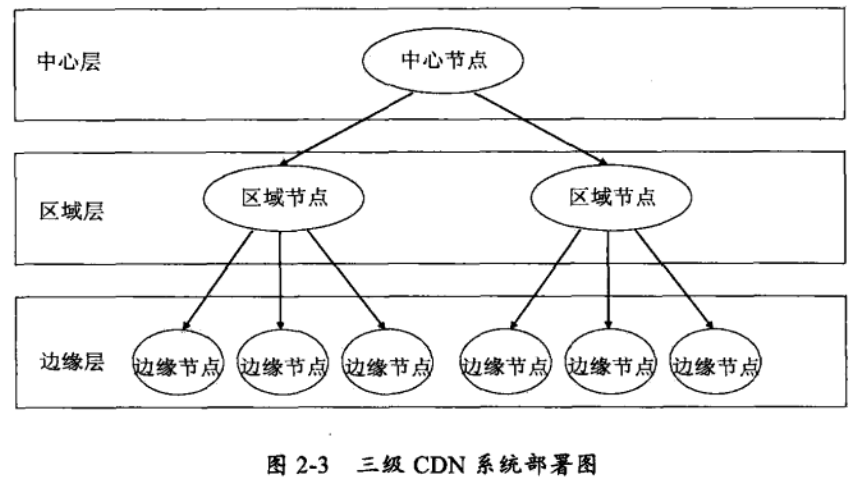

CDN的系统架构
============================================================
### 功能架构
CDN技术自1998年诞生以来，伴随着互联网的高速发展，其技术一直在持续演进和完善，但基本的CDN功能架构在
2003年左右就已基本形成和稳定下来。从功能上划分，典型的CDN系统架构由 **分发服务系统**，**负载均衡系统** 和
**运营管理系统** 三大部分组成。

#### 分发服务系统
该系统的主要作用是实现将内容从内容源中心向边缘推送和存储，承担实际的内容数据流的全网分发工作和面向最终
用户的数据请求服务。分发服务系统最基本的工作单元就是许许多多的Cache设备（缓存服务器），Cache负责直接
响应最终用户的访问请求，把缓存在本地的内容快速地提供给用户。同时Cache还负责与源站点进行内容同步，
把更新的内容以及本地没有的内容从源站点获取并保存在本地。

#### 负载均衡系统
它是一个CDN系统的神经中枢，主要功能是负责对所有发起服务请求的用户进行访问调度，确定提供给用户的最终实际
访问地址。大多数CDN系统的负载均衡是分级实现的，这里以最基本的两级调度体系进行简要说明。一般而言，
两级调度体系分为全局负载均衡（GSLB）和本地负载均衡（SLB）。其中，全局负载均衡（GSLB）主要根据用户就近
性原则，通过对每个服务节点进行“最优”判断，确定向用户提供服务的Cache的物理位置。最通用的GSLB实现方法是
基于DNS解析的方式实现。本地负载均衡（SLB）主要负责节点内部的设备负载均衡，当用户请求从GSLB调度到SLB时，
SLB会根据节点内容各Cache设备的实际能力或内容分布等因素对用户进行重定向。

#### 运营管理系统
运营管理子系统是CDN系统的业务管理功能实体，负责处理业务层面的与外界系统交互所必需的一些收集，整理，
交付工作，包含客户管理，产品管理，计费管理，统计分析等功能。

### 部署架构
CDN系统设计的首要目标是尽量减少用户的访问响应时间，为达到这一目标，CDN系统应该尽量将用户所需要的内容
存放在距离用户最近的位置。也就是说，负责为用户提供内容服务的Cache设备应部署在物理上的网络边缘位置，
我们称这一层为CDN边缘层。CDN系统中负责全局性管理和控制的设备组成中心层，中心层同时保存着最多的内容副本，
当边缘层设备未命中时，会向中心层请求，如果在中心层仍未命中，则需要中心层向源站回源。不同CDN系统设计之间
存在差异，中心层可能具备用户服务能力，也可能不直接提供服务，只向下级节点提供内容。如果CDN网络规模较大，
边缘层设备直接向中心层请求内容或服务会造成中心层设备压力过大，就要考虑在边缘层和中心层之间部署一个区域
层，负责一个区域的管理和控制，也保存部分内容副本供边缘层访问。

下面是一个典型的CDN系统三级部署示意图：

