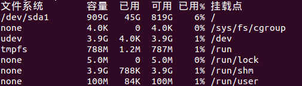
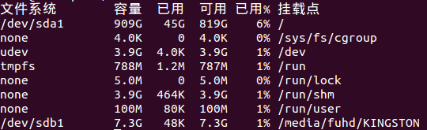
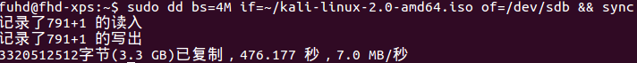

dd命令制作U盘系统启动盘
=====================================
### 先从磁盘使用信息中找到挂载的U盘信息
插入U盘前：
```powershell
$ df -h
```


插入U盘后：
```powershell
$ df -h
```


最后一行就是U盘的挂载信息。

### 解挂载U盘
```powershell
$ umount /dev/sdb1
```
### 使用dd命令烧写
```powershell
$ sudo dd bs=4M if=~/kali-linux-2.0-amd64.iso of=/dev/sdb && sync
```


**注意，dd命令中的目标是sdb，没有标号。**
