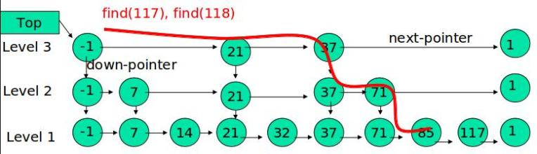

随机数据结构：跳表（SkipList）
==============================================================
**在JDK的并发包中**，除了常用的 **哈希表** 外，还实现了一种有趣的数据结构————**跳表**。跳表是一种可以用来 **快速查找** 的数据结构，
有点类似于平衡树。它们都可以对元素进行快速的查找。但有一个重要的区别是：**对平衡树的插入和删除往往很可能导致
平衡树进行一次全局的调整。而对跳表的插入和删除只需要对整个数据结构的局部进行操作即可。这样带来的好处是：在高并发
的情况下，你会需要一个全局锁来保证整个平衡树的线程安全。而对于跳表，你只需要部分锁即可。这样，在高并发环境下，
你就可以拥有更好的性能。而就查询的性能而言，跳表的时间复杂度也是O(logn)。所以在并发数据结构中，JDK使用跳表来
实现一个Map**。

跳表的另外一个特点是 **随机算法**。跳表的本质是 **同时维护了多个链表**，并且 **链表是分层** 的：



**最低层的链表维护了跳表内所有的元素，每上面一层链表都是下面一层的子集，一个元素插入哪些层是完全随机的**。
因此，如果你运气不好的话，你可能会得到一个性能很糟糕的结构，但是在实际工作中，它的表现是非常好的。

**跳表内的所有链表的元素都是排序的。查找时，可以从顶级链表开始找。一旦发现被查找的元素大于当前链表中的取值，
就会转入下一层链表继续找。这也就是说在查找过程中，搜索是跳跃式的（见上图）。在跳表中查找元素117。
查找从顶层的头部索引节点开始。由于顶层的元素最少，因此，可以快速跳跃那些小于117的元素。很快，查找过程就能到37，
转入第二层链表，查找到71，再跳到最下一层，很快就找到117。整个过程，要比一般链表从元素1开始逐个搜索快很多**。

因此，很显然，**跳表是一种使用空间换时间的算法**。

使用跳表实现`Map`和使用哈希算法实现`Map`的另外一个不同之处是：**哈希并不会保存元素的顺序，而跳表内所有的元素
都是排序的。因此在对跳表进行遍历时，你会得到一个有序的结果。所以，如果你的应用需要有序性，那么跳表就是你
不二选择**。

实现这一数据结构的类是：**`ConcurrentSkipListMap`**。下面展示了跳表的简单使用：
```java
Map<Integer,Integer> map = new ConcurrentSkipListMap<Integer,Integer>();
for(int i = 0; i < 30; i++){
    map.put(i,i);
}
for(Map.Entry<Integer,Integer> entry : map.entrySet()) {
    System.out.println(entry.getKey());
}
```
和`HashMap`不同，对跳表的遍历输出是有序的。

跳表的内部实现有几个关键的数据结构组成。首先是`Node`，一个`Node`就是表示一个节点，里面含有两个重要的元素
`key`和`value`（就是`Map`的`key`和`value`）。每个`Node`还会指向下一个`Node`，因此还有一个元素`next`。
```java
static final class Node<K,V> {
    final K key;
    volatile Object value;
    volatile Node<K,V> next;
}
```
对`Node`的所有操作，使用`CAS`方法：
```java
boolean casValue(Object cmp, Object val){
    return UNSAFE.compareAndSwapObject(this, valueOffset, cmp , val);
}
boolean casNext(Node<K,V> cmp, Node<K,V> val) {
    return UNSAFE.compareAndSwapObject(this, nextOffset, cmp, val);
}
```
方法`casValue()`用来设置`value`的值，相对的`casNext()`用来设置`next`的字段。

另外一个重要的数据结构是  **`Index`**。顾名思义，这个表示 **索引**。它内部包装了`Node`，
同时增加了 **向下** 的引用和 **向右** 的引用。
```java
static class Index<K,V> {
    final Node<K,V> node;
    final Index<K,V> down;
    volatile Index<K,V> right;
}
```
整个跳表就是根据`Index`进行全网的组织的。

此外，对于每一层的表头，还需要记录当前处于哪一层。为此，还需要一个称为`HeadIndex`的数据结构，
表示链表头的第一个`Index`。它继承自`Index`：
```java
static final class HeadIndex<K,V> extends Index<K,V> {
    final int level;
    HeadIndex(Node<K,V> node, Index<K,V> down, Index<K,V> right, int level) {
        super(node, down, right)；
        this.level = level;
    }
}
```
到这里，核心的内部元素就介绍完了！

### concurrentHashMap与ConcurrentSkipListMap性能测试
在4线程1.6万数据的条件下，`ConcurrentHashMap`存取速度是`ConcurrentSkipListMap`的4倍左右。
但`ConcurrentSkipListMap`有几个`ConcurrentHashMap`不能比拟的优点：

1. **`ConcurrentSkipListMap`的`key`是有序的**。
2. **`ConcurrentSkipListMap`支持更高的并发。`ConcurrentSkipListMap`的时间复杂度为O(logn)，
和线程数几乎无关。也就是说在数据量一定的情况下，并发的线程越多，`ConcurrentSkipListMap`越能体现出他的优势**。
