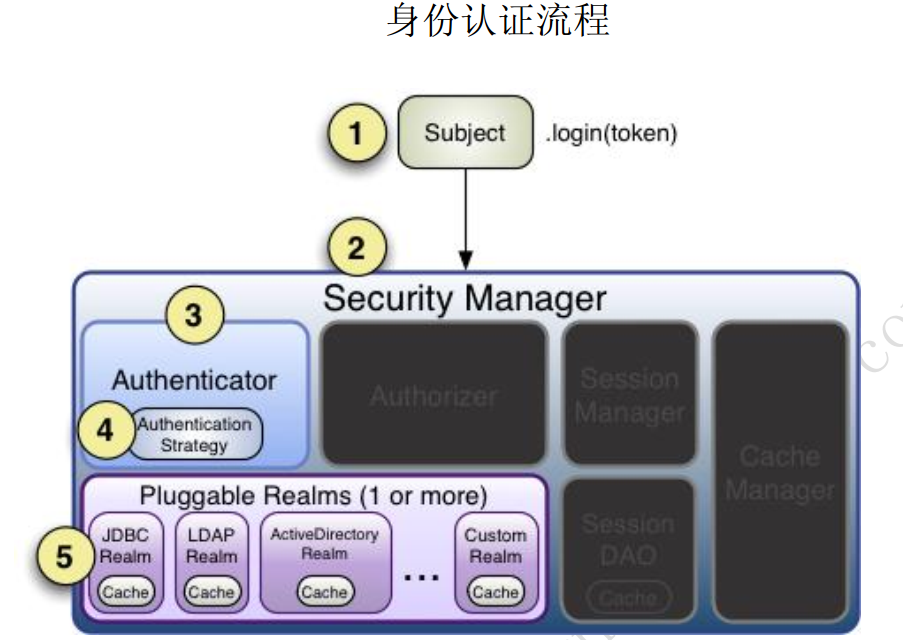
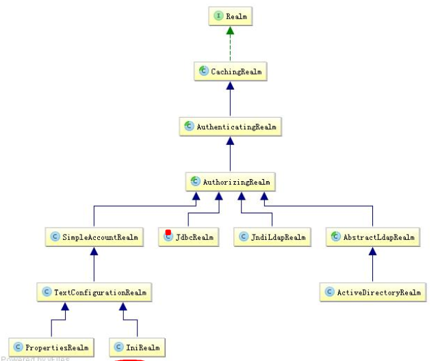

shiro认证
====================================================

### 关键词

principals：身份

credentials：证明/凭证


### 示例
```java
@Test
public void testHelloworld() {
    //1、获取 SecurityManager 工厂，此处使用 Ini 配置文件初始化 SecurityManager
    Factory<org.apache.shiro.mgt.SecurityManager> factory = new IniSecurityManagerFactory("classpath:shiro.ini");
    //2、得到 SecurityManager 实例 并绑定给 SecurityUtils
    org.apache.shiro.mgt.SecurityManager securityManager = factory.getInstance();
    SecurityUtils.setSecurityManager(securityManager);
    //3、得到 Subject 及创建用户名/密码身份验证 Token（即用户身份/凭证）
    Subject subject = SecurityUtils.getSubject();
    UsernamePasswordToken token = new UsernamePasswordToken("zhang", "123");
    try {
        //4、登录，即身份验证
        subject.login(token);
    } catch (AuthenticationException e) {
        //5、身份验证失败
    }
    Assert.assertEquals(true, subject.isAuthenticated()); //断言用户已经登录
    //6、退出
    subject.logout();
}
```
通过 SecurityUtils 得到 Subject，其会自动绑定到当前线程；如果在 web 环境在请求结束时需要解除绑定。

调用 subject.login 方法进行登录， 其会自动委托给 SecurityManager.login 方法进行登录。

调用 subject.logout 退出，其会自动委托给 SecurityManager.logout 方法退出。

**注**：用户身份 Token 可能不仅仅是用户名/密码，也可能还有其他的，如登录时允许用户名/邮箱/手机号同时登录。


### 身份验证失败异常
AuthenticationException或其子类

+ DisabledAccountException：禁用的帐号
+ LockedAccountException：锁定的帐号
+ UnknownAccountException：错误的帐号
+ ExcessiveAttemptsException：登录失败次数过多
+ IncorrectCredentialsException：错误的凭证
+ ExpiredCredentialsException：过期的凭证


### shiro处理流图



流程如下：

1. 首先调用 Subject.login(token) 进行登录，其会自动委托给 SecurityManager，调用之前必须通过 SecurityUtils.setSecurityManager()设置；
2. SecurityManager 负责真正的身份验证逻辑；它会委托给 Authenticator 进行身份验证；
3. Authenticator 才是真正的身份验证者，Shiro API 中核心的身份认证入口点，此处可以自定义插入自己的实现；
4. Authenticator 可能会委托给相应的 AuthenticationStrategy 进行多 Realm 身份验证，默认ModularRealmAuthenticator
会调用 AuthenticationStrategy 进行多 Realm 身份验证；
5. Authenticator 会把相应的 token 传入 Realm，从 Realm 获取身份验证信息，如果没有返回/抛出异常表示身份验证失败了。
此处可以配置多个 Realm，将按照相应的顺序及策略进行访问。


### Realm
Shiro 从 Realm 获取安全数据（如用户、角色、权限），就是说 SecurityManager 要验证用户身份，
那么它需要从 Realm 获取相应的用户进行比较以确定用户身份是否合法；也需要从 Realm 得到用户相应的角色/权限进行验证用户是否能进行操作；
可以把 Realm 看成 DataSource ， 即安全数据源。

securityManager 会按照 realms 指定的顺序进行身份认证。

#### 默认Realm实现



以后一般继承 AuthorizingRealm （授权）即可； 其继承了 AuthenticatingRealm （即身份验证），
而且也间接继承了 CachingRealm（带有缓存实现）。


### Authenticator 及 AuthenticationStrategy
Authenticator 的职责是验证用户帐号，是 Shiro API 中身份验证核心的入口点：
```java
public AuthenticationInfo authenticate(AuthenticationToken authenticationToken) throws AuthenticationException;
```
如果验证成功，将返回 AuthenticationInfo 验证信息；此信息中包含了身份及凭证；
如果验证失败将抛出相应的 AuthenticationException 实现。

SecurityManager 接口继承了 Authenticator，另外还有一个 ModularRealmAuthenticator 实现，其委托给多个 Realm 进行验证，
验证规则通过 AuthenticationStrategy 接口指定，默认提供的实现：

+ `FirstSuccessfulStrategy`：只要有一个 Realm 验证成功即可，只返回第一个 Realm 身份验证成功的认证信息，其他的忽略；
+ `AtLeastOneSuccessfulStrategy`： 只要有一个 Realm 验证成功即可，和 FirstSuccessfulStrategy不同，
返回所有 Realm 身份验证成功的认证信息；
+ `AllSuccessfulStrategy`：所有 Realm 验证成功才算成功，且返回所有 Realm 身份验证成功的认证信息，如果有一个失败就失败了。

**ModularRealmAuthenticator 默认使用 AtLeastOneSuccessfulStrategy 策略**。
