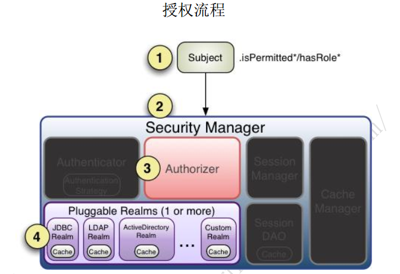

shiro授权
=================================================================
授权，也叫访问控制，即在应用中控制谁能访问哪些资源（如访问页面/编辑数据/页面操作等）。
在授权中需了解的几个关键对象： **主体** （`Subject`）、**资源** （`Resource`）、**权限** （`Permission`）、
**角色**（`Role`）。

### 授权流程



流程如下：

1. 首先调用 Subject.isPermitted*/hasRole*接口，其会委托给 SecurityManager，
而 SecurityManager 接着会委托给 Authorizer；
2. Authorizer 是真正的授权者，如果我们调用如 isPermitted(“user:view”)，其首先会通过 PermissionResolver
把字符串转换成相应的 Permission 实例；
3. 在进行授权之前，其会调用相应的 Realm 获取 Subject 相应的角色/权限用于匹配传入的角色/权限；
4. Authorizer 会判断 Realm 的角色/权限是否和传入的匹配，如果有多个 Realm，会委托给 ModularRealmAuthorizer 进行循环判断，
如果匹配如 isPermitted*/hasRole*会返回 true，否则返回 false 表示授权失败。

**ModularRealmAuthorizer 进行多 Realm 匹配流程**：

1. 首先检查相应的 Realm 是否实现了 Authorizer；
2. 如果实现了 Authorizer，那么接着调用其相应的 isPermitted*/hasRole* 接口进行匹配；
3. 如果有一个 Realm 匹配那么将返回 true，否则返回 false。
```
    如果 Realm 进行授权的话，应该继承 AuthorizingRealm，其流程是：

    1.1. 如果调用 hasRole*，则直接获取 AuthorizationInfo.getRoles()与传入的角色比较即可；
    1.2. 如果调用如 isPermitted(“user:view”)，首先通过 PermissionResolver 将权限字符串转换成相应的 Permission 实例，
         默认使用 WildcardPermissionResolver，即转换为通配符的 WildcardPermission；
```
4. 通过 AuthorizationInfo.getObjectPermissions() 得到 Permission 实例集合； 通过AuthorizationInfo. getStringPermissions()
得到字符串集合并通过 PermissionResolver 解析为 Permission 实例；然后获取用户的角色，并通过 RolePermissionResolver 解析角色对应的权
限集合（默认没有实现，可以自己提供）；
5. 接着调用 Permission. implies(Permission p)逐个与传入的权限比较，如果有匹配的则返回 true，否则 false。
