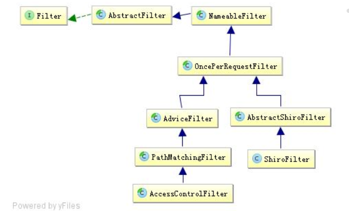

Shiro拦截器机制
====================================================================
Shiro 使用了与 Servlet 一样的 Filter 接口进行扩展；



+ NameableFilter：NameableFilter 给 Filter 起个名字， 如果没有设置默认就是 FilterName；
还记得之前的如 `authc` 吗？当我们组装拦截器链时会根据这个名字找到相应的拦截器实例；
+ OncePerRequestFilter：OncePerRequestFilter 用于防止多次执行 Filter 的；也就是说一次请求只会走一次拦截器链；
另外提供 enabled 属性，表示是否开启该拦截器实例，默认 enabled=true 表示开启，如果不想让某个拦截器工作，
可以设置为 false 即可。
+ ShiroFilter：ShiroFilter 是整个 Shiro 的入口点，用于拦截需要安全控制的请求进行处理；
+ AdviceFilter：AdviceFilter 提供了 AOP 风格的支持，类似于 SpringMVC 中的 Interceptor；
+ PathMatchingFilter：PathMatchingFilter 提供了基于 Ant 风格的请求路径匹配功能及拦截器参数解析的功能；
+ AccessControlFilter：AccessControlFilter 提供了访问控制的基础功能； 比如是否允许访问/当访问拒绝时如何处理等；

    ```java
    //表示是否允许访问；mappedValue 就是[urls]配置中拦截器参数部分，如果允许访问返回 true，否则 false；
    abstract boolean isAccessAllowed(ServletRequest request, ServletResponse response, Object mappedValue) throws Exception;
    //表示当访问拒绝时是否已经处理了；如果返回 true 表示需要继续处理；如果返回 false 表示该拦截器实例已经处理了，将直接返回即可
    boolean onAccessDenied(ServletRequest request, ServletResponse response, Object mappedValue) throws Exception;
    abstract boolean onAccessDenied(ServletRequest request, ServletResponse response) throwsException;
    //自动调用这两个方法决定是否继续处理
    boolean onPreHandle(ServletRequest request, ServletResponse response, Object mappedValue) throws Exception {
        return isAccessAllowed(request, response, mappedValue) || onAccessDenied(request,response, mappedValue);
    }
    ```

### 拦截器链
Shiro 对 Servlet 容器的 FilterChain 进行了代理，即 ShiroFilter 在继续 Servlet 容器的 Filter链的执行之前，
通过 ProxiedFilterChain 对 Servlet 容器的 FilterChain 进行了代理；即先走Shiro 自己的 Filter 体系，
然后才会委托给 Servlet 容器的 FilterChain 进行 Servlet 容器级别的 Filter 链执行；Shiro 的 ProxiedFilterChain 执行流程：

1. 先执行 Shiro 自己的 Filter 链；
2. 再执行 Servlet 容器的 Filter 链（即原始的 Filter）；

而 ProxiedFilterChain 是通过 FilterChainResolver 根据配置文件中 [urls] 部分是否与请求的 URL 是否匹配解析得到的。
```java
FilterChain getChain(ServletRequest request, ServletResponse response, FilterChain originalChain);
```

Shiro 内部提供了一个路径匹配的 FilterChainResolver 实现 ：PathMatchingFilterChainResolver，其根据[urls]中配置的 url 模式（默认Ant风格）
= 拦截器链和请求的 url 是否匹配来解析得到配置的拦截器链的； 而 PathMatchingFilterChainResolver 内部通过 FilterChainManager 维护着拦截器链，
比如 DefaultFilterChainManager 实现维护着 url 模式与拦截器链的关系。因此我们可以通过 FilterChainManager 进行动态动态增加 url 模式与拦截器链的关系。

DefaultFilterChainManager 会默认添加 org.apache.shiro.web.filter.mgt.DefaultFilter 中声明的拦截器：
```java
public enum DefaultFilter {
    anon(AnonymousFilter.class),
    authc(FormAuthenticationFilter.class),
    authcBasic(BasicHttpAuthenticationFilter.class),
    logout(LogoutFilter.class),
    noSessionCreation(NoSessionCreationFilter.class),
    perms(PermissionsAuthorizationFilter.class),
    port(PortFilter.class),
    rest(HttpMethodPermissionFilter.class),
    roles(RolesAuthorizationFilter.class),
    ssl(SslFilter.class),
    user(UserFilter.class);
```

### 自定义拦截器与默认拦截器

一些拦截器基类（自定义拉截器可以从这些扩展，当然也可以从默认拦截器扩展）：

1. OncePerRequestFilter 保证一次请求只调用一次 doFilterInternal，即如内部的 forward 不会再多执行一次 doFilterInternal；
2. AdviceFilter 提供了 AOP 的功能，其实现和 SpringMVC 中的 Interceptor 思想一样；
3. PathMatchingFilter 继承了 AdviceFilter，提供了 url 模式过滤的功能，如果需要对指定的请求进行处理，可以扩展 PathMatchingFilter；
4. AccessControlFilter 继承了 PathMatchingFilter，并扩展了了两个方法：
    + isAccessAllowed：即是否允许访问，返回 true 表示允许；
    + onAccessDenied：表示访问拒绝时是否自己处理，如果返回 true 表示自己不处理且继续拦截器链执行，返回 false 表示自己已经处理了（比如重定向到另一个页面）。


认证相关默认拦截器：

| 默认拉截器名 | 拦截器类 | 说明 |
| :-----------| :-------| :----|
| authc | org.apache.shiro.web.filter.authc.FormAuthenticationFilter | 基于表单的拦截器 |
| authcBasic | org.apache.shiro.web.filter.authc.BasicHttpAuthenticationFilter | Basic HTTP 身份验证拦截器 |
| logout | org.apache.shiro.web.filter.authc.LogoutFilter | 退出拦截器 |
| user | org.apache.shiro.web.filter.authc.LogoutFilter | 用户拦截器 |
| anon | org.apache.shiro.web.filter.authc.AnonymousFilter | 匿名拦截器 |

授权相关默认拦截器：

| 默认拉截器名 | 拦截器类 | 说明 |
| :-----------| :-------| :----|
| roles | org.apache.shiro.web.filter.authz.RolesAuthorizationFilter | 角色授权拦截器 |
| perms | org.apache.shiro.web.filter.authz.PermissionsAuthorizationFilter | 权限授权拦截器 |
| port | org.apache.shiro.web.filter.authz.PortFilter | 端口拦截器 |
| rest | org.apache.shiro.web.filter.authz.HttpMethodPermissionFilter | rest 风格拦截器 |
| ssl | org.apache.shiro.web.filter.authz.SslFilter | SSL 拦截器 |

其它默认拦截器：

| 默认拉截器名 | 拦截器类 | 说明 |
| :-----------| :-------| :----|
| noSessionCreation | org.apache.shiro.web.filter.session.NoSessionCreationFilter | 不创建会话拦截器 |

**注：这些默认的拦截器会自动注册！！**
