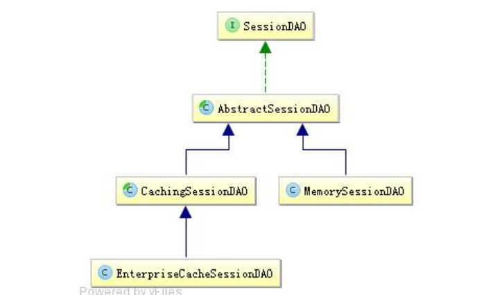

shiro会话管理
==============================================================
Shiro 提供了完整的企业级会话管理功能，不依赖于底层容器（如 web 容器 tomcat），不管JavaSE 还是 JavaEE
环境都可以使用，提供了会话管理、会话事件监听、会话存储/持久化、容器无关的集群、失效/过期支持、对 Web 的透明支持、
SSO 单点登录的支持等特性。即直接使用 Shiro 的会话管理可以直接替换如 Web 容器的会话管理。

### 会话管理器
会话管理器管理着应用中所有 Subject 的会话的创建、维护、删除、失效、验证等工作。是 Shiro 的核心组件，
顶层组件 SecurityManager 直接继承了 SessionManager，且提供了 SessionsSecurityManager 实现直接把会话管理
委托给相应的 SessionManager ，DefaultSecurityManager 及 DefaultWebSecurityManager 默认 SecurityManager 都继承了
SessionsSecurityManager。

Shiro 提供了三个默认实现：
+ `DefaultSessionManager`：DefaultSecurityManager 使用的默认实现，用于 JavaSE 环境；
+ `ServletContainerSessionManager`：DefaultWebSecurityManager 使用的默认实现，用于 Web环境，其直接使用 Servlet 容器的会话；
+ `DefaultWebSessionManager` ： 用于 Web 环境的实现 ，可以替代ServletContainerSessionManager，自己维护着会话，直接废弃了 Servlet 容器的会话管理。

### 会话监听器
+ SessionListener
+ SessionListenerAdapter 适配器

### 会话存储/持久化
Shiro 提供 SessionDAO 用于会话的 CRUD，即 DAO（Data Access Object）模式实现：
```java
//如 DefaultSessionManager 在创建完 session 后会调用该方法；如保存到关系数据库/文件系统/NoSQL 数据库；
//即可以实现会话的持久化；返回会话 ID；主要此处返回的
Serializable create(Session session);
//根据会话 ID 获取会话
Session readSession(Serializable sessionId) throws UnknownSessionException;
//更新会话；如更新会话最后访问时间/停止会话/设置超时时间/设置移除属性等会调用
void update(Session session) throws UnknownSessionException;
//删除会话；当会话过期/会话停止（如用户退出时）会调用
void delete(Session session);
//获取当前所有活跃用户，如果用户量多此方法影响性能
```

Shiro 内嵌了如下 SessionDAO 实现：



AbstractSessionDAO 提供了 SessionDAO 的基础实现，如生成会话 ID 等；CachingSessionDAO 提供了对开发者透明的会话缓存的功能，
只需要设置相应的 CacheManager 即可；MemorySessionDAO 直接在内存中进行会话维护；
而 EnterpriseCacheSessionDAO 提供了缓存功能的会话维护，默认情况下使用 MapCache 实现，
内部使用 ConcurrentHashMap 保存缓存的会话。

Shiro 提供了使用 Ehcache 进行会话存储，我计划用Redis作为会话存储。

### 会话验证
Shiro 提供了会话验证调度器，用于定期的验证会话是否已过期，如果过期将停止会话；出于性能考虑，
一般情况下都是获取会话时来验证会话是否过期并停止会话的； 但是如在 web环境中，
如果用户不主动退出是不知道会话是否过期的，因此需要定期的检测会话是否过期，Shiro 提供了会话验证调度器
SessionValidationScheduler 来做这件事情。

### sessionFactory
sessionFactory 是创建会话的工厂，根据相应的 Subject 上下文信息来创建会话；默认提供了
SimpleSessionFactory 用来创建 SimpleSession 会话。
