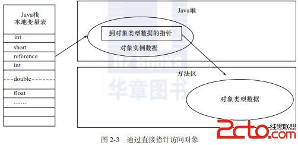

对象访问
==================================================
我们来探讨一个问题：在Java语言中，对象访问是如何进行的！即使是最简单的访问，也会涉及Java栈，Java堆，
方法区这三个最重要内存区域之间的关联关系，如下面的这句代码：
```java
Object obj = new Object();
```
假设这句代码出现在方法体中，那`Object obj`这部分的语义将会反映到 **Java栈的本地变量表** 中，
作为一个reference类型数据出现。而`new Object()`这部分的语义将会反映到 **Java堆** 中，形成一块
存储了Object类型所有实例数据值的结构化内存。另外，在Java堆中还必须包含能够查找到此对象类型数据（
如对象类型，父类，实现的接口，方法等）的地址信息，这些类型数据则存储在 **方法区** 中。

由于reference类型在Java虚拟机规范里面只规定了一个指向对象的引用，并没有定义这个引用应该通过哪种
方式去定位，以及访问到Java堆中的对象的具体位置，因此不同虚拟机实现的对象访问方式会有所不同，主流的
访问方式有两种：**使用句柄** 和 **直接指针**。
+ 如果 **使用句柄** 访问方式，Java堆中将会划分出一块内存来作为句柄池，reference中存储的就是对象的句柄地址，
而句柄中包含了对象实例数据和类型数据各自的具体地址信息。如图：


+ 如果使用 **直接指针** 访问方式，Java堆对象的布局中就必须考虑如何放置访问类型数据的相关信息，reference中直接存储的就是对象地址。如图：


这两种对象的访问方式各有优势，**使用句柄访问** 的最大好处就是reference中存储的是稳定的句柄地址，
在对象被移动时只会改变句柄中的实例数据指针，而reference本身不需要被修改。

**使用直接指针访问** 方式的最大好处就是速度更快，它 **节省了一次指针定位的时间开销**，由于对象的访问在Java中
非常频繁，因此这类开销积少成多后也是一项非常可观的执行成本。就Sun HotSpot虚拟机而言，使用的是这种
对象访问方式（直接指针）。
