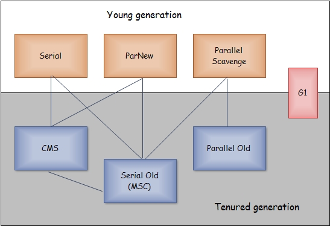

垃圾收集器
================================================
收集算法是内存回收的方法论，垃圾收集器就是内存回收的具体实现。

这里讨论的收集器基于Sun HotSpot虚拟机1.6版 Update 22，它包含的所有收集器如上图所示。
上图展示了7种作用于不同分代的收集器，**如果两个收集器之间存在连线，就说明它们可以搭配使用**。

### Serial收集器（新生代）
`Serial`收集器是最基本 ，历史最悠久的收集器，曾经（在JDK1.3.1之前）是虚拟机新生代收集的唯一选择。
这个收集器是一个 **单线程的收集器**，但它的“单线程”的意义并不仅仅是说明它只会使用一个CPU或一条收集线程
去完成垃圾收集工作，**更重要的是在它进行垃圾收集时，必须暂停其他所有的工作线程，直到它收集结束**。
这对很多应用来说都是难以接受的！

似乎`Serial`收集器成了一个老而无用，食之无味弃之可惜的鸡肋了，但实际上到现在为止，它依然是 **虚拟机
运行在`Client`模式下的默认新生代收集器**。它也有着优于其他收集器的地方：简单而高效，对于限定单个CPU
的环境来说，`Serial`收集器由于没有线程交互的开销，专心做垃圾收集自然可以获得最高的单线程收集效率。
所以，**`Serial`收集器对于运行在`Client`模式下的虚拟机来说是一个很好的选择**。

### ParNew收集器（新生代）
**`ParNew`收集器其实就是`Serial`收集器的多线程版本**，除了使用多多条线程进行垃圾收集之外，其余都完全一样。

`ParNew`收集器除了多线程收集之外，其他与`Serial`收集器相比并没有太多创新之处，但它却是许多运行在
`Server`模式下的虚拟机中首先的新生代收集器，其中有一个与性能无关但很重要的原因是，除了`Serial`收集器外，
目前只有它能与`CMS`收集器配合工作（不幸的是，`CMS`作为老年代的收集器，却无法与JDK 1.4.0中已经存在的新生
代收集器`Parallel Scavenge`配合工作，所以在JDK1.5中使用CMS来收集老年代的时候，新生代只能选择`ParNew`
或`Serial`收集器中的一个）。

`ParNew`收集器在单CPU的环境中绝对不会有比`Serial`收集器更好的效果。当然，随着可以使用的CPU的数量的
增加，它对于GC时系统资源的利用还是很有好处的。**它默认开启的收集线程数与CPU的数量相同**，在CPU非常多（
譬如32个，现在CPU动辄就4核加超线程，服务器超过32个逻辑CPU的情况越来越多了）的环境下，可以使用
**`-XX:ParallelGCThreads`** 参数来限制垃圾收集的线程数。

### Parallel Scavenge收集器（新生代）
`Parallel Scavenge`收集器也是一个新生代收集器，它也是使用复制算法的收集器。它的关注点与其他收集器不同，
`CMS`等收集器的关注点尽可能地缩短垃圾收集时用户线程停顿时间，而`Parallel Scavenge`收集器的目标则是
**达到一个可控制的吞叶量**。所谓吞吐量就是CPU用于运行用户代码的时间与CPU总消耗时间的比值，即 **吞吐量 =
运行用户代码时间 / （运行用户代码时间 + 垃圾收集时间）** ，虚拟机总共运行了100分钟，其中垃圾收集花掉
1分钟，那吞吐量就是99%。

**停顿时间越短就越适合需要与用户交互的程序，良好的响应速度能提升用户的体验；而高吞吐量则可以最高效率地
利用CPU时间，尽快地完成程序的运算任务，主要适合在后台运算而不需要太多交互的任务**。

`Parallel Scavenge`收集器提供了两个参数用于精确控制吞吐量，分别是 **控制最大垃圾收集停顿时间** 的
**`-XX:MaxGCPauseMillis`** 参数及直接 **设置吞吐量大小** 的 **`-XX:GCTimeRatio`** 参数。

`MaxGCPauseMillis`参数允许的值是一个大于0的毫秒数，收集器将尽力保证内存回收花费的时间不超过设定值。
**GC停顿时间缩短是以牺牲吞吐量和新生代空间来换取的**：系统把新生代调小一些，收集300M新生代肯定比收集
500M快吧，这也直接导致垃圾收集发生得更频繁一些，原来10秒收集一次，每次停顿100毫秒，现在变成5秒收集一次，
每次停顿70毫秒。停顿时间的确在下降，但吞吐量也降下来了。

`GCTimeRatio`参数的值应当是一个 `0< x <100` 的整数，也就是垃圾收集时间占总时间的比率，相当于是吞吐量的
倒数。如果把此参数设置为19，那允许的最大GC时间就占总时间的5%（即1/(1+19)），默认值为99，就是允许最大1％（1/(1+99)）
的垃圾收集时间。

由于与吞吐量关系密切，`Parallel Scavenge`收集器也经常被称为 **“吞吐量优先”收集器**。除上述两个参数之外，
`Parallel Scavenge`收集器还有一个参数 **`-XX:+UseAdaptiveSizePolicy`** 值得关注。这是一个开关参数，
当这个参数打开之后，就不需要手工指定新生代的大小（**-Xmn**）以及`Eden`与`Survivor`区的比例（**-XX:SurvivorRatio**），
还包括晋升老年代对象年龄（**-XX:PretenureSizeThreshold**）等细节参数了，虚拟机会根据当前系统的运行
情况收集性能监控信息，动态调整这些参数以提供最合适的停顿时间或最大的吞吐量。这种调节方式称为 **GC自适应的调节策略（GC Ergonomics）**。
**如果对收集器运作原理不太了解，手工优化存在困难的时候，使用`Parallel Scavenge`收集器配合自适应调节策略，
把内存管理的调优任务交给虚拟机去完成将是一个不错的选择。只需要把基本的内存数据设置好（如`-Xmx`设置最大堆），
然后使用`MaxGCPauseMillis`参数（更关注最大停顿时间）或`GCTimeRatio`参数（更关注吞吐量）给虚拟机设立一个优化目标，
那些具体细节参数的调节工作就由虚拟机完成了**！

### Serial Old收集器（老年代）
`Serial Old`是`Serial`收集器的老年代版本，它同样是一个单线程收集器，使用“标记——整理”算法。
这个收集器的主要意义也是被Client模式下的虚拟机使用。如果在Server模式下，它主要还有两大用途：一个是
在JDK1.5及之前的版本中与`Parallel Scavenge`收集器搭配使用，另外一个就是作为CMS收集器的后备预案，
在并发收集发生Concurrent Mode Failure的时候使用。

### Parallel Old收集器（老年代）
`Parallel Old`是`Parallel Scavenge`收集器的老年代版本，使用多线程和“标记——整理”算法。
这个收集器是在JDK1.6中才开始提供的，在此之前，新生代的`Parallel Scavenge`收集器一直处于比较尴尬的状态。
原因是，如果新生代选择了`Parallel Scavenge`收集器，老年代除了`Serial Old`收集器外别无选择。
由于单线程的老年代`Serial Old`收集器在服务端应用性能上的“拖累”，即便使用了`Parallel Scavenge`
收集器也未必能在整体应用上获得吞吐量最大化的效果。

直到`Parallel Old`收集器出现后，“吞吐量优先”收集器终于有了比较名副其实的应用组合，在注重吞吐量及CPU资源
敏感的场合，都可以优先考虑`Parallel Scavenge`加`Parallel Old`收集器。

### CMS收集器（老年代）
CMS（Concurrent Mark Sweep）收集器是一种以 **获取最短回收停顿时间** 为目标的收集器。目前很大一部分
的Java应用都集中在 **互联网站或B/S系统** 的服务端上，这类应用尤其 **重视服务的响应速度**，希望系统停顿时间最短，
以给用户带来较好的体验。CMS收集器就非常符合这类应用的需求。

CMS收集器是基于“标记——清除”算法实现的，它的运作过程相对于前面几种收集器来说要更复杂一些，整个过程分为4个步骤：
+ 初始标记（CMS initial mark）
+ 并发标记（CMS concurrent mark）
+ 重新标记（CMS remark）
+ 并发清除（CMS concurrent sweep）

其中初始标记，重新标记这两个步骤仍然需要“垃圾收集时，需要暂停所有工作线程”。初始标记仅仅只是标记一下GC Roots
能直接关联到的对象，速度很快，并发标记阶段就是进行GC Roots Tracing的过程，而重新标记阶段则是为了修正并发标记
期间，因用户程序继续运作而导致标记产生变动的那一部分对象的标记记录，这个阶段的停顿时间一般会比初始标记阶段稍长一
些，但远比并发标记的时间短。

由于整个过程中耗时最长的并发标记和并发清除过程中，收集器线程都可以与用户线程一起工作，所以总体上来说，
**CMS收集器的内存回收过程是与用户线程一起并发地执行的**。

### G1收集器
G1（Garbage First）收集器是当前收集器技术发展的最前沿成果，在JDK1.6 Update14中提供了Early Access版本的G1
收集器以供试用。在将来JDK 1.7正式发布的时候，G1收集器很可能会有一个成熟的商用版本随之发布！

G1收集器是垃圾收集器理论进一步发展的产物，它与前面的CMS收集器相比有两个显著的改进：一是G1收集器是基于“标记——整理”
算法实现的收集器，也就是说它不会产生空间碎片，这对于长时间运行的应用系统来说非常重要。二是它可以非常精确
地控制停顿，即能让使用者明确指定在一个长度为M毫秒的时间片段内，消耗在垃圾收集上的时间不得超过N毫秒，这几乎
已经是实时Java(RTSJ)垃圾收集器的特征了。

**G1收集器可以实现在基本不牺牲吞吐量的前提下完成低停顿的内存回收**，这是由于 **它能够极力地避免全区域的垃圾收集**，
之前的收集器进行收集的范围都是整个新生代或老年代，**而G1将整个Java堆（包括新生代，老年代）划分为多个大小固定的独立
区域，并且跟踪这些区域里面的垃圾规程程序，在后台维护一个优先列表，每次根据允许的收集时间，优先回收垃圾最多的区域（
这就是Garbage First名称的由来）**。区域划分及有优先级的区域回收，保证了G1收集器在有限的时间内可以获得最高的收集效率。
