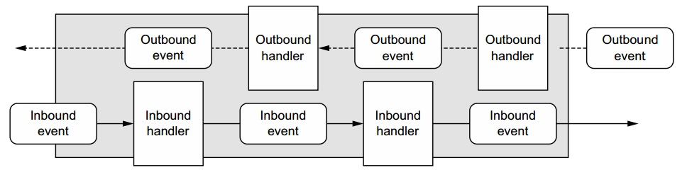

Netty的核心组件
=====================================================
Netty的主要组成模块：
+ **Channels**；
+ **Callbacks**；
+ **Futures**；
+ **Events和handlers**；

### Channels
一个`Channel`是`Java NIO`的一个基本抽象。它代表了：**一个连接到比如硬件设备，文件，网络socket等实体的开放连接，
或者是一个能够完成一种或多种譬如读或写等不同I/O操作的程序**。

目前，**可以把一个`Channel`想象成一个输入和输出数据的媒介**。同样地，它可以被打开或者关闭，连接或者断开。

### Callbacks
一个`callback`就是一个方法，一个提供给另一个的方法的引用。这让另一个方法可以在适当的时候回过头来调用这个`callback`方法。
`Callbacks`在很多编程情形中被广泛使用，是 **用于通知相关方** 某个操作已经完成最常用的方法之一。

Netty在处理事件时内部使用了`callback`；当一个`callback`被触发，事件可以被`ChannelHandler`的接口实现处理。
下面的代码清单是这样一个例子：当一个新的连接建立后，`ChannelHandler`的`callback`方法`channelActive()`会被调用，
然后打印一条消息。
```java
public class ConnectHandler extends ChannelInboundHandlerAdapter {
  //当一个新的连接建立时，channelActive(ChannelHandlerContext ctx)被调用
  @Override
  public void channelActive(ChannelHandlerContext ctx) throws Exception {
    System.out.println("Client " + ctx.channel().remoteAddress() + " connected");
  }
}
```

### Future
一个`Future`提供了另一个当操作完成时如何通知应用的方法。**`Future`对象充当了一个存放异步操作结果的占位符(placeholder)角色；
它会在将来某个时间完成并且提供对操作结果的访问**。

JDK搭载了接口`java.util.concurrent.Future`, 但是提供的接口实现只允许你手动检查操作是否已经完成，
或者就一直阻塞到操作完成。这非常麻烦，所以 **Netty提供了它自己的`ChannelFuture`实现，用于执行异步操作**。

`ChannelFuture`提供了额外的方法让我们 **可以注册一个或者多个`ChannelFutureListener`实例**。
监听者的callback方法 **`operationComplete()`在操作完成时被调用**。然后监听者可以查看这个操作是否成功完成，还是出错了。
如果出错了，我们可以从`future`获取`Throwable`。简单来说，**`ChannelFutureListener`提供的通知机制免去了手动检查操作完成情况的麻烦**。

每个Netty输出的I/O操作都会返回一个`ChannelFuture`；就是说，没有一个操作是阻塞的。就像我们之前所说的，
**Netty由下至上都是异步和事件驱动的**。

下面示例中，一个`ChannelFuture`做为一个I/O操作的一部分被返回。这里，`connect()`会无阻塞地直接返回，
调用会在后台完成。什么时候会完成取决于多个因素，但是这个担心已经从代码里被抽离(abstract away)出来了。
因为这个线程没有阻塞在等待这个操作完成，它可以同时做其他事情，因此更有效率地利用资源。
```java
Channel channel = ......;
//Does not block
//异步连接到远端
ChannelFuture future = channel.connect(new InetSocketAddress("192.168.0.1", 25));
```
下面示例代码展示了如何利用`ChannelFutureListener`。首先你连接到一个远端。
然后用`connect()`返回的`ChannelFuture`注册一个新的`ChannelFutureListener`。当监听器被通知连接建立时，
检查状态(1：注释位置，解释用)。如果这个操作成功，你写数据到这个`Channel`。否则你从`ChannelFuture`中读取`Throwable`。
```java
Channel channel = ......;
//Does not block
//异步连接到远端
ChannelFuture future = channel.connect(new InetSocketAddress("192.168.0.1", 25));
//注册一个ChannelFutureListener用于在操作完成时收到通知
future.addListener(new ChannelFutureListener(){
  @Override
  public void operationComplete(ChannelFuture future){
    //检查操作的状态，上文中1的位置
    if(future.isSuccess()){
      //如果操作成功，创建一个ByteBuf来存放数据
      ByteBuf buffer = Unpooled.copiedBuffer("Hello", Charset.defaultCharset());
      //异步地发送数据到远端，返回一个ChannelFuture
      ChannelFuture wf = future.channel().writeAndFlush(buffer);
      ......
    }else{
      //如果错误发生，读取描述错误原因的Throwable
      Throwable cause = future.cause();
      cause.printStackTrace();
    }
  }
});
```
注意错误处理完全取决于你，取决于某个具体错误施加的限制。比如说，连接错误发生时，你可以试着重连或者和另一个远端建立连接。

**如果你认为一个`ChannelFutureListener`是一个callback的复杂版本，那你想对了。事实上，`callbacks`和`Futures`是互补的机制**；
两者结合起来构成了Netty的关键模块之一。

### Events和handlers
Netty用 **细分的events** 来通知我们状态的变化或者操作的状况。这让我们可以 **基于发生的events来触发适当的行为**。
这类行为可能包括：
+ 日志记录；
+ 数据传送；
+ 流控制；
+ 应用逻辑；

Netty是一个网络编程框架，所以 **events按它们和输入或者输出数据流的关系来分类**。可能被 **输入数据或者相关状态改变** 触发的events包括：
+ 活跃或者停用的连接；
+ 读数据；
+ 用户events；
+ 错误events；

而 **输出event** 则是会触发将来行为的操作的结果，可能会是：
+ 打开或者关闭到远端的连接；
+ 写或者刷数据到一个socket；

**每一个event都可以被分派到一个用户实现的handler对象的方法**。

这是一个事件驱动的模型如何直接转变为应用模块的好例子。下图展示了一个event如何被一串这样的`event handler`处理：



Netty的`ChannelHandler`提供了如上图中展示的`handler`的基本抽象。我们在适当的时候会更多地谈论到`ChannelHandler`，
但是现在 **你可以认为每个handler实例就是一种响应某个具体event的callback**。

**Netty提供了大量你可以马上拿来用的预定义handler，包括`HTTP`和`SSL/TLS`等协议的handler**。在内部，
`ChannelHandler`自己也用`events`和`futures`，和你的应用是同样抽象的消费者。
