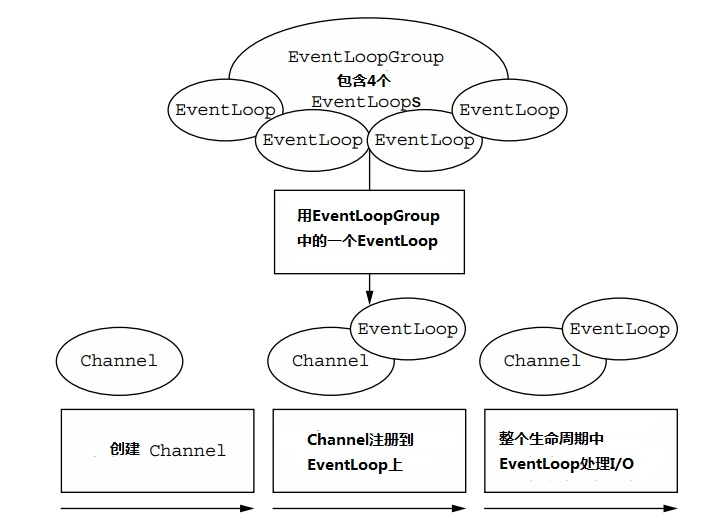
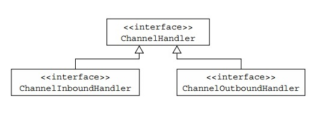
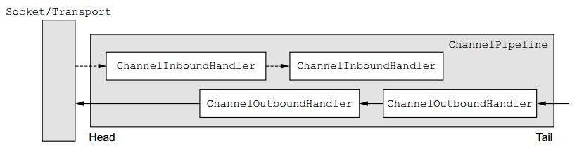

Netty的组件和设计
=============================================================
从一个高层次的角度来看，Netty解决了 **两个相应领域** 的问题，我们可以大体上称其为 **技术上的** 和 **结构上的**。
首先，它的 **异步** 和 **事件驱动** 基于Java NIO实现，**在高负载下能保证最好的应用性能和可扩展性**。第二，
Netty包含了一系列 **用来解耦应用逻辑和网络层的设计模式**，简化了开发的同时最大限度地提升了可测试性，模块化和可重用性。

随着我们更具体地学习Netty的单个组件，我们将会密切关注这些组件是如何配合来支持结构的最佳实践。遵循同样的原则，
我们就能收获Netty提供的所有好处。在这个目标的指引下，在这一章，我们会回顾下到目前为止我们已经介绍过的主要概念和组件。

### Channel，EventLoop和ChannelFuture
它们合起来可以被看成是Netty的网络抽象：
+ `Channel`————Sockets；
+ `EventLoop`————控制流，多线程，并发；
+ `ChannelFuture`————异步通知；

#### 接口Channel
基本的I/O操作（**`bind()`，`connect()`，`read()`和`write()`**）依赖于底层网络传输层提供的基本类型。
在基于Java的网络编程中，基本的构造单元就是 **`Socket`类**。Netty的 **`Channel`接口** 提供了一个API，
极大地降低了直接使用`Socket`的复杂性。另外，`Channel`是一个包含大量预定义，有专门用途的类层次结构中的根元素，
下面只是列出了其中的一些部分：
+ `EmbeddedChannel`；
+ `LocalServerChannel`；
+ `NioDatagramChannel`；
+ `NioSctpChannel`；
+ `NioSocketChannel`；

#### 接口EventLoop
`EventLoop`定义了Netty的核心抽象，**用来处理发生在一个连接生命周期中的event**。现在，下图从高层次展现了`Channel`，
`EventLoop`，`Thread`和`EventLoopGroup`之间的关系。

这些关系是指：
+ 一个`EventLoopGroup`包含一个或者多个`EventLoop`；
+ 所有的`EventLoop`在它的整个生命周期里都绑定在一个线程上；
+ 所有被一个`EventLoop`处理的event都是由`EventLoop`绑定的线程处理的；
+ 一个`Channel`在它的生命周期内只注册到一个`EventLoop`上；
+ 一个`EventLoop`可以被分配给一个或者多个`Channel`。

**注意，某一个`Channel`的所有I/O由同一个线程执行的这个设计，实际上省去了同步的需要**。

#### 接口ChannelFuture
如同我们之前解释的，Netty中所有的I/O操作都是异步的。因为一个操作可能不会立刻返回，我们需要一个方法在稍后的时间来判定它的结果。
因此，Netty提供了`ChannelFuture`，它的`addListener()`方法注册一个`ChannelFutureListener`，
当操作完成时可以收到通知（无论成功与否）。

把一个`ChannelFuture`看成一个 **容器**，存放在未来执行的操作的结果。这个操作何时会被执行取决于几个因素，
因此不可精确预测，但是确信的是它会被执行。另外，所有属于同一个`ChannelFuture`的操作都会保证按调用的顺序来执行。

### ChannelHandler和ChannelPipeline

#### 接口ChannelHandler
从应用开发者的角度来看，Netty的主要组件是`ChannelHandler`，**它作为一个应用逻辑的容器，处理输入输出数据**。
这成为可能，是因为`ChannelHandler`的方法是被 **网络event**（这里的event是广义的）触发的。事实上，
一个`ChannelHandler` **可以被用于几乎任何类型的行为**，比如转换数据格式，处理抛出的异常。

举例来说，`ChannelInboundHandler`是一个你将会经常实现的子接口。这个类型 **接收输入event和数据** 后，
让你的应用业务逻辑处理。在你给一个连接的客户端发送响应的时候，你也能在一个`ChannelInboundHandler`里刷新(flush)数据。
**你的应用业务逻辑通常会存在一个或者多个`ChannelInboundHandler`中**。

#### ChannelPipeline接口
一个`ChannelPipeline`为一串`ChannelHandler`提供了一个容器，同时定义了在这一串`ChannelHandler`中传送输入输出event的API。
当一个`Channel`被创建，它会自动被分配一个`ChannelPipeline`。

`ChannelHandler`按如下步骤安装到`ChannelPipeline`中：
+ 一个`ChannelInitializer`接口实现被注册到一个`ServerBootstrap`；
+ 当`ChannelInitializer.initChannel()`被调用时，这个`ChannelInitializer`会往管道(pipeline)中安装定制的一组`ChannelHandler`；
+ 然后这个`ChannelInitializer`把自己从`ChannelPipeline`中移除；

让我们来深入了解下`ChannelPipeline`和`ChannelHandler`之间的共生关系，来检验当你发送或者接收数据的时候发生了什么!?

`ChannelHandler`特地被设计来支持广泛的应用，你可以把它看成是一个代码的通用容器，这些代码用来处理往来`ChannelPipeline`
的event（包括数据）。在下图中可以看出，**`ChannelInboundHandler`和`ChannelOutBoundHandler`衍生自`ChannelHandler`**。

让一个event在这个管道中运转是`ChannelHandler`们的工作，`ChannelHandler`在初始化段或者应用的bootstrapping阶段
被安装在`ChannelPipeline`中。这些`ChannelHandler`对象接收event，执行已经实现了的处理逻辑，**然后传递数据到链中的下一个handler**。
`ChannelHandler`执行的顺序按照它们被添加到`ChannelPipeline`中的顺序。实际上，我们正是把`ChannelHandler`
的有序排列称作`ChannelPipeline`。

**包含输入和输出ChannelHandler的ChannelPipeline**，如图：

上图展示了在Netty应用中 **输入(inbound)** 和 **输出(outbound)** 数据流之间的区别。从一个客户端应用的角度来看，
如果event是从客户端到服务器的，那么这些event是输出的，反之是输入的。

上图还说明了 **输入和输出handlers可以被安装在同一个管道中**。**如果一条消息或者其他任何的输入event被读取，
它会从管道的头部开始，然后被传送到第一个`ChannelInboundHandler`。根据handler的具体功能，这个handler也许会改动这条数据，
也可能不改动这条数据，然后数据会被传送到链中的下一个`ChannelInboundHandler`。最后，数据到达管道的尾部，所有的处理结束**。

**数据的输出运动（也就是写数据）** 在概念上类似。这个例子里，**数据从管道尾部流出，穿过`ChannelOutBoundHandler`链直到达到头部**。
之后，输出数据会到达网络层，如图所示是一个Socket。通常，这会触发一个socket的写操作。

**更多关于输入和输出handlers**
通过利用每个方法提供的输入参数`ChannelHandlerContext`，一个event可以被转发到当前链中的下一个handler。
因为有时候你会忽略不感兴趣的event，所以Netty提供了抽象基类`ChannelInboundHandlerAdapter`和`ChannelOutBoundHandlerAdapter`。
它们都提供了一些方法，只需简单地通过调用`ChannelHandlerContext`上相应的方法，把可以event传送到下一个handler。
你可以通过重写你感兴趣的方法来扩展这些类。

鉴于输出和输入操作是不同的，你也许会想知道当两类handler被混在同一个`ChannelPipeline`中会发生什么。
**虽然输入和输出handler都扩展自`ChannelHandler`，但是Netty可以区分`ChannelInboundHandler`和`ChannelOutBoundHandler`的实现，
并且确保数据只通过同一方向类型的handler**。

当一个`ChannelHandler`被加入一个`ChannelPipeline`时，就被分配了一个`ChannelHandlerContext`。
`ChannelHandlerContext`代表了一个`ChannelHandler`和`ChannelPipeline`直接的绑定关系。
**虽然说`ChannelHandlerContext`这个对象可以被用来获取底层的`Channel`，但是它主要是被用来写输出数据的**。

**Netty中有两种发送消息的方法。你可以直接写到`Channel`中，或者写到一个`ChannelHandler`相关的`ChannelHandlerContext`中。
前者让消息从`ChannelPipeline`的尾部开始发送，而后者让消息从`ChannelPipeline`中的下一个handler开始发送**。

#### 进一步了解ChannelHandler
我们之前说的，有很多不同种类的`ChannelHandler`，而且每一个`ChannelHandler`的功能主要由它的父类决定。
Netty以适配器类的形式，提供了很多缺省handler实现，以此来简化应用处理逻辑的开发过程。你刚才已经看到了，
一个管道里的每个`ChannelHandler`都负责转发event到链中的下一个handler。**这些适配器类（和它们的子类）自动地完成这些转发，
因此你可以只重写那些你想要特别实现的方法和event**。

**为什么要用适配器**？
有一些适配器类把 **定制`ChannelHandler`的麻烦减小到了最低**，因为它们提供了定义在相应接口中所有方法的缺省实现。
这些是你在创建你的定制handler时经常会用到的适配器。
+ `ChannelHandlerAdapter`；
+ `ChannelInboundHandlerAdapter`；
+ `ChannelOutboundHandlerAdapter`；
+ `ChannelDuplexHandlerAdapter`；

接下来，我们来仔细看下三种`ChannelHandler`的子类型：**编码器(encoders)**，**解码器(decoders)**，
和一个`ChannelInboundHandlerAdapter`的子类 **`SimpleChannelInboundHandler<T>`**；
