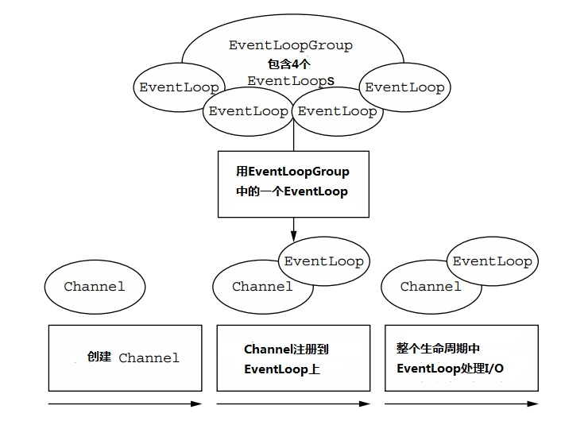

Netty的组件和设计
=============================================================
从一个高层次的角度来看，Netty解决了 **两个相应领域** 的问题，我们可以大体上称其为 **技术上的** 和 **结构上的**。
首先，它的 **异步** 和 **事件驱动** 基于Java NIO实现，**在高负载下能保证最好的应用性能和可扩展性**。第二，
Netty包含了一系列 **用来解耦应用逻辑和网络层的设计模式**，简化了开发的同时最大限度地提升了可测试性，模块化和可重用性。

随着我们更具体地学习Netty的单个组件，我们将会密切关注这些组件是如何配合来支持结构的最佳实践。遵循同样的原则，
我们就能收获Netty提供的所有好处。在这个目标的指引下，在这一章，我们会回顾下到目前为止我们已经介绍过的主要概念和组件。

### Channel，EventLoop和ChannelFuture
它们合起来可以被看成是Netty的网络抽象：
+ `Channel`————Sockets；
+ `EventLoop`————控制流，多线程，并发；
+ `ChannelFuture`————异步通知；

#### 接口Channel
基本的I/O操作（**`bind()`，`connect()`，`read()`和`write()`**）依赖于底层网络传输层提供的基本类型。
在基于Java的网络编程中，基本的构造单元就是 **`Socket`类**。Netty的 **`Channel`接口** 提供了一个API，
极大地降低了直接使用`Socket`的复杂性。另外，`Channel`是一个包含大量预定义，有专门用途的类层次结构中的根元素，
下面只是列出了其中的一些部分：
+ `EmbeddedChannel`；
+ `LocalServerChannel`；
+ `NioDatagramChannel`；
+ `NioSctpChannel`；
+ `NioSocketChannel`；

#### 接口EventLoop
`EventLoop`定义了Netty的核心抽象，**用来处理发生在一个连接生命周期中的event**。现在，下图从高层次展现了`Channel`，
`EventLoop`，`Thread`和`EventLoopGroup`之间的关系。

这些关系是指：
+ 一个`EventLoopGroup`包含一个或者多个`EventLoop`；
+ 所有的`EventLoop`在它的整个生命周期里都绑定在一个线程上；
+ 所有被一个`EventLoop`处理的event都是由`EventLoop`绑定的线程处理的；
+ 一个`Channel`在它的生命周期内只注册到一个`EventLoop`上；
+ 一个`EventLoop`可以被分配给一个或者多个`Channel`。

**注意，某一个`Channel`的所有I/O由同一个线程执行的这个设计，实际上省去了同步的需要**。

#### 接口ChannelFuture
如同我们之前解释的，Netty中所有的I/O操作都是异步的。因为一个操作可能不会立刻返回，我们需要一个方法在稍后的时间来判定它的结果。
因此，Netty提供了`ChannelFuture`，它的`addListener()`方法注册一个`ChannelFutureListener`，
当操作完成时可以收到通知（无论成功与否）。

把一个`ChannelFuture`看成一个 **容器**，存放在未来执行的操作的结果。这个操作何时会被执行取决于几个因素，
因此不可精确预测，但是确信的是它会被执行。另外，所有属于同一个`ChannelFuture`的操作都会保证按调用的顺序来执行。

### ChannelHandler和ChannelPipeline

#### 接口ChannelHandler
从应用开发者的角度来看，Netty的主要组件是`ChannelHandler`，**它作为一个应用逻辑的容器，处理输入输出数据**。
这成为可能，是因为`ChannelHandler`的方法是被 **网络event**（这里的event是广义的）触发的。事实上，
一个`ChannelHandler` **可以被用于几乎任何类型的行为**，比如转换数据格式，处理抛出的异常。

举例来说，`ChannelInboundHandler`是一个你将会经常实现的子接口。这个类型 **接收输入event和数据** 后，
让你的应用业务逻辑处理。在你给一个连接的客户端发送响应的时候，你也能在一个`ChannelInboundHandler`里刷新(flush)数据。
**你的应用业务逻辑通常会存在一个或者多个`ChannelInboundHandler`中**。
