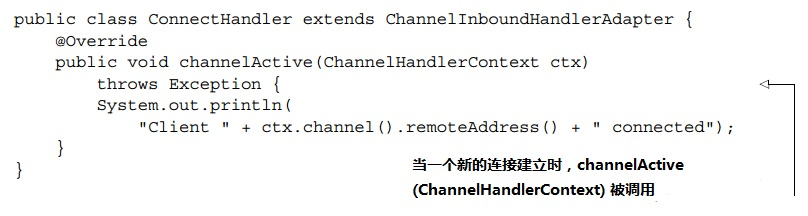

Netty：异步和事件驱动
=============================================================
假设你即将要为一个重要的大公司开发一个新的关键任务的应用程序。在第一次会议上，
你了解到这个系统必须能无性能损耗地扩展到支持15万个并发用户。这时所有的人都看着你，你会说什么？

如果你自信地说“没问题”，那么真心佩服你！但是我们中的大部分人可能还是说得更谨慎些，比如“听起来是可行的”。
然后，一旦回到电脑前，我们就会开始搜索“高性能Java网络编程（high performance Java networking）”。

如今，如果你搜索这个关键字，在第一页的结果中，你将会看到这个:`Netty: Home`，`netty.io/`。
Netty是一个用于快速开发可维护的高性能协议服务器和客户端的 **异步的事件驱动网络应用框架**。

如果你像很多人一样，通过这种方式发现了Netty，那么接下来你也许就会浏览官网，下载代码，研读Javadocs和一些博客，
同时开始写代码。如果你已经有了扎实的网络编程经验，你也许会取得很大的进步；否则的话，可能不会。

为什么这么说呢？实现像上述例子中的高性能系统需要超一流的编程技术，需要诸多复杂领域的经验，包括网络，多线程和并发。
Netty让甚至是网络编程的新手都可以运用到这些专业知识。但到目前为止，缺少一份全面的指导使得这个学习过程变得很困难，
所以才有了本书。

我们写这本书的主要目的是使Netty被最大可能范围的开发人员所接受。这包括那些有创新内容和服务，
但是既没有时间也无意成为网络专家的人。如果你也是其中一员，我们相信你会惊喜地发现你会很快地准备好创建你的第一个Netty应用。
另一方面，我们致力于支持那些寻找开发私有网络协议工具的高级开发者。

事实上，Netty确实提供了一个非常丰富的网络开发工具包，我们会花大部分的时间来探索它的性能。但是Netty终究是一个框架，
它的架构方法和设计原则同它的技术内容一样重要。因此，我们还将会提到这些：
+ 关注点分离（解耦业务和网络逻辑）；
+ 模块化和可重用性；
+ 做为第一需求的易测性；

在第一章，我们介绍Netty，以及它的核心概念和组件。到本章的结尾，你将会准备好创建你的第一个基于Netty的客户端和服务器。

### Netty简介
不久以前，我们在一开始展现的那个场景（支持成千上万的并发用户）会被认为是不可能的事。如今，做为系统用户，
我们认为这种能力是理所当然的，做为开发者，我们期望这个极限可以更高。我们知道，总会出现对更大吞吐量，
更高扩展性的低成本需求。

不要低估上一个观点的重要性。我们从漫长而痛苦的经历中学习到，**低层次APIs的直接使用会暴露复杂度，
同时带来对稀缺技能的严重依赖**。所以，一个面向对象的基本概念是：**用简化的抽象隐藏底层实现的复杂性**。

这个原则刺激了许多框架的出现，这些框架将常规编程任务封装成现成解决的方案，很多还和分布式系统开发密切相关。
也许可以这么断言，所有的职业Java开发者熟悉至少一种框架。对于我们很多人来说，这些框架是必不可少的，
不仅满足了我们的技术需求，也满足了我们的开发进度。

在网络编程领域，Netty是出色的Java框架。通过使用简单易用的API来享用到Java高级APIs的威力，
Netty让你可以专注于真正让你感兴趣的东西（你应用的独特价值）。

#### 谁在用Netty？
Netty有一个活跃的不断成长的使用团体，除了一些流行的开源代码项目比如`Infinispan`，`HornetQ`，`Vert.x`，
`Apache Cassandra`和`Elastic seartch`，还包括一些大公司，比如Apple，Twitter，Facebook，Google，
Square和Instagram。他们都在核心代码里采用了Netty强大的网络抽象。在初创公司中，Firebase和Urban Airship在使用Netty，
前者用于 **HTTP长连接**，后者用于 **各种推送通知**。

每当你用Twitter时，你就在用`Finagle`，一个用于内部系统通信的基于Netty的框架。Facebook在他们的Apache Thrift服务Nifty中用了Netty。
可扩展性和性能是这两个公司的关注重点，同时他们也是Netty项目的定期贡献者。

反过来，Netty也从这些项目中获益，通过实现比如`FTP`，`SMTP`，`HTTP`，`WebSocket`和其他基于文本及二进制的协议，
提高了Netty的应用范围和灵活性。

#### 异步和事件驱动
我们会频繁用异步这个词，所以现在是阐明其背景的好时机。异步，也就是非同步的事件大家肯定很熟悉了。
比如电子邮件：你可能会，也可能不会立刻收到你发出的消息的回复，或者你会在发消息的同时收到一个意外的消息。
异步的事件也可以有个有序的关系。比如你通常会在你问了问题之后才得到这个问题的答案，并且你在等答案的同时可以做一些别的事情。

在日常生活中，异步就这么发生了，所以你可能都没多想。但是要让一个电脑程序也这么工作会出现一些非常特殊的问题。
**本质上，一个异步和事件驱动的系统向会我们展现一个特殊的非常有价值的状态：它可以响应任何时候任何顺序发生的事件**。
这个能力对于获取最高级别的可扩展性是很关键的。**可扩展性是指“一个系统，网络或者程序能以扩展来满足持续增长的工作量的能力”**。

异步和可扩展性直接有什么联系呢？
+ 非阻塞网络调用让我们不用再一直等到操作完成：一个异步的方法立即返回，并且当完成时再直接或者稍后通知用户；
+ `Selectors`让我们可以用更少的线程监控许多连接事件的发生；

把这些元素放在一起，采用非阻塞I/O，我们可以比阻塞I/O更快速更经济地处理非常大数目的事件。从网络编程的角度讲，
这是我们希望创建的系统的关键，接下来你会看到，这也是Netty由下至上设计的关键。

#### Netty的核心组件
在这一节我们会讨论Netty的主要组成模块：
+ **Channels**；
+ **Callbacks**；
+ **Futures**；
+ **Events和handlers**；

这些模块代表了不同类型的概念：资源，逻辑和通知。你的应用将会利用这些模块来获取网络和网络上的数据。
对每个组件，我们会给出一个基本的定义，并且在合适的情况下，用一个简单的代码实例说明它的用法。

##### Channels
一个`Channel`是Java NIO的一个基本抽象。它代表了：**一个连接到比如硬件设备，文件，网络socket等实体的开放连接，
或者是一个能够完成一种或多种譬如读或写等不同I/O操作的程序**；目前，**可以把一个`Channel`想象成一个输入和输出数据的媒介**。
同样地，**它可以被打开或者关闭，连接或者断开**。

##### Callbacks
一个`callback`就是一个方法，一个提供给另一个的方法的引用。这让另一个方法可以在适当的时候回过头来调用这个`callback`方法。
`Callbacks`在很多编程情形中被广泛使用，是 **用于通知相关方某个操作已经完成** 最常用的方法之一。

Netty在处理事件时内部使用了`callback`；当一个`callback`被触发，事件可以被`ChannelHandler`的接口实现处理。
下面的代码清单是这样一个例子：当一个新的连接建立后，`ChannelHandler`的`callback`方法`channelActive()`会被调用，
然后打印一条消息。

**ChannelHandler被一个callback触发：**

