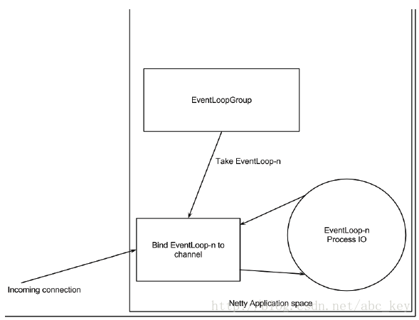
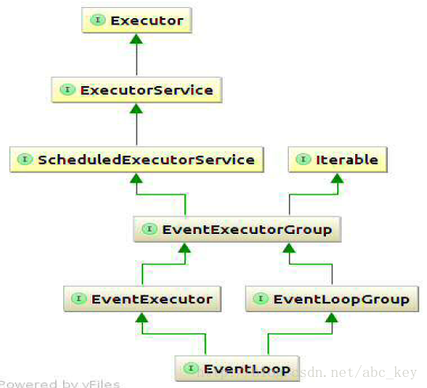
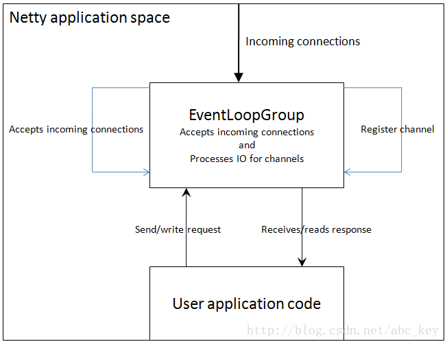

Netty核心概念
================================================
这里，我们将讨论Netty的10个核心类，清楚了解他们的结构对使用Netty很有用。可能有一些不会再工作中用到，
但是也有一些很常用也很核心，你会遇到。
+ **`Bootstrap` 或者 `ServerBootstrap`**；
+ **`EventLoop`**；
+ **`EventLoopGroup`**；
+ **`ChannelPipeline`**；
+ **`Channel`**；
+ **`Future 或者 ChannelFuture`**；
+ **`ChannelInitializer`**；
+ **`ChannelHandler`**；

### Netty速成课
一个Netty程序开始于`Bootstrap`类，`Bootstrap`类是Netty提供的一个可以通过简单配置来 **设置或"引导"程序** 的一个很重要的类。
Netty中设计了 **Handlers** 来处理特定的 **"event"** 和设置Netty中的 **事件**，从而来处理多个协议和数据。
事件可以描述成一个非常通用的方法，因为你可以自定义一个handler,用来将`Object`转成`byte[]`或将`byte[]`转成`Object`；
也可以定义个handler处理抛出的异常。

你会经常编写一个实现`ChannelInboundHandler`的类，**`ChannelInboundHandler`是用来接收消息**，当有消息过来时，
你可以决定如何处理。当程序需要返回消息时可以在`ChannelInboundHandler`里 **write/flush** 数据。
**可以认为应用程序的业务逻辑都是在`ChannelInboundHandler`中来处理的**，业务逻辑的生命周期在`ChannelInboundHandler`中。

Netty连接客户端或绑定服务器需要知道如何发送或接收消息，这是通过不同类型的handlers来做的，多个Handlers是怎么配置的？
Netty提供了`ChannelInitializer`类用来配置Handlers。`ChannelInitializer`是通过`ChannelPipeline`来添加`ChannelHandler`的，
如发送和接收消息，这些Handlers将确定发的是什么消息。`ChannelInitializer`自身也是一个`ChannelHandler`，
在添加完其他的handlers之后会自动从`ChannelPipeline`中删除自己。

所有的Netty程序都是基于`ChannelPipeline`。`ChannelPipeline`和`EventLoop`和`EventLoopGroup`密切相关，
因为它们三个都和事件处理相关，所以这就是为什么它们处理IO的工作由EventLoop管理的原因。

**Netty中所有的IO操作都是异步执行的**，例如你连接一个主机默认是异步完成的；写入/发送消息也是同样是异步。
也就是说操作不会直接执行，而是会等一会执行，**因为你不知道返回的操作结果是成功还是失败，但是需要有检查是否成功的方法或者是注册监听来通知**；
Netty使用`Futures`和`ChannelFutures`来达到这种目的。**Future注册一个监听，当操作成功或失败时会通知**。
`ChannelFuture`封装的是一个操作的相关信息，操作被执行时会立刻返回`ChannelFuture`。

### Channels,Events和IO
**Netty是一个非阻塞、事件驱动的网络框架**。Netty实际上是使用多线程处理IO事件，对于熟悉多线程编程的读者可能会需要同步代码。
这样的方式不好，因为同步会影响程序的性能，Netty的设计保证程序处理事件不会有同步。

下图显示一个`EventLoopGroup`和一个`Channel`关联一个单一的`EventLoop`，Netty中的`EventLoopGroup`包含一个或多个`EventLoop`，
而`EventLoop`就是一个`Channel`执行实际工作的线程。`EventLoop`总是绑定一个单一的线程，在其生命周期内不会改变：

当注册一个`Channel`后，Netty将这个`Channel`绑定到一个`EventLoop`，在`Channel`的生命周期内总是被绑定到一个`EventLoop`。
**在Netty IO操作中，你的程序不需要同步，因为一个指定通道的所有IO始终由同一个线程来执行**。为了帮助理解，
下图显示了`EventLoop和EventLoopGroup`的关系：

`EventLoop`和`EventLoopGroup`的关联不是直观的，因为我们说过`EventLoopGroup`包含一个或多个`EventLoop`，
但是上面的图显示`EventLoop`是一个`EventLoopGroup`，这意味着你可以只使用一个特定的`EventLoop`。

### 什么是Bootstrap?为什么使用它？
“引导”是Netty中配置程序的过程，当你需要 **连接客户端** 或 **服务器绑定指定端口** 时需要使用`bootstrap`。如前面所述，
**“引导”有两种类型，一种是用于客户端的`Bootstrap`(也适用于`DatagramChannel`)，一种是用于服务端的`ServerBootstrap`**。
不管程序使用哪种协议，无论是创建一个客户端还是服务器都需要使用“引导”。

两种bootsstraps之间有有很多相似之处，也有一些不同。`Bootstrap`和`ServerBootstrap`之间的差异：
+ `Bootstrap`用来连接远程主机，有 **1个** `EventLoopGroup`；
+ `ServerBootstrap`用来绑定本地端口，有 **2个** `EventLoopGroup`；

这里只讨论两种"引导"的差异(`Bootstrap`和`ServerBootstrap`)。第一个差异很明显，`ServerBootstrap`监听在服务器，
监听一个端口，轮询客户端的`Bootstrap`或`DatagramChannel`是否连接服务器。客户端通常需要调用`Bootstrap`类的`connect()`方法，
但是也可以先调用`bind()`再调用`connect()`进行连接，之后使用的`Channel`包含在`bind()`返回的`ChannelFuture`中。

第二个差别也许是最重要的。客户端`bootstraps/applications`使用一个单例`EventLoopGroup`，
而`ServerBootstrap`使用两个`EventLoopGroup`，它可能不是显而易见的，但是它是个好的方案。
一个`ServerBootstrap`可以认为有 **两个channels组**，第一组包含一个单例`ServerChannel`，代表 **持有一个绑定了本地端口的socket**；
第二组包含所有的`Channel`，代表 **服务器已接受了的连接**。下图形象的描述了这种情况：

上图中，`EventLoopGroup A`唯一的目的就是接受连接，然后交给`EventLoopGroup B`。Netty可以使用两个不同的Group，
因为服务器程序需要接受很多客户端连接的情况下，**一个`EventLoopGroup`将是程序性能的瓶颈，因为事件循环忙于处理连接请求，
没有多余的资源和空闲来处理业务逻辑，最后的结果会是很多连接请求超时。若有两EventLoops，即使在高负载下，
所有的连接也都会被接受，因为`EventLoops`接受连接不会和哪些已经连接了的处理共享资源**。

`EventLoopGroup`和`EventLoop`是什么关系？`EventLoopGroup`可以包含很多个`EventLoop`，每个`Channel`绑定一个`EventLoop`不会被改变，
很多`Channel`会共享同一个`EventLoop`。这意味着在一个`Channel`保持`EventLoop`繁忙会禁止其他`Channel`绑定到相同的`EventLoop`。
我们可以理解为 **`EventLoop`是一个事件循环线程，而`EventLoopGroup`是一个事件循环集合**。

如果你决定两次使用相同的`EventLoopGroup`实例配置Netty服务器，下图显示了它是如何改变的：

**Netty允许处理IO和接受连接使用同一个`EventLoopGroup`，这在实际中适用于多种应用**。
上图显示了一个`EventLoopGroup`处理连接请求和IO操作。

### Channel Handlers and Data Flow（通道处理和数据流）
当你发送或接收数据时发生了什么？回想本章开始提到的handler概念。要明白Netty程序wirte或read时发生了什么，
**首先要对`Handler`是什么有一定的了解**。`Handlers`自身依赖于`ChannelPipeline`来 **决定它们执行的顺序**，
因此不可能通过`ChannelPipeline`定义处理程序的某些方面，反过来不可能定义也不可能通过`ChannelHandler`定义
`ChannelPipeline`的某些方面。本节将介绍`ChannelHandler`和`ChannelPipeline`在某种程度上细微的依赖。

**在很多地方，Netty的`ChannelHandler`是你的应用程序中处理最多的**。即使你没有意思到这一点，
如果你使用Netty应用将至少有一个`ChannelHandler`参与，换句话说，`ChannelHandler`对很多事情是关键的。
那么`ChannelHandler`究竟是什么？给`ChannelHandler`一个定义不容易，**我们可以理解为`ChannelHandler`
是一段执行业务逻辑处理数据的代码**，它们来来往往的通过`ChannelPipeline`。实际上，`ChannelHandler`是定义一个handler的父接口，
**`ChannelInboundHandler`和`ChannelOutboundHandler`都实现`ChannelHandler`接口**，如下图：
