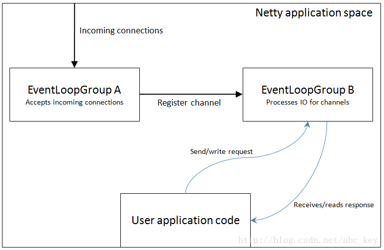
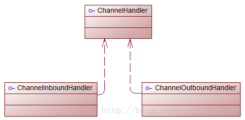
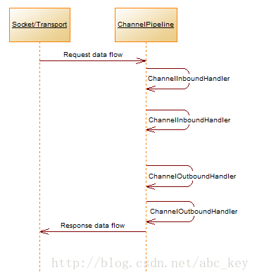

Netty核心概念
================================================
这里，我们将讨论Netty的10个核心类，清楚了解他们的结构对使用Netty很有用。可能有一些不会再工作中用到，
但是也有一些很常用也很核心，你会遇到。
+ **`Bootstrap` 或者 `ServerBootstrap`**；
+ **`EventLoop`**；
+ **`EventLoopGroup`**；
+ **`ChannelPipeline`**；
+ **`Channel`**；
+ **`Future 或者 ChannelFuture`**；
+ **`ChannelInitializer`**；
+ **`ChannelHandler`**；

### Netty速成课
一个Netty程序开始于`Bootstrap`类，`Bootstrap`类是Netty提供的一个可以通过简单配置来 **设置或"引导"程序** 的一个很重要的类。
Netty中设计了 **Handlers** 来处理特定的 **"event"** 和设置Netty中的 **事件**，从而来处理多个协议和数据。
事件可以描述成一个非常通用的方法，因为你可以自定义一个handler,用来将`Object`转成`byte[]`或将`byte[]`转成`Object`；
也可以定义个handler处理抛出的异常。

你会经常编写一个实现`ChannelInboundHandler`的类，**`ChannelInboundHandler`是用来接收消息**，当有消息过来时，
你可以决定如何处理。当程序需要返回消息时可以在`ChannelInboundHandler`里 **write/flush** 数据。
**可以认为应用程序的业务逻辑都是在`ChannelInboundHandler`中来处理的**，业务逻辑的生命周期在`ChannelInboundHandler`中。

Netty连接客户端或绑定服务器需要知道如何发送或接收消息，这是通过不同类型的handlers来做的，多个Handlers是怎么配置的？
Netty提供了`ChannelInitializer`类用来配置Handlers。`ChannelInitializer`是通过`ChannelPipeline`来添加`ChannelHandler`的，
如发送和接收消息，这些Handlers将确定发的是什么消息。`ChannelInitializer`自身也是一个`ChannelHandler`，
在添加完其他的handlers之后会自动从`ChannelPipeline`中删除自己。

所有的Netty程序都是基于`ChannelPipeline`。`ChannelPipeline`和`EventLoop`和`EventLoopGroup`密切相关，
因为它们三个都和事件处理相关，所以这就是为什么它们处理IO的工作由EventLoop管理的原因。

**Netty中所有的IO操作都是异步执行的**，例如你连接一个主机默认是异步完成的；写入/发送消息也是同样是异步。
也就是说操作不会直接执行，而是会等一会执行，**因为你不知道返回的操作结果是成功还是失败，但是需要有检查是否成功的方法或者是注册监听来通知**；
Netty使用`Futures`和`ChannelFutures`来达到这种目的。**Future注册一个监听，当操作成功或失败时会通知**。
`ChannelFuture`封装的是一个操作的相关信息，操作被执行时会立刻返回`ChannelFuture`。

### Channels,Events和IO
**Netty是一个非阻塞、事件驱动的网络框架**。Netty实际上是使用多线程处理IO事件，对于熟悉多线程编程的读者可能会需要同步代码。
这样的方式不好，因为同步会影响程序的性能，Netty的设计保证程序处理事件不会有同步。

下图显示一个`EventLoopGroup`和一个`Channel`关联一个单一的`EventLoop`，Netty中的`EventLoopGroup`包含一个或多个`EventLoop`，
而`EventLoop`就是一个`Channel`执行实际工作的线程。`EventLoop`总是绑定一个单一的线程，在其生命周期内不会改变：

当注册一个`Channel`后，Netty将这个`Channel`绑定到一个`EventLoop`，在`Channel`的生命周期内总是被绑定到一个`EventLoop`。
**在Netty IO操作中，你的程序不需要同步，因为一个指定通道的所有IO始终由同一个线程来执行**。为了帮助理解，
下图显示了`EventLoop和EventLoopGroup`的关系：

`EventLoop`和`EventLoopGroup`的关联不是直观的，因为我们说过`EventLoopGroup`包含一个或多个`EventLoop`，
但是上面的图显示`EventLoop`是一个`EventLoopGroup`，这意味着你可以只使用一个特定的`EventLoop`。

### 什么是Bootstrap?为什么使用它？
“引导”是Netty中配置程序的过程，当你需要 **连接客户端** 或 **服务器绑定指定端口** 时需要使用`bootstrap`。如前面所述，
**“引导”有两种类型，一种是用于客户端的`Bootstrap`(也适用于`DatagramChannel`)，一种是用于服务端的`ServerBootstrap`**。
不管程序使用哪种协议，无论是创建一个客户端还是服务器都需要使用“引导”。

两种bootsstraps之间有有很多相似之处，也有一些不同。`Bootstrap`和`ServerBootstrap`之间的差异：
+ `Bootstrap`用来连接远程主机，有 **1个** `EventLoopGroup`；
+ `ServerBootstrap`用来绑定本地端口，有 **2个** `EventLoopGroup`；

这里只讨论两种"引导"的差异(`Bootstrap`和`ServerBootstrap`)。第一个差异很明显，`ServerBootstrap`监听在服务器，
监听一个端口，轮询客户端的`Bootstrap`或`DatagramChannel`是否连接服务器。客户端通常需要调用`Bootstrap`类的`connect()`方法，
但是也可以先调用`bind()`再调用`connect()`进行连接，之后使用的`Channel`包含在`bind()`返回的`ChannelFuture`中。

第二个差别也许是最重要的。客户端`bootstraps/applications`使用一个单例`EventLoopGroup`，
而`ServerBootstrap`使用两个`EventLoopGroup`，它可能不是显而易见的，但是它是个好的方案。
一个`ServerBootstrap`可以认为有 **两个channels组**，第一组包含一个单例`ServerChannel`，代表 **持有一个绑定了本地端口的socket**；
第二组包含所有的`Channel`，代表 **服务器已接受了的连接**。下图形象的描述了这种情况：

上图中，`EventLoopGroup A`唯一的目的就是接受连接，然后交给`EventLoopGroup B`。Netty可以使用两个不同的Group，
因为服务器程序需要接受很多客户端连接的情况下，**一个`EventLoopGroup`将是程序性能的瓶颈，因为事件循环忙于处理连接请求，
没有多余的资源和空闲来处理业务逻辑，最后的结果会是很多连接请求超时。若有两EventLoops，即使在高负载下，
所有的连接也都会被接受，因为`EventLoops`接受连接不会和哪些已经连接了的处理共享资源**。

`EventLoopGroup`和`EventLoop`是什么关系？`EventLoopGroup`可以包含很多个`EventLoop`，每个`Channel`绑定一个`EventLoop`不会被改变，
很多`Channel`会共享同一个`EventLoop`。这意味着在一个`Channel`保持`EventLoop`繁忙会禁止其他`Channel`绑定到相同的`EventLoop`。
我们可以理解为 **`EventLoop`是一个事件循环线程，而`EventLoopGroup`是一个事件循环集合**。

如果你决定两次使用相同的`EventLoopGroup`实例配置Netty服务器，下图显示了它是如何改变的：

**Netty允许处理IO和接受连接使用同一个`EventLoopGroup`，这在实际中适用于多种应用**。
上图显示了一个`EventLoopGroup`处理连接请求和IO操作。

### Channel Handlers and Data Flow（通道处理和数据流）
当你发送或接收数据时发生了什么？回想本章开始提到的handler概念。要明白Netty程序wirte或read时发生了什么，
**首先要对`Handler`是什么有一定的了解**。`Handlers`自身依赖于`ChannelPipeline`来 **决定它们执行的顺序**，
因此不可能通过`ChannelPipeline`定义处理程序的某些方面，反过来不可能定义也不可能通过`ChannelHandler`定义
`ChannelPipeline`的某些方面。本节将介绍`ChannelHandler`和`ChannelPipeline`在某种程度上细微的依赖。

**在很多地方，Netty的`ChannelHandler`是你的应用程序中处理最多的**。即使你没有意思到这一点，
如果你使用Netty应用将至少有一个`ChannelHandler`参与，换句话说，`ChannelHandler`对很多事情是关键的。
那么`ChannelHandler`究竟是什么？给`ChannelHandler`一个定义不容易，**我们可以理解为`ChannelHandler`
是一段执行业务逻辑处理数据的代码**，它们来来往往的通过`ChannelPipeline`。实际上，`ChannelHandler`是定义一个handler的父接口，
**`ChannelInboundHandler`和`ChannelOutboundHandler`都实现`ChannelHandler`接口**，如下图：

上图中，Netty中有 **两个方向的数据流**，**入站**(`ChannelInboundHandler`)和 **出站**(`ChannelOutboundHandler`)
之间有一个明显的区别：**若数据是从用户应用程序到远程主机则是“出站(outbound)”，相反若数据时从远程主机到用户应用程序则是“入站(inbound)”**。

为了使数据从一端到达另一端，一个或多个`ChannelHandler`将以某种方式操作数据。这些`ChannelHandler`会在程序的“引导”阶段
被添加到`ChannelPipeline`中，**并且被添加的顺序将决定处理数据的顺序**。`ChannelPipeline`的作用我们可以理解为 **用来管理
`ChannelHandler`的一个容器**，每个`ChannelHandler`处理各自的数据(例如入站数据只能由`ChannelInboundHandler`处理)，
处理完成后将转换的数据放到`ChannelPipeline`中交给下一个`ChannelHandler`继续处理，直到最后一个`ChannelHandler`处理完成。

下图显示了ChannelPipeline的处理过程：

上图显示`ChannelInboundHandler`和`ChannelOutboundHandler`都要经过 **相同的`ChannelPipeline`**。

在`ChannelPipeline`中，**如果消息被读取或有任何其他的入站事件**，消息将从`ChannelPipeline`的 **头部开始** 传递给
第一个`ChannelInboundHandler`，这个`ChannelInboundHandler`可以处理该消息或将消息传递到下一个`ChannelInboundHandler`中，
一旦在`ChannelPipeline`中没有剩余的`ChannelInboundHandler`后，`ChannelPipeline`就知道消息已被所有的`Handler`处理完成了。

反过来也是如此，**任何出站事件或写入** 将从`ChannelPipeline`的 **尾部开始**，并传递到最后一个`ChannelOutboundHandler`。
`ChannelOutboundHandler`的作用和`ChannelInboundHandler`相同，它可以传递事件消息到下一个`Handler`或者自己处理消息。
不同的是`ChannelOutboundHandler`是从`ChannelPipeline`的尾部开始，而`ChannelInboundHandler`是从`ChannelPipeline`的头部开始，
当处理完第一个（按代码定义的顺序排在最前面的）`ChannelOutboundHandler`处理完成后会出发一些操作，比如一个写操作。

一个事件能传递到 **下一个** `ChannelInboundHandler`或 **上一个** `ChannelOutboundHandler`，
在`ChannelPipeline`中通过使用`ChannelHandlerContext`调用每一个方法。Netty提供了抽象的事件基类称为
`ChannelInboundHandlerAdapter`和`ChannelOutboundHandlerAdapter`。每个都提供了在`ChannelPipeline`中通过调用相应的方法
将事件传递给下一个`Handler`的方法的实现。我们能覆盖的方法就是我们需要做的处理。

可能有读者会奇怪，**出站和入站的操作不同，能放在同一个`ChannelPipeline`工作**？Netty的设计是很巧妙的，入站和出站`Handler`有不同的实现，
**Netty能跳过一个不能处理的操作，所以在出站事件的情况下，`ChannelInboundHandler`将被跳过**，Netty知道每个handler都必须
实现`ChannelInboundHandler`或`ChannelOutboundHandler`。

当一个`ChannelHandler`添加到`ChannelPipeline`中时获得一个`ChannelHandlerContext`。通常是安全的获得这个对象的引用，
但是当一个数据报协议如 **UDP** 时这是 **不正确** 的，这个对象可以在之后用来获取底层通道，因为要用它来read/write消息，
因此通道会保留。也就是说 **Netty中发送消息有两种方法：直接写入通道或写入ChannelHandlerContext对象**。
这两种方法的主要区别如下：
+ **直接写入通道导致处理消息从`ChannelPipeline`的尾部开始**；
+ **写入`ChannelHandlerContext`对象导致处理消息从`ChannelPipeline`的下一个`handler`开始**；

### 编码器、解码器和业务逻辑：细看Handlers
有很多不同类型的handlers，每个handler的依赖于它们的基类。**Netty提供了一系列的“Adapter”类**，这让事情变的很简单。
每个handler负责转发到`ChannelPipeline`的下一个handler。在*Adapter类(和子类)中是自动完成的，因此 **我们只需要在感兴趣的*Adapter中重写方法**。
这些功能可以帮助我们非常简单的编码/解码消息。有几个适配器(adapter)允许自定义`ChannelHandler`，
**一般自定义ChannelHandler需要继承编码/解码适配器类中的一个**。Netty有一下适配器：
+ **ChannelHandlerAdapter**；
+ **ChannelInboundHandlerAdapter**；
+ **ChannelOutboundHandlerAdapter**；

三个`ChannelHandler`中，我们重点看看`ecoders`,`decoders`和`SimpleChannelInboundHandler<I>`，
`SimpleChannelInboundHandler<I>`继承`ChannelInboundHandlerAdapter`。

#### Encoders(编码器), decoders(解码器)
发送或接收消息后，Netty必须将消息数据从一种形式转化为另一种。**接收消息后，需要将消息从字节码转成Java对象(由某种解码器解码)；
发送消息前，需要将Java对象转成字节(由某些类型的编码器进行编码)**。这种转换一般发生在网络程序中，因为网络上只能传输字节数据。

有多种基础类型的编码器和解码器，要使用哪种取决于想实现的功能。要弄清楚某种类型的编解码器，从类名就可以看出，
如“`ByteToMessageDecoder`”、“`MessageToByteEncoder`”，还有Google的协议“`ProtobufEncoder`”和“`ProtobufDecoder`”。

严格的说其他handlers可以做编码器和适配器，使用不同的Adapter classes取决你想要做什么。
**如果是解码器则有一个`ChannelInboundHandlerAdapter`或`ChannelInboundHandler`，所有的解码器都继承或实现它们。
“`channelRead`”方法/事件被覆盖，这个方法从入站(inbound)通道读取每个消息。重写的channelRead方法将调用每个解码器的“decode”方法并通过`ChannelHandlerContext.fireChannelRead(Object msg)`传递给`ChannelPipeline`中的下一个`ChannelInboundHandler`**。

类似入站消息，当你发送一个消息出去(出站)时，除编码器将消息转成字节码外还会转发到下一个`ChannelOutboundHandler`。

#### 业务逻辑(Domain logic)
也许最常见的是应用程序处理接收到消息后进行解码，然后供相关业务逻辑模块使用。所以应用程序只需要扩展`SimpleChannelInboundHandler<I>`，
也就是我们自定义一个继承`SimpleChannelInboundHandler<I>`的handler类，其中<I>是handler可以处理的消息类型。通过重写父类的方法可以获得一个`ChannelHandlerContext`的引用，它们接受一个`ChannelHandlerContext`的参数，你可以在class中当一个属性存储。

**处理程序关注的主要方法是“`channelRead0(ChannelHandlerContext ctx, I msg)`”**，每当Netty调用这个方法，
对象“I”是消息，这里使用了Java的泛型设计，程序就能处理I。如何处理消息完全取决于程序的需要。在处理消息时有一点需要注意的，
**在Netty中，事件处理IO一般有很多线程，程序中尽量不要阻塞IO线程，因为阻塞会降低程序的性能**。

**必须不阻塞IO线程意味着在`ChannelHandler`中使用阻塞操作会有问题。幸运的是Netty提供了解决方案，
我们可以在添加`ChannelHandler`到`ChannelPipeline`中时指定一个`EventExecutorGroup`，
`EventExecutorGroup`会获得一个`EventExecutor`，`EventExecutor`将执行`ChannelHandler`的所有方法。
`EventExecutor`将使用不同的线程来执行和释放`EventLoop`**。
