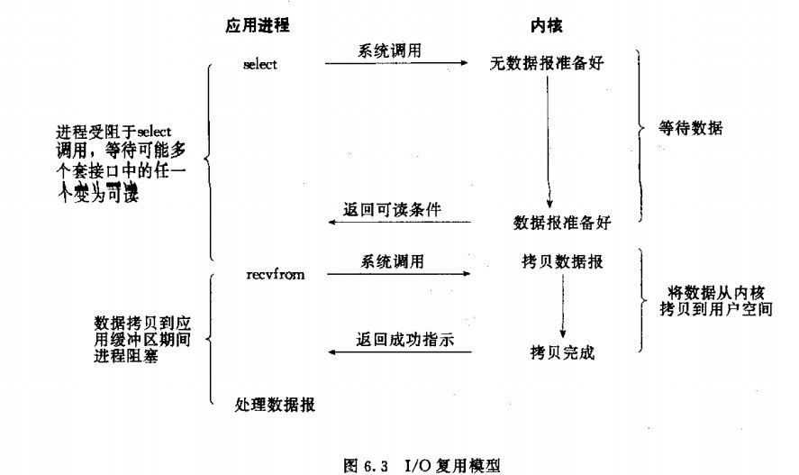
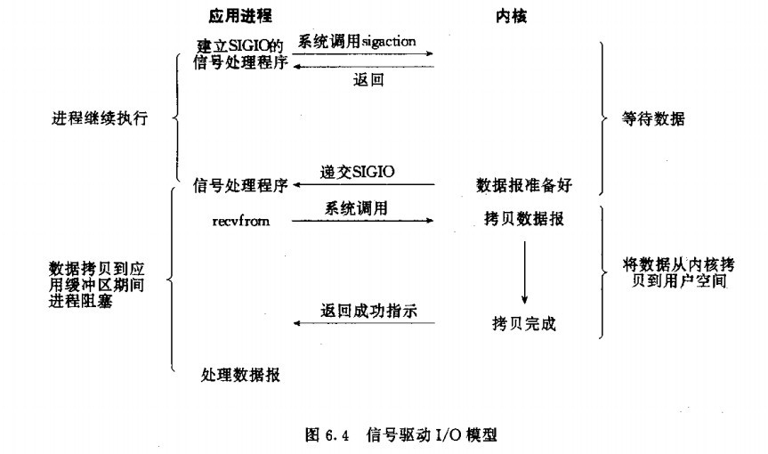

Linux网络IO模型介绍
=============================================
Linux提供了5种I/O模型。

### 阻塞I/O模型
最常用的I/O模型就是阻塞I/O模型。缺省情形下，所有文件操作都是阻塞的。这里我们以套接字接口为例来
讲解此模型：在进程空间中调用`recvfrom`，其系统调用直到数据包到达且被复制到应用进程的缓冲区中或者发
生错误时才返回，在此期间一直会等待，进程在从调用`recvfrom`开始到它返回的整段时间内都是被阻塞的，
因此被称为阻塞I/O模型。如图：

### 非阻塞IO模型
`recvfrom`从应用层到内核的时候，如果该缓冲区没有数据的话，就直接返回一个`EWOULDBLOCK`错误，
一般都对非阻塞I/O模型进行轮询检查这个状态，看内核是不是有数据到来。如图：

### I/O复用模型
Linux提供`select/poll`，进程通过将一个或多个`fd`传递给`select`或`poll`系统调用，阻塞在`select`
操作上，这样`select/poll`可以帮我们侦测多个`fd`是否处于就绪状态。`select/poll`是顺序扫描`fd`
是否就绪，而且支持的fd数量有限，因此它的使用受到了一些制约。Linux还提供了一个`epoll`系统调用，
`epoll`使用基于事件驱动方式代替顺序扫描，因此性能更高。当有`fd`就绪时，立即回调函数`rollback`。示例：

**注**：Linux的内核将所有外部设备都看做一个文件来操作，对一个文件的读写操作会调用内核提供的系统命令，
返回一个`file descriptor`(`fd`，文件描述符)。而对一个`socket`的读写也会有相应的描述符，称为
`socketfd`（`socket`描述符），**描述符就是一个数字，它指向内核中的一个结构体（文件路径，数据区等一些属性）**。

### 信号驱动I/O模型
首先开启套接口信号驱动I/O功能，并通过系统调用`sigaction`执行安装一个信号处理函数（此系统调用立即返回，进程
继续工作，它是非阻塞的）。当数据准备就绪时，就为该进程生成一个`SIGIO`信号，通过信号回调通知应用程序调用
`recvfrom`来读取数据，并通知主循环函数处理数据。如图：

### 异步I/O
告知内核启动某个操作，并让内核在整个操作完成后（包括将数据从内核复制到用户自己的缓冲区）通知我们。
这种模型与信号驱动模型的主要区别是：信号驱动I/O由内核通知我们何时可以开始一个I/O操作；异步I/O模型
由内核通知我们I/O操作何时已经完成。如图：

## 注意：前四种都是同步I/O，只有最后一种是异步I/O**。
