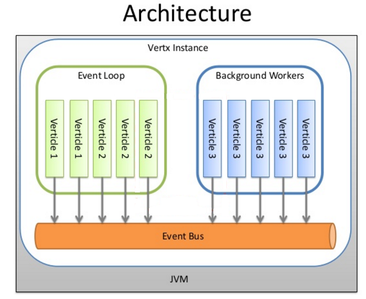
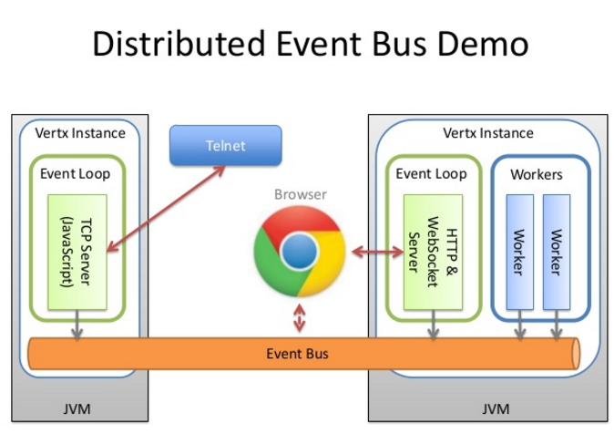

Vert.x3架构
=======================================
### Vert.x3架构

#### vert.x实例
`vert.x`实例是`vert.x API`的入口点。我们调用`vert.x`中的核心服务时，都要先获取`vert.x`实例，通过该实例
来调用相应的服务，例如部署`verticle`。

一个JVM中通常只有一个`vert.x`实例，当然也可以有多个实例。每个`vert.x`实例有自己的事件循环（一个事件循环对应
一个事件循环线程），**其事件循环数量缺省是`CPU`核数的2倍（文档中提到缺省数量等于CPU核数，但经过测试发现`vert.x 3.1.0`
版本中是2倍！！真的吗？？没有验证过！！！）**。

#### verticle
`verticle`是`vert.x`中的组件，就是一个 **执行单元**，可以理解成`akka`中的 **actor**，它可以有很多个实例。
`verticle`实例之间的通讯通过`Event Bus`，发消息到`Event Bus`。

`verticle`可分为两种类型：**标准verticle** 和 **worker verticle**。

`标准verticle`运行在`vert.x`实例的事件循环线程中，也就是当有事件发生时，在 **事件循环线程** 中 **回调**
`verticle`实例中的`event handler`。一个`vert.x`实例可以有多个标准verticle实例。当事件发生时，
每个标准verticle实例中的`event handler`总是在一个固定的事件循环线程中被回调。**因为在固定的单线程中运行，
一定程度上避免了竞争条件和死锁**。标准verticle（更确切的说是`verticle event handler`中的 **回调方法**）
不能阻塞事件循环。

`worker verticle`在background worker线程池中执行，该线程池的大小缺省为 **40**。`worker verticle`
又可分成两种，一种是 **多线程`worker verticle`**，一个多线程`worker verticle`实例可在多个worker线程中并发执行；
另一种是 **单线程`worker verticle`**，在同一时间只能有一个线程执行（串行执行），但在不同时间可被不同线程执行。
