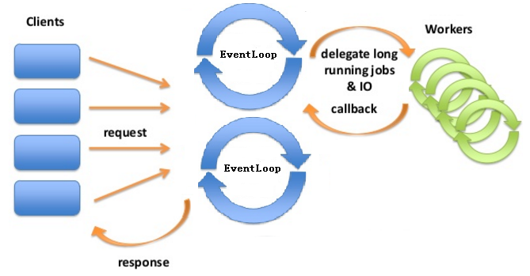

Vert.x3架构
=======================================
### Vert.x3架构

#### vert.x实例
`vert.x`实例是`vert.x API`的入口点。我们调用`vert.x`中的核心服务时，都要先获取`vert.x`实例，通过该实例
来调用相应的服务，例如部署`verticle`。

一个JVM中通常只有一个`vert.x`实例，当然也可以有多个实例。每个`vert.x`实例有自己的事件循环（一个事件循环对应
一个事件循环线程），**其事件循环数量缺省是`CPU`核数的2倍（文档中提到缺省数量等于CPU核数，但经过测试发现`vert.x 3。1。0`
版本中是2倍！！真的吗？？没有验证过！！！）**。
