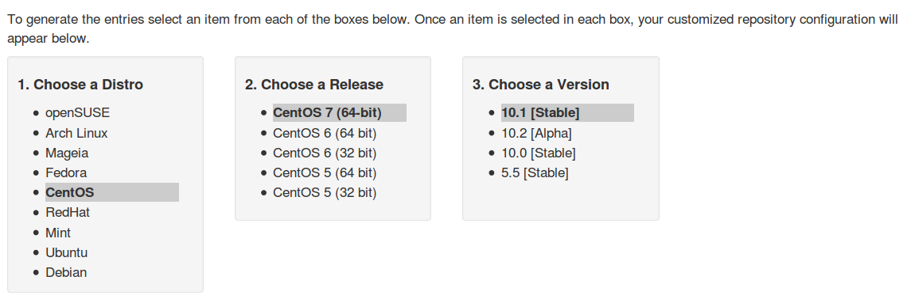

在CentOS7下安装MariaDB
===============================================
### MariaDB下载地址
我们可以从[https://downloads.mariadb.org/](https://downloads.mariadb.org/)下载所需要的安装包。

### CentOS7下安装
我们可以从[这里](https://downloads.mariadb.org/mariadb/repositories/#mirror=neusoft)选择操作系统，
系统版本，MariaDB版本：



接下来配置MariaDB的yum源，copy下面的代码到`/etc/yum.repos.d/MariaDB.repo`文件中，MariaDB.repo是
新创建的文件（建议使用MariaDB.repo名称，当然你也可以使用别的名称）。
```ini
# MariaDB 10.1 CentOS repository list - created 2016-05-11 05:45 UTC
# http://mariadb.org/mariadb/repositories/
[mariadb]
name = MariaDB
baseurl = http://yum.mariadb.org/10.1/centos7-amd64
gpgkey=https://yum.mariadb.org/RPM-GPG-KEY-MariaDB
gpgcheck=1
```
然后安装MariaDB：
```powershell
sudo yum install MariaDB-server MariaDB-client
```
**注意：如果你还没有接受MariaDB的GPG key，系统会提示你这么做**。

### 安装之后立即修改密码
安装之后，正常情况下是可以直接登录MySQL服务器的：
```powershell
sudo mysql -u root -p
```
使用Linux的超级管理员权限运行`mysql`命令，使用MySQL的root帐户并 **无密码** 登录。所以安装之后，
我们要立即修改root的密码（下面的命令执行当然也需要Linux的超级管理员权限）：
```powershell
sudo mysqladmin -u root password 123456;
```
`123456`就是设置的新密码。如果你的root用户已经有密码了，我们现在需要修改成另一个新密码，可以这样：
```powershell
sudo mysqladmin -u root -p password 123456;
```
