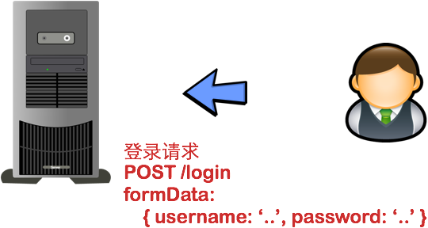
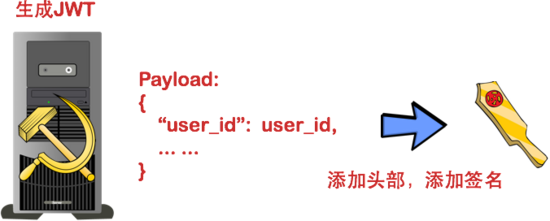
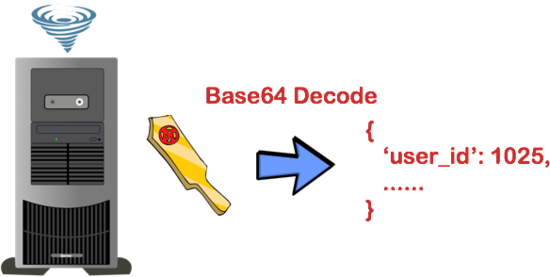

使用JWT设计单点登录系统
================================
### 用户认证
所谓 **用户认证** （Authentication），就是让用户登录，并且在接下来的一段时间内让用户访问网站时可以使用其账户，
而不需要再次登录的机制。

首先，服务器应用（下面简称“应用”）让用户通过Web表单将自己的用户名和密码发送到服务器的接口。这一过程一般是一个HTTP POST请求。
建议的方式是 **通过SSL加密的传输（https协议）**，从而避免敏感信息被嗅探。

接下来，应用和数据库核对用户名和密码。

核对用户名和密码成功后，应用将 **用户的id** （图中的user_id）作为 **JWT Payload的一个属性，
将其与头部分别进行Base64编码拼接后签名，形成一个JWT** （用点号拼接）。这里的JWT就是一个形同 **lll.zzz.xxx** 的字符串。

应用将JWT字符串 **作为该请求Cookie的一部分** 返回给用户。注意，在这里必须 **使用HttpOnly属性** 来防止Cookie被JavaScript读取，
从而避免 跨站脚本攻击（XSS攻击）。

**在Cookie失效或者被删除前**，用户每次访问应用，应用都会接受到含有JWT的Cookie。从而应用就可以将JWT从请求中提取出来。

应用通过一系列任务 **检查JWT的有效性** 。例如，检查签名是否正确；检查Token是否过期；检查Token的接收方是否是自己（可选）。

应用在确认JWT有效之后，JWT进行 **Base64解码**（可能在上一步中已经完成），然后在 **Payload** 中读取 **用户的id值**，
也就是user_id属性。这里用户的id为1025。

应用从数据库取到id为1025的用户的信息，加载到内存中，进行ORM之类的一系列底层逻辑初始化。

应用根据用户请求进行响应。

### 和Session方式存储id的差异
**Session方式** 存储用户id的最大弊病在于要 **占用大量服务器内存**，对于较大型应用而言可能还要保存许多的状态。一般而言，
大型应用还需要借助一些 **KV数据库** 和一系列 **缓存机制** 来实现Session的存储。

而 **JWT方式** 将用户状态分散到了 **客户端** 中，可以明显减轻服务端的内存压力。除了用户id之外，还可以存储其他的和用户相关的信息，
例如该用户是否是管理员等。

虽说 **JWT方式** 让服务器有 **一些计算压力**（例如加密、编码和解码），但是这些压力相比磁盘I/O而言或许是半斤八两。
具体是否采用，需要在不同场景下用数据说话。
