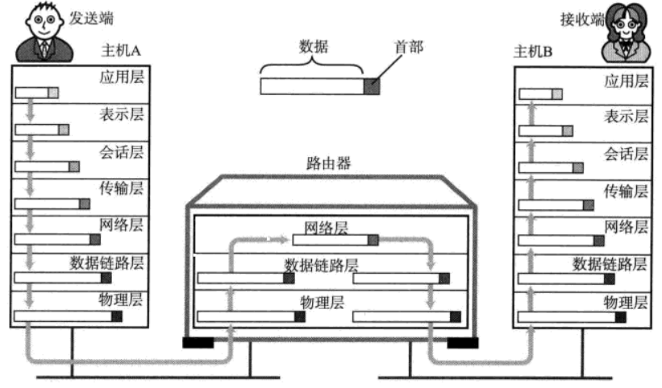

OSI参考模型通信处理举例
===============================================

### 7层通信
发送方从第7层（应用层），第6层到第1层由上至下按照顺序传输数据，而接收端则从第1层（物理层），
第2层到第7层由下至上向每个上一级分层传输数据。每个分层上，在处理由上一层传过来的数据时可以 **附上当前
分层的协议所必须的“首部”信息**。然后接收端对收到的数据 **进行数据“首部”与”内容”的分离**，再转发给上一分层，
并最终将发送端的数据恢复为原状。

### 会话层以上的处理
#### 应用层
我们以发邮件为例（用户A在主机A上新建一封电子邮件，指定收件人为B，并输入邮件内容为”早上好”）。
从用户输入完所要发送的内容（“早上好”）并点击“发送”按钮的那一刻开始，就进入了 **应用层** 协议的处理。
该协议会在所要传送数据的前端附加一个首部信息。这一附有首部信息的数据传送给主机B以后由该主机上的收发邮件
软件通过“收信”功能获取内容。主机B上的应用收到由主机A发送过来的数据后，分析其数据首部与数据正文，
并将邮件保存到硬盘或是其他非易失性存储器。
#### 表示层
**表示层** 是将数据从“某个计算机特定的数据格式”转换为“网络通用的标准数据格式”。接收端主机收到数据以后将
这些网络标准格式的数据恢复为“该计算机特定的数据格式”，然后再进行相应处理。由于数据被转换为通用标准
的格式后再进行处理，使得异构的机型之间也能保持数据的一致性。这也正是表示层的作用所在。即表示层是进行
“统一的网络数据格式”与“某一台计算机或某一款软件特有的数据格式”之间相互转换的分层。
#### 会话层
我们来分析在两端主机的 **会话层** 之间是如何高效地进行数据交互，采用何种方法传输数据。假定用户A
新建了5封邮件准备发给B用户。这5封邮件的发送顺序可以有很多种。例如，可以每发一封邮件时建立一次连接，
随后断开连接。还可以一经建立好连接后就将5封邮件连续发送给对方。甚至可以同时建立好5个连接，将5封邮件
同时发送给对方。决定采用何种连接方法是会话层的主要责任。

### 传输层以下的处理
#### 传输层
主机A确保与主机B之间的通信并准备发送数据。这一过程叫做“建立连接”。有了这个通信连接就可以使主机A发送
的电子邮件到达主机B中，并由主机B的邮件处理程序获取最终数据。此外，当通信传输结束后，有必要将连接断开。

如上，进行建立连接或断开连接的处理（**此处注意，会话层负责决定建立连接和断开连接的时机，而传输层进行实际
的建立和断开处理**），在两个主机之间创建逻辑上的通信连接即是传输层的主要作用。此外，传输层为确保所传输
的数据到达目标地址，会在通信两端的计算机之间进行确认，如果数据没有到达，它会负责进行重发。

例如，主机A将“早上好”这一数据发送给主机B。期间可能会因为某些原因导致数据被破坏，或由于发生某种网络
异常致使只有一部分数据到达目标地址。假设主机B只收到了“早上”这一部分数据，那么它会在收到数据后将自己
没有收到“早上”之后那部分数据的事实告知主机A。主机A得知这个情况后就会将后面的“好”重发给主机B，并再次
确认对端是否收到。

由此可见，**保证数据传输的可靠性是传输层的一个重要作用**。为了确保可靠性，在这一层也会为所要传输的数据附加
首部以识别这一分层的数据。然而，实际上将数据传输给对端的处理是由网络层来完成的。
